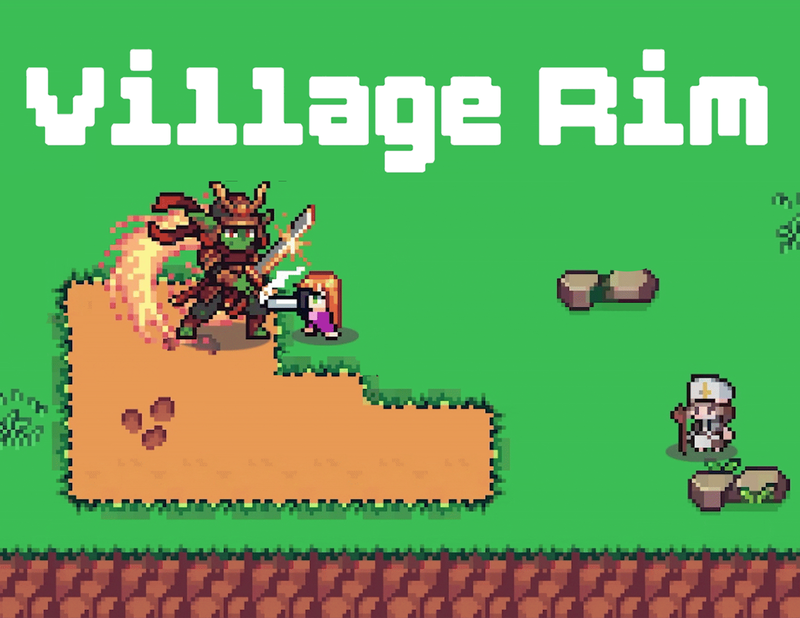

# Game Projects

[Back to homepage](index.md) | [中文](zh/game-projects.md)

A selection of my game projects. You can find more detailson the links, which are all located at my itch.io page: https://bluesamoyed777.itch.io/.

Some art resources in the Unity games were generated with Suno AI and diffusion models; the details are listed in each project's `credit.txt`.

## Village Rim

[Village Rim](https://bluesamoyed.itch.io/village-rim) is a roughly 20-minute 2D adventure game coauthored with Gigi Pan, James Tian, Emma Zhang, and Yulong Huang.

I was fully responsible for the enemy and combat system, including action design and implementation, animations, and additional tilesets for the player and enemies. I started with FSMs and later adapted the enemies to behavior trees for richer interactions, while keeping the spawning system compatible with both. I also designed each level of the game.

## Zelda 1986 Level 1 Recreation

This is my recreation of the original Zelda 1986 dungeon level 1, coauthored with James Tian: [Zelda 1986 Game](https://bluesamoyed.itch.io/zelda1986-level1).

I implemented the enemy AI system, health system, room control system, and the bomb and boomerang weapons. I also designed our custom shadow feature and made most of the animations. The animations were built from open-source spritesheets found on [The Spriters Resource](https://www.spriters-resource.com/).

## Colorable

[Colorable](https://bluesamoyed.itch.io/colorables) is my first personal game, a small single-player FPS built around color manipulation.

The core mechanic is changing and mixing colors. There are eight possible color states: black, the primary colors, pairwise mixtures, and pure white. Enemies and objects also have colors that the player can interact with, so the mechanic shapes both combat and puzzle solving.
