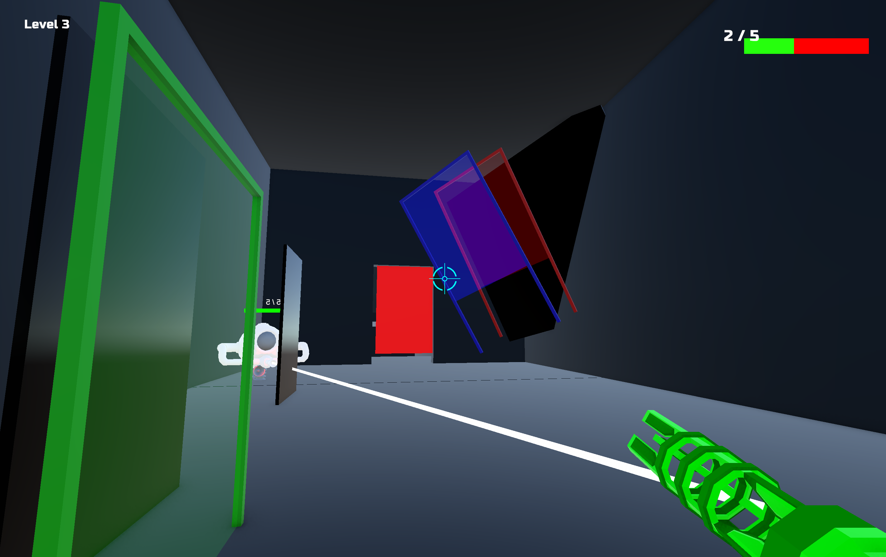

# Qiulin's Homepage

  <label for="lang">🌐 Language:</label>
  <select id="lang" onchange="location = this.value;">
    <option value="https://qiulinfan.github.io/">English</option>
    <option value="https://qiulinfan.github.io/zh/">中文</option>
  </select>

  
  

  My favorite animation character Tohka. Image credit: <a href="https://www.pixiv.net/artworks/74140599">Bison倉鼠</a>
  

This is Qiulin, senior undergrad from University of Michigan, dual majoring in Mathematics (Honors) and Computer Science. 

My career interest mainly lies in Computer Vision, Computer Graphics, Game Development and Game Engine Development. I am familiar with C++ and Unreal Engine; and proficient in python, C# and Unity engine.

I am also a Math fan out of interest. I love analysis and differential geometry. Currently I am reading *Probability: Theory and Examples* by Durret for measure-based probability theory, and *Intro to Smooth Manifolds* by John Lee for differential topology.

I post study notes on Github. Some are made into Github pages that can be found here.

## Game Projects
Some art resources are generated by Suno AI and diffusion models, mentioned in credit.txt in these projects. So far I only used Unity Engine and C# language for game development (together with some scripting languages as tools).

All games are hosted on [itch.io](https://itch.io/) and you can play it online, or use the download link on the game page.

### Recreation of Zelda 1986, Dungen Level 1
Check this link for my replica of the OG game Zelda 1986, coauthered with James Tian: [Zelda 1986 Game](https://saddysamoyed.itch.io/zelda1986-level1).

  
  

I implemented the enemy AI system, health system, room control system, bomb and boomerang weapons; 

I also designed our custom feature: shadow, and made most of the animations.

Animations are made out of open-source spritesheets found on [Open Sprite Resource](https://www.spriters-resource.com/).

### Colorable, my first personal game.

Link for my first personal game, a tiny single-player FPS game: [Colorables](https://saddysamoyed.itch.io/colorables).

  
  

The game is hosted on itch and you can play it online, or use the download link on the game page.

The mechanism is about manipulating color changes and mixtures. There are 8 possible colors you can have: Black, Primary colors, Mixtures in pairs and pure white. 

And it is not only you: enemies and objects also have colors, with whom you can interact with. Check it out if you are interested!

## notes on EECS subjects

Programming and Computer Systems

- [C++ Programming](https://qiulinfan.github.io/cpp/index.html)
- [Data Structures and Algorithms](https://qiulinfan.github.io/dsa/index.html)
- [Operating Systems](https://qiulinfan.github.io/os/index.html)
- [Computer Networks](https://qiulinfan.github.io/network/index.html)

AI and Optimization: 

- [Machine Learning & Deep Learning](https://qiulinfan.github.io/ml/index.html)
- [Nonlinear Optimization](https://qiulinfan.github.io/opt/index.html)
- [Computer Vision](https://qiulinfan.github.io/cv/index.html)
- [Nature Language Processing](https://qiulinfan.github.io/nlp/index.html)
- [Unity Game Dev](https://qiulinfan.github.io/gamedev/index.html)

## notes on Math subjects
- [Measure Theory (following *Real Analysis* by Folland)](https://qiulinfan.github.io/math-597-measure_theory-notes/index.html)

