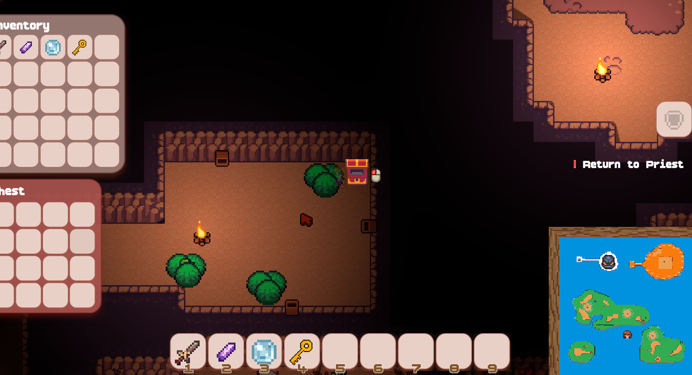
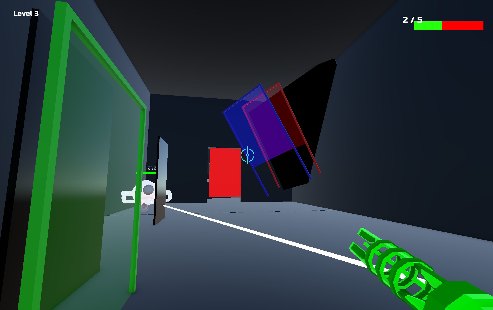

# Qiulin's Homepage

  <label for="lang">🌐 Language:</label>
  <select id="lang" onchange="location = this.value;">
    <option value="https://qiulinfan.github.io/">English</option>
    <option value="https://qiulinfan.github.io/zh/">中文</option>
  </select>

  
  

  My favorite animation character Tohka. Image credit: <a href="https://www.pixiv.net/artworks/74140599">Bison倉鼠</a>
  

This is Qiulin, a senior undergrad at the University of Michigan, dual majoring in Mathematics and Computer Science.

My main interests are Computer Vision, Computer Graphics, Game Development, and Game Engine Development. I am familiar with C++ and Unreal Engine, and proficient in Python, C#, and Unity.

I am also a math fan out of pure interest. This year I am reading *Probability: Theory and Examples* by Durrett for measure-theoretic probability, and *Introduction to Smooth Manifolds* by John Lee for differential topology.

I post study notes on GitHub, and some of them are published as GitHub Pages here.

## Projects

### Game Projects
[View game projects page](game-projects.md)

  
  
  

### PocketEngine
[Project page](https://qiulinfan.github.io/pocketEngine/) | [Repository](https://github.com/qiulinfan/pocketEngine)

PocketEngine is a 2d game engine written in C++17, hosting a Lua runtime for component scripting, on top of SDL2 for windowing and input, Box2D for physics, Dear ImGui for editor UI, and RapidJson for scene assets and actor templates.

The editor includes a docked Sceneview, embedded runtime Viewport, Project browser, Hierarchy, Inspector, and live playmode mutation workflow.

Demonstration videos: [YouTube](https://www.youtube.com/watch?v=xl0QTMO_6ok&t=3s)

## Research
- [graphNL2SQL](https://github.com/qiulinfan/graphNL2SQL): Graph-Enhanced Schema Modeling for Natural Language to SQL Generation. Fine-tuning small LLMs (3-8B) to achieve strong NL2SQL performance using graph-based schema representations.

## notes

Math:
- [Measure Theory (following *Real Analysis* by Folland)](https://qiulinfan.github.io/mathnotes-measure_theory/index.html)
- [Probability Theory](https://qiulinfan.github.io/mathnotes-probability/index.html)
- [Stochastic Processes](https://qiulinfan.github.io/mathnotes-stochastic_processes/index.html)

Programming & Computer Systems:
- [C++ Programming](https://qiulinfan.github.io/csnotes-cpp_prog/index.html)
- [Data Structures and Algorithms](https://qiulinfan.github.io/data_structure-algorithms/index.html)
- [Operating Systems](https://qiulinfan.github.io/os/index.html)

AI and Optimization: 
- [Machine Learning & Deep Learning](https://qiulinfan.github.io/ml/index.html)
- [Nonlinear Optimization](https://qiulinfan.github.io/opt/index.html)
- [Computer Vision](https://qiulinfan.github.io/cv/index.html)
- [Natural Language Processing](https://qiulinfan.github.io/nlp/index.html)
