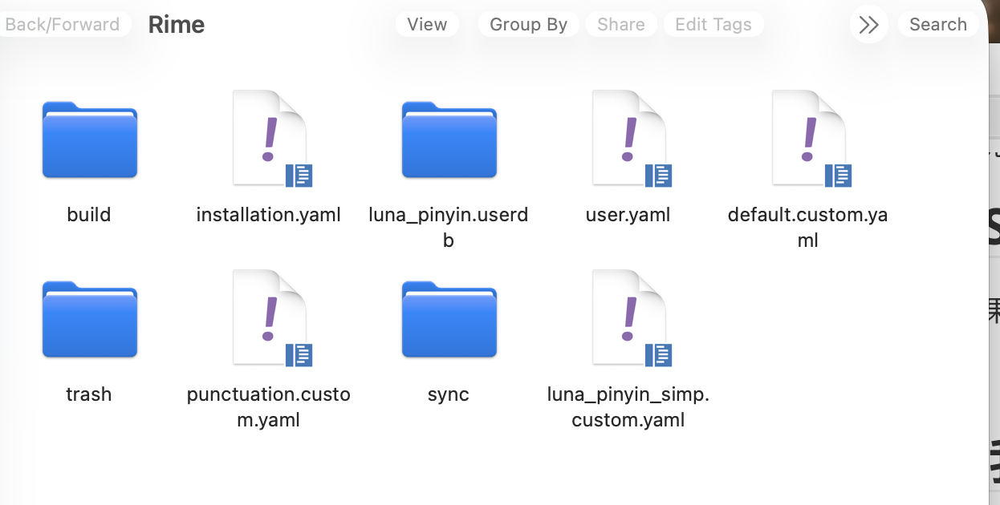
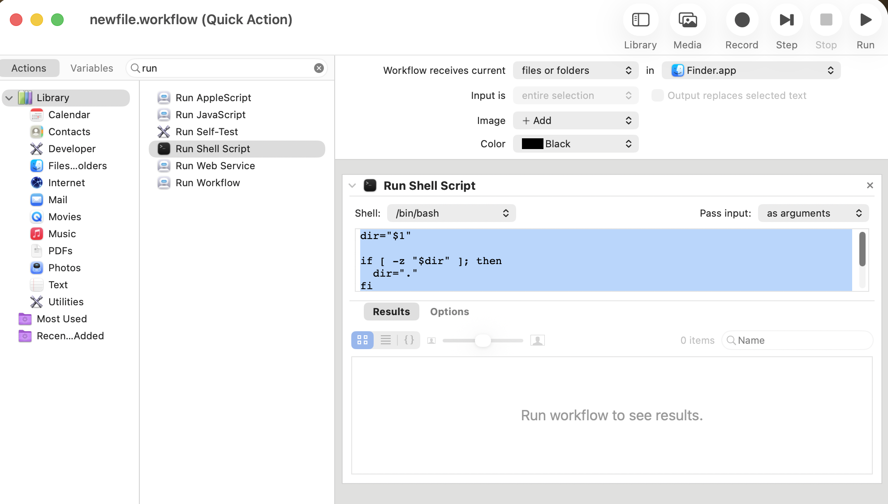

macOS. 非常优秀的一个系统, 但是也是非常多恶心的原生设置.

虽然说建立这个 repository 当作个人备忘录的初衷是防止我的电脑突然炸掉了 or 各种意外的情况导致数据损坏而我又忘记了我至今为止做过的所有 settings 但是

## iCloud Sync

这个东西好像可以解决问题. (以及 BTW. 用苹果系肯定要用 iCloud 把? 不然用它干嘛.)

不过这个 repo 仍然可以 serve 一些其他的目的. 比如

- 我可能突然不想续 icloud 了或者它的价格我突然不能接受了
- 更改了某个 setting 但是又想回退
- 纯粹娱乐目的记录一些好用的软件
- 帮助其他人省去一些配置的麻烦

所以还是做了这个 config.

我的 config 核心理念:

1. 个人习惯用 win. 所以在一些比较习惯性的东西(比如输入法和键位)上完全都搞得和 win 一样
2. 个人还是把 macOS 当作一个 ssh 工具. 而且它是一个 POSIX 的系统, 这是个好事啊.


## 输入法和键位

### 把 fn 映射到 command

mac 最神经的一点就是 ctrl 位变成了 command.

常用的 ctrl+c/v/a/z 等等都不习惯

所以我打开第一件事就是设置 -> 键盘 -> 键盘快捷键 -> 修饰键 -> 把 fn (地球仪) 键重映射到 command


### 输入法推荐 1: Rime (已 deprecated)

最大的原因是. 苹果系统的中文 inputsource pinyin, 虽然支持全部用英文标点, 但是居然是不完全的. 就我而言, 最关键的: 一个是$, 一个是\, 一个是 {}, Latex 必开的默认英文标点, 居然没有被覆盖到. 而且这个 inputsource 完全不可以自定义.

我做过另一个尝试: 就是用 Karabiner 全局拦截输入并修改. 但是问题是它的连续行为是异步的, 首先指令之间自己得设置挺大的延迟, 其次还会受到系统级的拦截限制. 比如我把 shift+4 设置为: 切换到英文输入, 重新打一遍, 再切换回中文输入. 结果每次当输入 enter /space 之后, 这个自定义行为都会因为系统的高权限拦截被 disable 掉.

所以我的做法是用一个挺不错的开源 inputsource. 真心比系统自带的好.

https://rime.im/download/




#### 加 emoji 库

但这个下载是不包括 emoji 库的. 我们需要自己额外下载一个 emoji 库.

```json
mkdir -p ~/Library/Rime/opencc

curl -L -o ~/Library/Rime/opencc/emoji.json \
  https://raw.githubusercontent.com/rime-aca/OpenCC_Emoji/master/opencc/emoji.json

curl -L -o ~/Library/Rime/opencc/emoji_word.txt \
  https://raw.githubusercontent.com/rime-aca/OpenCC_Emoji/master/opencc/emoji_word.txt

curl -L -o ~/Library/Rime/opencc/emoji_category.txt \
  https://raw.githubusercontent.com/rime-aca/OpenCC_Emoji/master/opencc/emoji_category.txt

```

下载结果大概是:

```bash
  % Total    % Received % Xferd  Average Speed   Time    Time     Time  Current
                                 Dload  Upload   Total   Spent    Left  Speed
100   382  100   382    0     0   2515      0 --:--:-- --:--:-- --:--:--  2529
  % Total    % Received % Xferd  Average Speed   Time    Time     Time  Current
                                 Dload  Upload   Total   Spent    Left  Speed
100  179k  100  179k    0     0   526k      0 --:--:-- --:--:-- --:--:--  525k
  % Total    % Received % Xferd  Average Speed   Time    Time     Time  Current
                                 Dload  Upload   Total   Spent    Left  Speed
100 15747  100 15747    0     0  74956      0 --:--:-- --:--:-- --:--:-- 75344
```


#### `luna_pinyin_simp.custom.yaml`

下载完之后自动重启, 打开 settings 就是进入这个文件夹. 只需要创建一个 `luna_pinyin_simp.custom.yaml` 文件然后输入

```yaml
patch:
  menu:
    page_size: 6

  punctuator:
    full_shape: false

  engine/filters:
    - simplifier
    - simplifier@emoji_suggestion

  simplifier:
    opencc_config: t2s.json
    tips: none

  emoji_suggestion:
    opencc_config: emoji.json
    option_name: emoji_suggestion
    tips: none

  switches:
    - name: emoji_suggestion
      reset: 1
      states: [ Off, Emoji ]
    - name: simplification
      reset: 1
      states: [汉字, 漢字]


  key_binder/bindings:
    - { when: always, accept: Control+Shift+4, send: noop }
    - { when: always, accept: Control+Shift+dollar, send: noop }

  reverse_lookup:
    enable: false

  recognizer/patterns:
    reverse_lookup: "a^"

```

就好了.

其他设置也可以改. 自定义支持度非常高. 我这里加了 emoji filter.


#### `squirrel.custom.yaml`

刚才我们定义的是 schema (输入方案层), 使用

- `luna_pinyin_simp.schema.yaml`
- `luna_pinyin_simp.custom.yaml`

负责:

- 拼写规则
- 词典
- translator
- recognizer
- key_binder
- engine pipeline

它不负责 UI 展示. UI 展示, 比如 layout 是横的还是竖着的, 是 `squirrel.custom.yaml` 里面自定义.

所以在这个目录再创建一个这个文件.

我这里定义了 layout 改成竖的.

```yaml
patch:
  "style/candidate_list_layout": linear
  "style/text_orientation": horizontal
```


#### 把 input sources 的 caplock 键切换 input source 给去掉.

system settings -> keyboard -> input sources -> all input sources -> use the 中/英 key to switch to and from ABC

去掉之后它就变成了真正的大写键.

本来的系统方案是需要它的, 但是我们现在用 rime 输入法, shift 恢复了切换中英文的功能, 于是就不再需要了. 现在恢复它原本的功能. 于是这个键盘就和 windows 的差不多了.


### 输入法推荐 2: 直接微信输入法 (目前方案)

微信输入法出来之后我就都用这个了. 我的多系统统一输入法 (并且智能一点) 的需求已经没问题. 而且好像更好用一点.

不过喜欢用文本定制的还是可以用 Rime 这种.

我会开:

- 符号自动转换; 自动编号; 模糊拼音; 单机模式; 中文和英文/数字之间自动加空格
- 快捷键 -> 使用 shift 切换中英文; 中文下中英文标点切换(我一般锁英文);

不开:

- 符号自动补全;
- 快捷键 -> ai 助手 (等号太常用了)


### 系统级改键位: Karabiner

这个软件可以拦截 input 并添加规则. 所以有系统级的优先级. 因为 macOS 的键位, 除了在 settings 里面可以让各个系统键相互置换之外, 并没有其他能更改的方法 (尤其是系统默认的功能键组合, 没法改), 所以我会下这个软件来修改.

https://karabiner-elements.pqrs.org/

(说这么老些我其实就是想改这两个组合:

- 把 fn/cmd + 左右 改成逐单词移动光标. 加 shift 前缀 -> 选中
- 把它们原本的跳转行首/行尾的功能放给 ctrl+左右键.

这样写代码习惯一点

)

下载完之后

1. 在系统的通用 -> 登录与扩展里 enable karabiner 的几个东西
2. 隐私与安全性 -> 辅助功能里允许 karabiner core service

3. 打开 karabiner-elements -settings, 进入 complex modifications -> add your own rule, 然后放进这个东西:

```json
{
  "description": "Command/Fn = word, Ctrl = line (with Shift support)",
  "manipulators": [
    {
      "type": "basic",
      "from": {
        "key_code": "left_arrow",
        "modifiers": {
          "mandatory": ["command"]
        }
      },
      "to": [
        {
          "key_code": "left_arrow",
          "modifiers": ["option"]
        }
      ]
    },
    {
      "type": "basic",
      "from": {
        "key_code": "right_arrow",
        "modifiers": {
          "mandatory": ["command"]
        }
      },
      "to": [
        {
          "key_code": "right_arrow",
          "modifiers": ["option"]
        }
      ]
    },
    {
      "type": "basic",
      "from": {
        "key_code": "left_arrow",
        "modifiers": {
          "mandatory": ["command", "shift"]
        }
      },
      "to": [
        {
          "key_code": "left_arrow",
          "modifiers": ["option", "shift"]
        }
      ]
    },
    {
      "type": "basic",
      "from": {
        "key_code": "right_arrow",
        "modifiers": {
          "mandatory": ["command", "shift"]
        }
      },
      "to": [
        {
          "key_code": "right_arrow",
          "modifiers": ["option", "shift"]
        }
      ]
    },
    {
      "type": "basic",
      "from": {
        "key_code": "left_arrow",
        "modifiers": {
          "mandatory": ["fn"]
        }
      },
      "to": [
        {
          "key_code": "left_arrow",
          "modifiers": ["option"]
        }
      ]
    },
    {
      "type": "basic",
      "from": {
        "key_code": "right_arrow",
        "modifiers": {
          "mandatory": ["fn"]
        }
      },
      "to": [
        {
          "key_code": "right_arrow",
          "modifiers": ["option"]
        }
      ]
    },
    {
      "type": "basic",
      "from": {
        "key_code": "left_arrow",
        "modifiers": {
          "mandatory": ["fn", "shift"]
        }
      },
      "to": [
        {
          "key_code": "left_arrow",
          "modifiers": ["option", "shift"]
        }
      ]
    },
    {
      "type": "basic",
      "from": {
        "key_code": "right_arrow",
        "modifiers": {
          "mandatory": ["fn", "shift"]
        }
      },
      "to": [
        {
          "key_code": "right_arrow",
          "modifiers": ["option", "shift"]
        }
      ]
    },
    {
      "type": "basic",
      "from": {
        "key_code": "left_arrow",
        "modifiers": {
          "mandatory": ["control"]
        }
      },
      "to": [
        {
          "key_code": "left_arrow",
          "modifiers": ["command"]
        }
      ]
    },
    {
      "type": "basic",
      "from": {
        "key_code": "right_arrow",
        "modifiers": {
          "mandatory": ["control"]
        }
      },
      "to": [
        {
          "key_code": "right_arrow",
          "modifiers": ["command"]
        }
      ]
    },
    {
      "type": "basic",
      "from": {
        "key_code": "left_arrow",
        "modifiers": {
          "mandatory": ["control", "shift"]
        }
      },
      "to": [
        {
          "key_code": "left_arrow",
          "modifiers": ["command", "shift"]
        }
      ]
    },
    {
      "type": "basic",
      "from": {
        "key_code": "right_arrow",
        "modifiers": {
          "mandatory": ["control", "shift"]
        }
      },
      "to": [
        {
          "key_code": "right_arrow",
          "modifiers": ["command", "shift"]
        }
      ]
    }
  ]
}

```

好了它现在彻底和 win 没什么区别了(


## 壁纸

### 推荐 1: Backdrop (已 deprecated)

买断制. 4k 动图壁纸库. 类似于 Wallpaper Engine, 虽然壁纸数量和社区远不如之, 但是真的是 mac 为数不多的正经的壁纸库软件了.


### 推荐 2: app store 搜 "我的壁纸";

- https://apps.apple.com/cn/app/%E6%88%91%E7%9A%84%E5%A3%81%E7%BA%B8-%E8%89%AF%E5%BF%83%E5%8A%A8%E6%80%81%E5%A3%81%E7%BA%B8/id1552826194?mt=12

仿 wallpaper engine 的一个东西. 我感觉壁纸质量比 backdrop 好一点 (backdrop 太多一眼 ai 的图了.)

38 rmb 买断去水印. 对于一个壁纸软件,, 还好吧

(其实只要买断制的都凑合能用. 看个人喜好)


## terminal and shell

### 先下载 homebrew

不论如何先开原生 terminal 下 homebrew. mac 就用这个包管理器.

https://brew.sh/zh-cn/

```shell
/bin/bash -c "$(curl -fsSL https://raw.githubusercontent.com/Homebrew/install/HEAD/install.sh)"
```

之后命令行下东西都得用它


### terminal: iTerm2 (我用的)

iTerm2 是普遍认为的 mac 最好的 terminal 之一. 可定制性高.

以前一直用.

缺点: gui 配置, 没法文本配置


配置主题: https://iterm2colorschemes.com (浏览和下载, 我喜欢用 nord)

下载完的 .itermcolors 双击自动 import.

然后 iterms2 -> settings -> color -> color preset 选 nord

换字体: text

- 我: 字号 14, semibold, 100 x 90 间距

	字体 jetsbrain mono nerd font

	下载:

	```shell
	brew install --cask font-jetbrains-mono-nerd-font
	```

背景和窗口大小: windows

- 我: 背景 tile to fill, blending 5/100
- windows size: 100 columns x 30 rows


(btw mac 没有默认 terminal. 可以在 VS Code 的 `settings.json` 中加入:

```
{
    "terminal.external.osxExec": "iTerms2.app"
}
```

这样 VS Code 打开外部终端时就会使用 iTerms2)


### terminal: ghostty (比较快, 没用过)

**https://ghostty.org/**

ghostty. 2025 以来最火的一个 terminal. 比较新, 很现代. gpu rendering 搞得非常快.

但是我还是习惯用 iTerms2 没用过.

缺点 (也未必算缺点) 1: 只有配置文件可以配置. 懒得读文档发需求给 ai 写一个很快.

缺点 2 (我觉得是最大缺点): 不能设置背景图片. 所以我不用.


### shell: 我用 fish

配置见 [`Shells/fish`](../../Shells/fish/)。

zsh 也挺好用的其实. 但是我统一用 fish


## 编辑器

依旧 vim, vscode 和 nvim

配置见 [`Editors`](../../Editors/)。

vscode 最好从 brew 下载:

```shell
brew install --cask visual-studio-code
```


## 文件管理系统

### finder 显示隐藏文件

比如 .gitignore, .config 之类的

terminal 直接:

```bash
defaults write com.apple.finder AppleShowAllFiles -bool true
killall Finder
```


### finder 布局

个人比较喜欢的


这个第三个布局. 可以看到文件树非常清晰.


### 新建 workflow: 在 finder 中创建文件

这个真的是比较傻比的一个事情 (个人习惯, 其实影响倒不大). 我不知道为什么 macOS 不支持右键新建文件. 以至于每次都要从 terminal 里面 touch, 或者 `code .` 然后在 VSCode 里面创建.

有一个办法, 虽然治标不治本 (finder 空白处不能 quick action, 只能对其中的文件夹进行 quick action), 但是起码好一点.

就是新建一个 workflow, 支持 quick action 创建一个新的空白文件.

- fn+space 打开 automater.app, 新建一个 workflow -> quick action

- 选择 run shell script, 参数: workflow receive current `files or folders` in `Finder.app`, 然后 shell 选择 `bin/bash`, pass input `as arguments`, 输入这段 shell 文字

	```bash
	dir="$1"

	if [ -z "$dir" ]; then
	  dir="."
	fi

	touch "$dir/untitled.txt"
	```



- 最后, cmd + S 保存 workflow.

- 现在就可以右键一个文件夹创建新文件了

	


### reminder: 拷贝文件路径

finder 另外一个傻比的事情 (这个感觉不是我个人偏好, 是真的很傻比) 就是右键窗口没有 "copy 文件路径"

但是有快捷键: **command option + c**

as a reminder.
