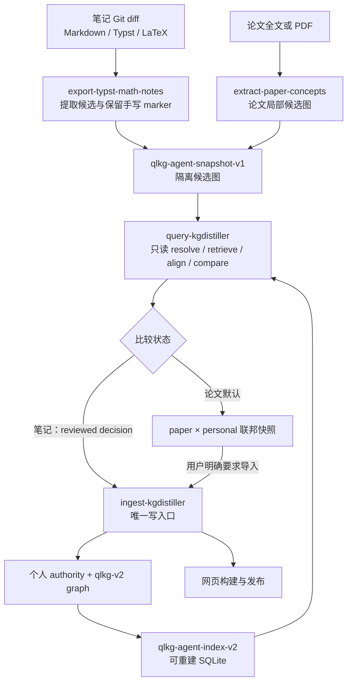

# Agentic 知识图谱工作流交接文档

> 状态日期：2026-08-05
>
> 覆盖仓库：`kgdistiller`、`qlblog`、后续验收仓库 `solvablemodel`
>
> 当前阶段：GraphRAG 查询基础和四 Skill 职责拆分已经完成；事务型 ingest 引擎与真实端到端验收尚未完成。

本文是当前项目状态的唯一交接入口。它回答四个问题：我们最终要做什么，哪些语义不能改变，两个仓库已经实现了什么，下一位执行者应按什么顺序继续。

相关权威文档：

- [职责拆分需求文档](../site/src/content/posts/kgdistiller-skill-separation-requirements.md)：保存用户原始要求、已经确认的理解和四 Skill 方案；该文已经发布。
- [qlblog 工作流](WORKFLOW.md)：面向日常笔记和论文操作的短版说明。
- [qlblog 图谱策略](SPEC.md)：个人知识源、marker、taxonomy、curation 和网页策略。
- [kgdistiller Agentic Knowledge Base spec](../vendor/kgdistiller/docs/agentic-knowledge-base-spec.md)：snapshot、索引、GraphRAG、MCP、安全和阶段设计。
- [kgdistiller graph contract](../vendor/kgdistiller/docs/graph-contract.md)：节点身份、来源和确定性图谱约束。

## 1. 北极星与真实需求

最终产品不是“把文档做一次关键词抽取”，而是：

> 将 Markdown、Typst、LaTeX、PDF 和研究者的研究过程蒸馏成可追溯的知识图谱；让 Agent 能以很小的上下文查询这张图、比较一篇新论文与个人已有知识，并只为真正缺失的知识生成词条。

目标工作流是：

```text
tex / md / typ / pdf
        ↓
来源约束的候选图
        ↓
kgdistiller 外接大脑（identity + alias + GraphRAG）
        ↓
known / partial / new / conflict / uncertain
        ↓
个人知识库写入，或不污染个人图谱的论文联邦快照
        ↓
受预算限制的 Agent query + 可选网页发布
```

这里的“外接大脑”解决两个原始痛点：

1. 上游 Skill 不再为每次任务读取整张个人知识图谱，因此不会随着图谱增长线性消耗 Agent tokens。
2. 笔记导出、论文理解、知识查询和知识写入不再塞进一个长 Skill，减少职责串线和幻觉。

用户原始要求中最关键的几句是：

> “这个知识图谱的知识源全部封装在这个 kgdistiller 的数据库里。它提供入库和查询 api 即可！”

> “入库和查询，分别做成一个 skill，伴随着 kgdistiller。它们给现有的两个 skills 调用。”

> 论文中已经有的知识“不再给出这些知识的词条”，并通过已有节点连接两张图；默认“只是给一个快照”，只有额外要求时才并入个人图谱并保留来源。

“封装在数据库里”是调用方视角的 API 边界，不代表 SQLite 成为事实来源。内部仍遵守：

- `.md`、`.typ`、`.tex` 是可编辑的知识 authority；
- `knowledge/graph` 是从 authority 和审查决策确定性生成、提交到 Git 的图谱；
- SQLite 是可删除、可重建的查询索引；
- PDF 是提取输入，不直接成为个人图谱的可编辑 authority。明确导入 PDF 知识时，必须先生成已注册、带来源位置的 research authority。

## 2. 不得回退的产品决策

后续实现可以优化算法和接口，但不能悄悄改变以下语义。

### 2.1 身份只来自显式 authority

支持的 marker 是：

| 格式 | 唯一定义 | 引用 |
| --- | --- | --- |
| Typst | `#kn[Name]` | `#ref[Name]` |
| Markdown | `--[[Name]]--` | `[[Name]]` |
| LaTeX | `\kn{Name}` | `\knref{Name}` |

标题、文档顺序、Git hunk 位置、关键词共现和向量相似度都不能创建或迁移身份。一个全局概念最多有一个 authority；其他出现位置是 ref。

### 2.2 名称相似不等于身份相同

`absolutely continuous`、`absolute continuity` 和论文局部定义的 `AC` 可能是同一个概念，也可能不是。当前和未来系统都必须：

- 先使用 canonical label、全局 alias、局部 scoped alias 和人工审查 mapping；
- 用文本检索与图结构召回候选，而不是把召回结果直接当成 identity；
- 对歧义返回 `uncertain`，对语义矛盾返回 `conflict`；
- 只有带证据的 reviewed mapping 能跨 namespace 建立 exact bridge；
- 论文局部缩写永远不能仅因相似度升级成个人图谱的全局 alias。

因此 GraphRAG 的作用是“召回证据、比较邻域、减少上下文”，不是绕过身份审查。

### 2.3 论文默认不污染个人图谱

论文提取必须使用独立 namespace，例如 `paper:<digest>`。默认输出是论文节点、论文内部关系以及指向个人节点的 bridge 组成的联邦快照。默认运行前后：

- 个人 graph digest 不变；
- `knowledge/alignments.json` 不变；
- 已知概念没有重复 entry；
- conflict/uncertain 没有 bridge。

只有用户明确要求导入时，才把选中的 `new`/`partial` 写入注册的 research authority，并把 `known` 写成 ref。

### 2.4 kgdistiller 高频升级，单次运行可追溯

qlblog 不永久冻结 kgdistiller。`make kgdistiller-update` 应经常跟随上游 `main`，然后运行两个仓库的兼容性检查并提交新的 submodule revision。每个 qlblog commit 记录当次实际使用的引擎版本，提供单次复现能力。

### 2.5 查询和写入是两种能力

- read-only MCP 可以供 Agent 默认长期运行；
- 所有个人图谱写操作只经过 ingest 引擎；
- 第一版事务 ingest 应先提供本地 Python/CLI API，不要为了方便把现有 MCP 默认改成可写服务；
- 上游提取 Skill 不直接读 graph JSONL、entry shards 或 SQLite，也不自行调用 `apply/sync/reconcile`。

## 3. 最终架构与四个 Skill



| Skill | 所属仓库 | 只负责 | 明确不负责 |
| --- | --- | --- | --- |
| `export-typst-math-notes` | qlblog | 从 Git 改动的完整 authority 和手写 marker 提取笔记候选；根据 query 决策安排 `kn/ref/entry`；成功入库后发布 | 读取大图、实现 identity、直接写全局图谱 |
| `extract-paper-concepts` | qlblog | 通读论文、覆盖来源、生成论文局部候选和最终联邦快照 | 默认导入个人图谱、重复解释 known、把缩写升级为全局 alias |
| `query-kgdistiller` | kgdistiller | 批量 resolve、受预算限制的 GraphRAG、align、compare、proposal | 修改 source、alignment、graph 或 index 事实 |
| `ingest-kgdistiller` | kgdistiller | 应用已审查的 marker/ref/entry/edge/alignment 决策并返回验证回执 | 读论文发现知识、决定歧义身份、生成无来源语义 |

上游 Skill 之间不应彼此复制命令说明。领域 Skill 调用 query/ingest；query/ingest 的规范随 kgdistiller 版本一起升级。

## 4. 当前已经实现的部分

### 4.1 kgdistiller 确定性核心

当前引擎已经具备：

- `qlkg-v2` 确定性、source-backed 图谱；
- Markdown、Typst、LaTeX 三种 scanner；
- source registry、bounded glob、唯一 ownership 和 path traversal 防护；
- 显式 rename identity 与 source statement fingerprint；
- repository/file/course 等增量 scan/sync；
- entry shard、语义 edge、backlink、来源证据和 curation 检查；
- `qlkg-agent-snapshot-v1` 自包含 Agent snapshot；
- `qlkg-agent-index-v2` SQLite 索引及 graph/alignment digest stale 检测；
- 索引缺失或陈旧时，由 Agent/MCP 查询自动重建；
- exact label、global alias、scoped alias 和 reviewed cross-namespace mapping；
- FTS、typed BFS、PPR 和 hybrid reciprocal-rank fusion；
- 带节点、边证据、backlink、retrieval path 和 omission 的 `qlkg-context-bundle-v1`；
- `qlkg-alignment-report-v1`、`qlkg-graph-comparison-v1`；
- `known`、`partial`、`new`、`conflict`、`uncertain` 比较状态；
- fingerprint-bound alignment/rejection，端点变化时自动失效；
- `qlkg-agent-proposal-v1` 和 `qlkg-agent-delta-v2` 安全预览；
- 只监听 `127.0.0.1` 的本地图谱浏览器。

当前 read-only MCP 已提供：

```text
kg_status
kg_resolve_concepts
kg_search
kg_get_node
kg_expand
kg_ppr
kg_build_context
kg_align_graph
kg_compare_graph
kg_create_proposal
```

这些能力已经足以让 Agent 不读取全量 graph 文件，查询时只接收受 token budget 限制的结构化证据包。

### 4.2 qlblog 集成

qlblog 当前已经具备：

- `vendor/kgdistiller` submodule；
- `knowledge/kgd.py` host adapter 和 Makefile query/build/check/update 命令；
- 个人 source registry、确定性 graph、alignment registry 和 ignored SQLite；
- 项目级 `.codex/config.toml` read-only kgdistiller MCP；
- Markdown/Typst/LaTeX authority 与网页发布集成；
- Git 新增、修改、删除、重命名的 workflow policy；
- knowledge graph、notes、blog、skills 共用的 Astro 站点；
- query/ingest Skill 的 qlblog discovery wrapper，正文读取 submodule 中的 canonical Skill；
- 旧 `kgdistiller-distill` Skill 和重复的 research ingestion 说明已经移除。

当前个人图谱的最近一次完整检查结果：

```text
registered authorities: 83
explicitly ignored files: 12
legacy unregistered backlog: 74
curated authorities: 67
graph nodes: 299
graph edges: 515
refs: 44
warnings: 0
```

这些数字是 2026-08-05 的状态快照，不是产品常量。

### 4.3 四个 Skill 已经完成的职责拆分

当前本地实现已经完成：

- 精简 `export-typst-math-notes`，只做改动来源提取、marker 处理和两个能力的编排；
- 精简 `extract-paper-concepts`，查询前只建轻量候选图，查询后 known 不写 entry，默认只建联邦快照；
- 新建 canonical `query-kgdistiller`，强制 read-only 和 bounded context；
- 新建 canonical `ingest-kgdistiller`，把所有个人知识写入收口到一个 Skill；
- qlblog 同名 query/ingest 目录只做发现和版本委托；
- Skill source tests 会阻止领域 Skill 直接调用 `apply/sync/reconcile/agent`；
- paper inventory contract 已按 known/partial/new/conflict/uncertain 重写。

### 4.4 已通过的验证

四 Skill 实现完成时已经通过：

| 范围 | 最近结果 |
| --- | --- |
| Skill `quick_validate` | 6 个 Skill/包装入口全部通过 |
| kgdistiller unit tests | 62 tests passed |
| kgdistiller package build | `uv build` passed |
| qlblog vendored kgdistiller tests | 62 tests passed |
| qlblog multisource/source/workflow tests | 16 tests passed |
| qlblog `make knowledge-check` | passed，0 warning |
| qlblog `make blog-check` | passed |
| qlblog `make blog-build` | passed，88 pages；Pagefind 35 pages / 5897 words |
| 已发布需求博客 | HTTP 200，标题验证通过 |

它们证明现有核心和 Skill 边界没有回归，但不等于笔记/论文的真实 Agent 端到端流程已经验收。

## 5. 当前 Git 与发布状态

### 5.1 已经发布的需求文档

用户原话与职责拆分方案已经合入并推送到 qlblog `main`：

- qlblog commit：`bf48e6d Document the kgdistiller Skill separation requirements`
- 在线页面：<https://qiulinfan.github.io/posts/kgdistiller-skill-separation-requirements/>

### 5.2 等待 review 的实现

四 Skill 实现目前仍是本地 review 状态，没有推送：

| 仓库 | 本地分支 | 本地 commit | 远端 main 基线 |
| --- | --- | --- | --- |
| `/Users/qiulinfan/Desktop/kgdistiller` | `codex/skill-separation` | `69b57b9 Split knowledge query and ingestion Skills` | `2d59f09` |
| `/Users/qiulinfan/Desktop/qlblog` | `codex/skill-separation` | `8c366f7 Implement the four-Skill knowledge workflow` | `bf48e6d` |

qlblog 的 gitlink 当前指向 kgdistiller `69b57b9`。这个 commit 尚未成为远端可获取对象，所以不能只推 qlblog 实现。review 通过后的正确发布顺序是：

1. 先推送并合并 kgdistiller `69b57b9`（或其后继实现 commit）；
2. 在 qlblog 中把 submodule 更新到远端可达的 kgdistiller commit；
3. 重新运行两个仓库的兼容性测试；
4. 再推送并合并 qlblog `8c366f7`（或其后继 commit）。

### 5.3 solvablemodel 当前现场

验收仓库位于 `/Users/qiulinfan/Desktop/solvablemodel`，当前 `main` 与 `origin/main` 都在 `c0510c2`。主要来源有：

- `main.tex`：论文式工作稿；
- `solvable model.md`：原始研究笔记；
- `main.pdf` 与 `output/pdf/fixed-linear-architectures-draft.pdf`：构建产物/提取输入；
- `references.bib`：论文来源。

该仓库在交接时已有用户自己的未提交改动：`.gitignore` 被修改，`.vscode/` 未跟踪。后续端到端工作必须保留这些改动，不得 reset、checkout 或覆盖。

## 6. 尚未实现或尚未验证的部分

这是下一阶段的真实起点。

### 6.1 没有事务型 ingest 引擎 API

`ingest-kgdistiller` Skill 已经定义写入边界，但底层目前仍是兼容命令序列：

```text
scan / sync / reconcile / propose / apply / sync / curate-check / check
```

尚不存在真正的：

- `qlkg-ingest-request-v1` schema；
- `qlkg-ingest-receipt-v1` schema；
- optimistic concurrency；
- 单写者锁；
- plan/apply 事务；
- 多文件 source + graph + alignment 的失败回滚；
- request 幂等与 crash recovery；
- 稳定错误码和可机器验证回执。

因此不能把当前 Skill 描述成“事务 API 已完成”。它只是将现有安全命令编排集中在唯一能力中。

### 6.2 候选 snapshot 的产品化入口仍不完整

引擎能导出、校验、索引和比较 `qlkg-agent-snapshot-v1`，但从任意笔记/论文提取结果构造合法隔离 snapshot 的独立 builder/API 还没有形成稳定产品入口。solvablemodel 端到端过程中应补齐 builder、schema validation 和最小示例，而不是让每个领域 Skill 手写 JSON。

### 6.3 笔记全流程尚未用真实 Agent 验收

已有单元/集成测试覆盖编译器和 Skill 文本边界，但尚未证明一次真实 Git 改动能够连续完成：候选提取 → batch query → known 写 ref/new 写 authority → transaction ingest → receipt → web export，并且不修改无关节点。

### 6.4 solvablemodel 尚未端到端蒸馏

目前只确认了验收仓库与来源文件，尚未生成论文 candidate snapshot、comparison report、联邦快照或 research authority，也没有验证默认流程前后个人 graph digest 不变。

### 6.5 尚未压力测试和产品化发布

尚未建立大图、歧义 alias、并发 writer、故障注入、token budget、延迟、内存、磁盘和安全边界的基准。个人部署说明、公共 quickstart、版本矩阵、迁移策略和正式 release 也未完成。

## 7. 后续路线图

下一阶段按以下顺序执行。不要先做 embedding 或调 prompt 精度；先闭合写事务和两个真实流程。

### Phase A：实现事务型 kgdistiller ingest 引擎 API

#### A1. 固化协议

新增、版本化并 JSON Schema 验证：

```text
qlkg-ingest-request-v1
├── request_id / request_sha256
├── mode: plan | apply
├── base_graph_sha256
├── base_alignment_sha256
├── candidate_snapshot_sha256
├── query_report_sha256
├── bounded authority patches + expected source hashes/markers
├── reviewed qlkg-agent-delta-v2
├── reviewed alignment decisions
└── review evidence and source provenance
```

```text
qlkg-ingest-receipt-v1
├── request digest + engine version/capabilities
├── before/after graph and alignment digests
├── before/after source hashes
├── added/reused/updated/orphaned node IDs
├── marker/ref/entry/edge/alignment changes
├── validation stages and durations
├── warnings/diagnostics
└── committed | rejected | rolled-back
```

请求只能引用 repo root 内、注册且唯一归属的 source；拒绝绝对越界路径、`..`、symlink escape、超限 payload 和未知 schema/capability。

#### A2. 实现客户端可见事务

建议公开：

```sh
kgdistiller ingest plan request.json --output plan.json
kgdistiller ingest apply request.json --receipt receipt.json
```

以及同语义的 Python service function。第一版不新增 write MCP。

执行器必须：

1. 获取 repo 级单写者锁；
2. 验证 request、capability、source ownership 和全部 base digests；
3. 在 repo 内受控 staging area 准备 authority patch、alignment 和 delta；
4. 对 staging state 运行 scan → apply delta → sync → curate-check → global check；
5. 只有全部通过才安装新 source/graph/alignment artifacts；
6. 用 journal/backup + 原子替换保证进程错误时可回滚或恢复；
7. graph commit 成功后再重建 disposable SQLite；
8. 输出一个 canonical receipt。

对调用方的事务保证是：失败后 authority、graph、alignment 的 hash 与请求前完全相同；成功后遵守 repo lock/generation manifest 的读取者不会看到混合版本。SQLite 可以在崩溃后丢弃并由 digest 检测重建。

#### A3. 并发、幂等和错误模型

- query 后 graph/alignment/source 任一 digest 改变，返回稳定 stale-precondition 错误，零写入；
- 相同 request digest 重试应返回已有 receipt 或确定性 no-op，不重复应用；
- 任何歧义 identity、缺少 authority marker 或未 reviewed 操作都在 plan 阶段阻止；
- 为 request validation、lock conflict、stale base、source ownership、scan、curation、global validation、rollback failure 定义稳定错误码；
- receipt 本身不能包含凭据、整篇论文或无界 source 内容。

#### A4. Phase A 验收

- 每个写阶段都有 failure injection 测试；
- 所有失败路径验证前后文件 hash 相等；
- 两个并发 writer 中只有一个能提交；
- stale request 不能写入；
- plan 永远不修改 repo；
- apply receipt 可重放验证；
- 完整 unit tests 和 `uv build` 通过；
- README、Skill 和 capability handshake 改为调用新 API，不再展示多命令兼容序列为主路径。

### Phase B：测试笔记侧全流程

至少对 Markdown、Typst、LaTeX 各跑一个真实 authority 场景，并覆盖 Git staged、unstaged、untracked、rename、delete。

必须验收：

1. 用户已有 marker 被原样保留；
2. known 概念只增加格式原生 ref，不创建节点和 entry；
3. new 概念才增加 authority marker 和 source-grounded entry；
4. partial 只提交缺失 entry/edge/限定，不复制完整已知定义；
5. conflict/uncertain 停止写入并生成 review evidence；
6. ingestion receipt 成功前不发布网页；
7. receipt 后 source、graph、SQLite query、网页 anchor/backlink 一致；
8. 未在 request scope 中的 graph/source hash 不变；
9. source glob 缺失或重叠时在写入前失败；
10. 用真实 Agent 隔离测试证明两个领域 Skill 没有读取 graph JSONL/SQLite，也没有绕过 ingest。

建议先在专用 fixture/scratch clone 中跑破坏性场景，再在 qlblog 选择一份小 authority 做真实 smoke test。完成后运行：

```sh
make knowledge-workflow-check
make knowledge-check
make blog-check
make blog-build
```

### Phase C：运行 solvablemodel 端到端导入

#### C1. 默认论文蒸馏

1. 记录 qlblog personal graph 和 alignment digest；
2. 完整读取 `main.tex`、`solvable model.md`、bibliography，必要时用 PDF 对照布局/公式；
3. 生成覆盖章节/主张/定义/假设/直接 prerequisite/来源位置的轻量 paper candidate snapshot；
4. 在写完整 entry 前批量调用 query；
5. known 只保留论文角色、source location 和 exact bridge；
6. partial 只写个人库缺失的论文特定条件/角色/claim；
7. new 才写完整 source-backed dossier；
8. uncertain/conflict 保留候选和证据，不 bridge；
9. 输出可独立浏览/查询的 `paper:<digest>` 联邦快照和阅读路线；
10. 再次验证 personal graph/alignment digest 完全不变。

#### C2. 明确导入验证

默认蒸馏通过后，再由用户选择要进入个人库的 new/partial 节点：

1. 在 qlblog 创建注册的 research authority；
2. 写入论文 title、作者/版本、BibTeX/URL、页码/章节/公式等来源；
3. known 使用 ref；
4. selected new/partial 使用 authority marker 和 dossier；
5. 通过事务 ingest 写入；
6. 用 receipt、query、图谱页面和站点构建验证来源及 bridge。

不要直接修改 solvablemodel 已有的 `.gitignore` 和 `.vscode/` 用户改动。是否把 marker 写回论文源，应作为单独选择；默认可把个人库导入内容放在 qlblog 的 research authority 中。

### Phase D：压力测试

建立可重复、无个人知识数据的 synthetic corpus 和 ambiguity corpus。

| 维度 | 必测内容 |
| --- | --- |
| 规模 | 1k / 10k / 100k nodes，不同 edge/ref 密度，首次建索引与增量更新 |
| 查询 | exact、alias、scoped alias、FTS、BFS、PPR、hybrid、context budget 的 p50/p95 |
| 身份安全 | `AC` 等多义缩写、近义不同概念、跨语言名称、失效 mapping；自动 false merge 必须为 0 |
| 事务 | 并发 writers、stale digest、重复 request、每阶段故障、kill/restart、磁盘不足 |
| 安全 | path traversal、symlink escape、超大请求、畸形 JSON/MCP、非 loopback 默认配置 |
| 资源 | CPU、峰值 RSS、SQLite/graph 磁盘、receipt 大小、重建时间 |
| 确定性 | 同输入重复运行 artifact digest 相同；不同机器排序和 schema 相同 |
| Agent 成本 | context 严格不超预算；图谱增长时输入 tokens 不随全图大小线性增长 |

第一轮可使用以下暂定工程目标，实际报告必须注明机器并在基线后校准：

- 100k nodes 的 warm exact/alias resolve p95 < 50 ms；
- bounded hybrid context p95 < 1 s；
- 100k nodes 全量索引在开发机上 < 60 s、峰值 RSS < 1 GiB；
- 任意 budget 的 context 都不超协议上限；
- ambiguity corpus 中未经 review 的自动 identity merge 为 0；
- 事务故障测试中 source/graph/alignment 数据损坏为 0。

### Phase E：个人部署与公共产品化

#### E1. 给个人使用

- qlblog 通过 submodule 高频升级 kgdistiller；
- Codex 默认连接 read-only MCP；
- 四个 Skill 能被自动发现并完成 query/ingest 委托；
- 本地写入使用事务 CLI/API 和 review receipt；
- 提供从新笔记、修改笔记、论文快照、显式论文导入到网页发布的短命令/手册；
- 提供 schema migration、索引重建、备份/恢复和升级回滚说明。

#### E2. 给其他人使用

kgdistiller 公共仓库只发布 provider-neutral 引擎、schema、两项 canonical Skill、无个人数据 fixtures 和文档。至少交付：

- `uv tool install` 与 Git submodule 两条 quickstart；
- 示例 host，演示 tex/md/typ authority 和 PDF → research candidate；
- source registry 初始化向导与可复制的 MCP 配置；
- query 和 ingest API reference；
- 四 Skill 集成协议，以及领域 extractor adapter 接口；
- schema/version/capability compatibility matrix；
- migration、security、privacy、backup 文档；
- Linux/macOS CI、package artifact、版本 tag 和 changelog；
- 一个完全本地、无模型 key 也能运行的 deterministic demo；
- 可选模型/embedding adapter 明确放在核心之外。

公共产品的一句话承诺应是：

> **把 tex/md/typ/pdf 蒸馏成 source-backed 图谱知识库，并通过 bounded GraphRAG 给 Agent 查询；用户的 authority、身份和导入决策始终可审查、可复现、可回滚。**

## 8. 总体验收标准

项目达到“可用”至少需要同时满足：

- 调用方不再读取全量个人图谱，query 返回有预算和 provenance 的结果；
- known/partial/new/conflict/uncertain 在笔记和论文两个流程中语义一致；
- 名称/alias/GraphRAG 只召回候选，不自动制造歧义身份；
- 个人知识库的所有写入只有事务 ingest 一个入口；
- 失败、并发和 stale request 不产生半写状态；
- 论文默认流程不改变个人 graph/alignment digest；
- 显式论文导入的每个节点和 edge 都可追到 research authority；
- Markdown、Typst、LaTeX 都完成真实全流程；PDF 完成候选提取和显式 research 导入；
- qlblog 网页、backlink、graph query 与 committed authority 一致；
- 100k synthetic graph 压测达标，context tokens 有硬上限；
- 两个仓库的完整 tests/build、fresh clone、submodule update、个人部署和公共 quickstart 全部通过；
- kgdistiller 仓库不含个人知识数据、凭据、模型 key 或生成的个人图谱。

## 9. 下一位执行者的启动顺序

1. 阅读本文、已发布需求博客、`WORKFLOW.md` 和 kgdistiller 两份 spec；
2. review 两个本地 Skill commit，确认职责边界后按“kgdistiller 先、qlblog 后”的顺序发布或继续开发；
3. 从 kgdistiller `codex/skill-separation` 创建后续分支，实现 Phase A request/receipt 和事务测试；
4. 跑 kgdistiller 完整 unit tests 与 `uv build`；
5. 更新 qlblog submodule，跑 vendored compatibility tests；
6. 完成 Phase B 笔记真实端到端；
7. 保护 solvablemodel 用户改动，完成 Phase C 默认论文快照，再做一次显式选择导入；
8. 完成 Phase D 基准、故障注入和报告；
9. 完成个人部署文档后再做公共 release；
10. 每阶段都更新本文的状态、commit 和验证结果，避免把计划写成已实现能力。

恢复本地现场的只读检查命令：

```sh
git -C /Users/qiulinfan/Desktop/kgdistiller status --short --branch
git -C /Users/qiulinfan/Desktop/kgdistiller log --oneline --decorate -5

git -C /Users/qiulinfan/Desktop/qlblog status --short --branch
git -C /Users/qiulinfan/Desktop/qlblog submodule status vendor/kgdistiller
git -C /Users/qiulinfan/Desktop/qlblog log --oneline --decorate -5

git -C /Users/qiulinfan/Desktop/solvablemodel status --short --branch
```

## 10. 2026-08-05 实施进展

本节覆盖并取代上面的旧现场结论；路线和验收原则仍然有效。

### 已完成

- kgdistiller Phase A：`qlkg-ingest-request-v1`、plan/apply、canonical receipt、
  digest/source precondition、bounded payload、single-writer lock、staging、原子安装、
  idempotency、journal rollback/crash recovery、candidate builder 和 packaged schemas。
- qlblog Phase B：Markdown/Typst/LaTeX scratch Git 仓库事务 E2E，覆盖 staged、unstaged、
  untracked、rename、delete、known/new/partial、uncertain/conflict、scope isolation 和 receipt；
  Makefile/四 Skill/工作流文档已经切换到 candidate + ingest plan/apply。
- 真实 Agent 隔离测试：笔记 exporter 的 review-only 运行通过 validator 和 workspace
  guard；论文 extractor 两次运行均因时间边界内没有完成 inventory 而明确判为失败，未
  用加强提示重试“刷通过”。第二次测试暴露的 SQLite byte change 已定位并修复：所有
  query index 现在从 committed hydrated graph 构建，read-only query 不再重建 current
  index。
- solvablemodel Phase C1：完整读取 `main.tex`、原始研究笔记和 bibliography；生成 20
  nodes / 28 prerequisite edges 的 `paper:f5ce64239e7e038a` candidate/snapshot，query
  分类为 1 known、9 new、10 uncertain、0 partial/conflict；完整联邦 inventory 和
  machine snapshot 位于
  `/Users/qiulinfan/Desktop/solvablemodel/.latex-build/learning/fixed-linear-architectures/`。
  personal graph/snapshot/alignment digest 未变化，论文、`.gitignore` 和 `.vscode/` 未改。
- kgdistiller Phase D：新增可复跑 synthetic stress harness 和小型默认回归。真实 100k
  knowledge-node Markdown+Typst 运行通过 exact、FTS、GraphRAG、file-scope no-op、事务
  plan/apply、fault injection 和 concurrent reader isolation；0 reader errors，峰值 RSS
  约 2.82 GiB。报告在 `/tmp/kgdistiller-stress-100k-report.json`，生成大图未入仓库。
- Phase E release preparation：local deployment、MCP/loopback、Git/backup/restore、crash
  recovery、upgrade/rollback、compatibility matrix、migration、security/privacy、release
  order、changelog、CI 和 wheel smoke test 已补齐。未 push、未 tag、未发布 package。

### 当前验证

- kgdistiller：75 unit tests 通过；`uv build` 通过；0.3.0 wheel 在干净 Python 3.9 venv
  安装/import/schema smoke test 通过。
- qlblog：`knowledge-check` 通过（299 nodes / 515 edges / 44 refs / 0 warnings）；
  `blog-check` 和 `blog-build` 通过（88 pages，Pagefind 35 pages）。
- 四个 qlblog knowledge Skill quick validation 通过。

### 当前 commits 与发布顺序

kgdistiller `codex/transactional-ingest`：

1. `25f35b7 Add transactional knowledge ingestion`
2. `2baa97f Add large-scale validation and release guidance`

qlblog `codex/transactional-ingest` 将在本节和子模块 pointer 提交后指向 `2baa97f`。
仍须先发布 kgdistiller，再发布 qlblog；当前两个分支都没有远程 push/tag/package release。

### 仍需用户决策或外部授权

1. Phase C2：用户从 C02、C07、C09、C12、C15、C16、C17、C19、C20 中明确选择要
   导入 qlblog research authority 的节点；C04 只作为
   `personal:conditional-expectation` ref；10 个 uncertain 节点不得自动导入。
2. 是否把 marker 写回 solvablemodel 论文 source；默认没有写回。
3. 是否 push kgdistiller、发布 0.3.0/tag/package，再按顺序 push/publish qlblog。

当前边界：**事务 ingest、笔记 E2E、默认论文联邦快照、100k 压测和 release preparation
已经实现；显式论文导入和实际公共发布等待用户选择/授权。**
