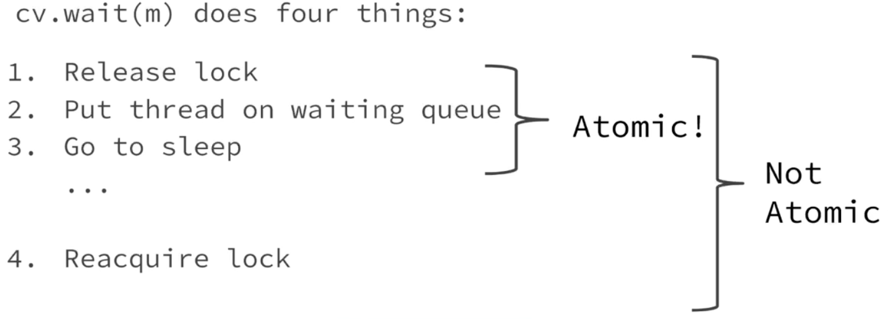

CV: atomically unlock 和 sleep, 然后让其他 threads do stuff, 等到被叫醒再 reacquire lock. 



(while 循环下, 直到条件被真的满足, 不然一直循环这件事)


## Monitor programming 的 template

```c++
lock();

while (!stop_condition_1) {wait;}
// now have lock again
do stuff
signal/broadcast anyone who cares about what we do
  
while (!stop_condition_2) {wait;}
//now have lock again
do stuff
signal/broadcast anyone who cares about what we do

//...

unlock();
```

既要考虑什么情况自己应该 wait, 也要考虑什么情况下对于同一个锁的别的 threads, 需要尝试叫醒它们.


monitor programming 的要点:

1. identify shared data 并 assign locks

2. identify 每个 thread 的 waiting conditions 并 assign CVs

   waiting 一定是 while 而不是 if.

3. 当 thread 改变 shared data 时, 时刻考虑其他 threads 是否关心这个改变, call `signal`, `broadcast` if 它们能够被允许继续.


### Monitor 练习: Pingpong

implementation 1: 

- 一个 pinger thread 和一个 ponger thread. 它们各一个 hit count.
- 两方的 hit count 都从 0 开始到 5 结束. 
- 两方的循环流程: 
  1. lock
  2. 把 turn 翻成自己的! (0/1)
  3. 自己的 count++
  4. signal 对方, 交出 lock 让对方来, 一直等到对方翻 turn (说明对方已经 get lock 并且打完了)
  5. unlock

implementation 2:

使用同一个函数做两个 thread, 只不过 take in 一个参数 0/1 表示是 pinger 还是 ponger. 基本和上面的一样.


这里的关键就是: 

1. 考虑对方. 一定要 signal. 不然对方醒不来.

2. 一定要在自己翻了 turn 之后 (表示自己已经打完了), 再 signal 对方. 

   这里虽然有 while, 但是其实很脆弱, 和 if 根本没区别. 因为这里是接力式的 signal 和 wait, 如果自己 signal 了对方, 对方醒过来发现 turn 还没有翻过来 (还是对方自己的 turn), 那么就会继续睡, 但是我们这里也已经睡了, 没有 signal 了, 那么程序就被迫结束了. 所以两方都只接一次 signal 就得醒. 


### Monitor 练习: Piano

shared data: 当前的 note

waiting condition: 

1. 对于 conductor 而言, 只有当前的 note empty, 自己才可以 conduct. 所以要等到 note empty.
2. 对于 pianoKey 而言, 只有当前的 note 是自己的 key, 自己才可以演奏. 所以要等到自己的 note.


Implementation: 

conductor 的意义是什么? 是读取 key! 

我们不能让 pianoKey thread 在运行完后自己读取 key 然后 signal 这个 key 对应的另一个 pianoKey. 因为万一下一个 key 也是自己呢? 那 lock 就死了. (自己在 waiting, 没有人会叫醒自己).

所以我们才需要 conductor! 我们可以 keep invariance: 每次 pianoKey 演奏完都把 currentNote 设置为空(Na), 然后叫醒 conductor!

这样, conductor 在读取完整个文件前都是读一次然后叫醒一个键然后自己被叫醒继续读, 保持了 conductor - somekey - conductor - somekey - .... 的循环.

这样就轻松完成.


这里的关键点：

1. pianoKey 的任务就是 play，conductor 的任务就是读. 

2. 每个 pianoKey 都要分配一个 cv! 这是为了效率.

   其实, 也可以所有人共用一个 cv 或者所有 pianoKeys 公用一个 cv. 但这样效率就变低了.


## correctness checker: automated testing

我们不能总依赖 gdb 进行 debug. 

这不仅是因为有些 bugs gdb 是弄不出来的, 而且因为: 

multithread 的程序是 non-deterministic 的. 我们得应对不同情况.

也就是说, 我们得进行 macro 的 testing: 运行大量次数并统计结果. 


即便不是 multithread 的 program, 其实我们也要做这种 testing (regression testing), 可以一次跑多个 test cases (一个suite) 来测试准确性.


我们要使用一个 scripting language 来做它. 比如 python.

1. batch run 我们的 test suite.
2. 对于每个 test case 的每次 run, 都要检查输出结果: 是否有违背 interface 的? (比如 pingpong: ping 之后要接 pong 不可以连续两个 ping; 一共需要 10 次, 次数不可以变)
3. 统计运行结果 (比如 pingpong: 应该有且仅有两个结果, pingpong 和 pongping 五下)


### pingpong 的 correctchecker

```python
def checker(filename):
    state = "start"
    ping_count = 0
    pong_count = 0
    with open(filename, 'r') as file:
        for line in file:
            if line == "ping\n":
                assert (state == "start" or state == "pong")
                state = "ping"
                ping_count += 1
            elif line == "pong\n":
                assert (state == "start" or state == "ping")
                state = "pong"
                pong_count += 1
            elif line == "No runnable threads. Exiting.\n":
                # ignore infra line
                pass
            else:
                print("Invalid line:" + line)
                return
assert (ping_count == 5)
assert (pong_count == 5)
print ("All correct !")
```


### more automated testing: 自动生成 test cases (接自动 run 和 verify)


```python
import random
import os
# run pizza and collect output
customers = ""
options = ["customer.in0", "customer.in1", "customer.in2", "customer.in3", "customer.in4"]
# choose a random mmber of customer input files
for _ in range(random.randint(1, 10)):
    customers += options[random.randint(1, 4)] + " "
# choose a randon number of drivers
num_drivers = random.randint(1, 100)
# run pizza
os.system(f"./pizza {num_drivers} {customers} > output.txt")
print(f"Running ./pizza {num_drivers} {customers} > output.txt")
# read ourput
f = open("output.txt", "r")
lines = f.readlines()
f.close()
```


## p1 的 correctness criterion

- Driver must be ready before being matched
- Driver must be matched before driving
- Driver must have arrived before customer pays them
- Driver must be paid before being ready
- Driver must be ready after being paid
- Driver must match with closest customer
- Customer must request pizza before being matched
- Driver must drive to matched customer
- Customer must pay matched driver
- Only matched customers and drivers should interact


tips: 

1. All of section 3.5 :)
2. "You may not assume anything about the order in which contending threads acquire the mutex."
3. "threads may awaken spuriously" (cv wait)
4. "Threads may run at arbitrary speeds; you may not assume anything about their relative speeds."
5. "Any thread may announce that a customer and driver have been matched by calling match."
6. "A customer thread ends when all its requests have been completed. A driver thread never ends -- a driver's job is never done, and drivers never run out of pizza!"
7. "Driving is a slow operation, so any number of drivers must be able to execute drive at the same time."
8. "plus 3 bonus feedbacks over the duration of this project."

