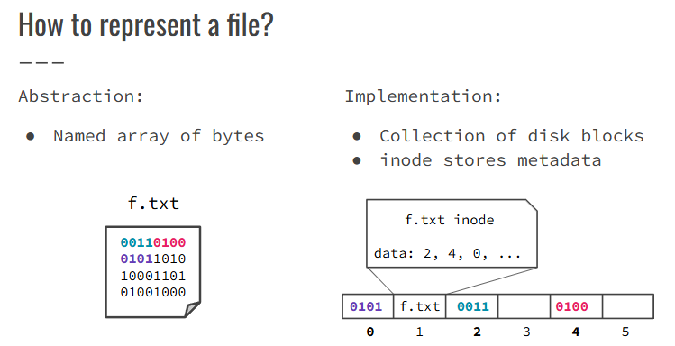
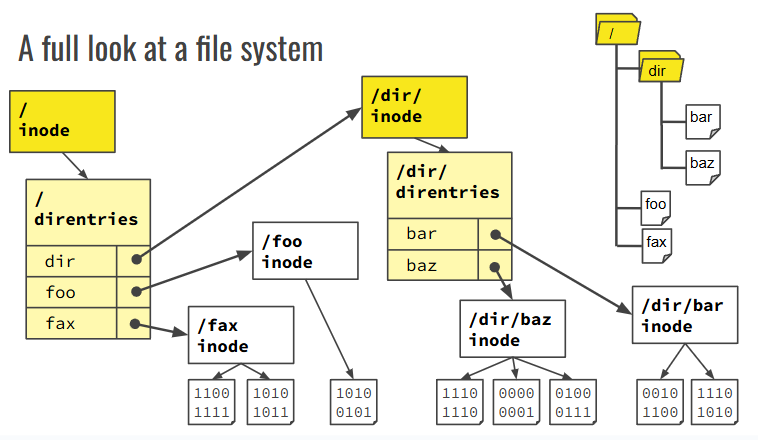
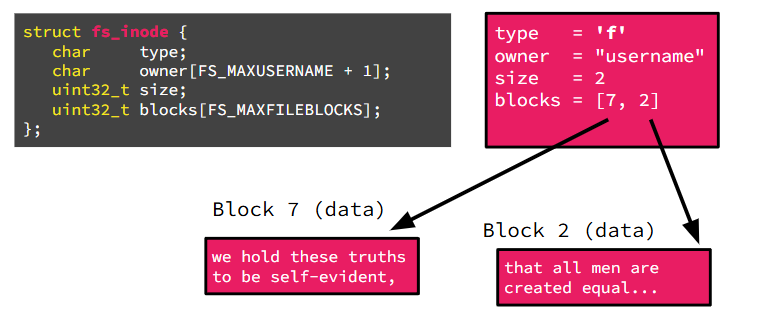
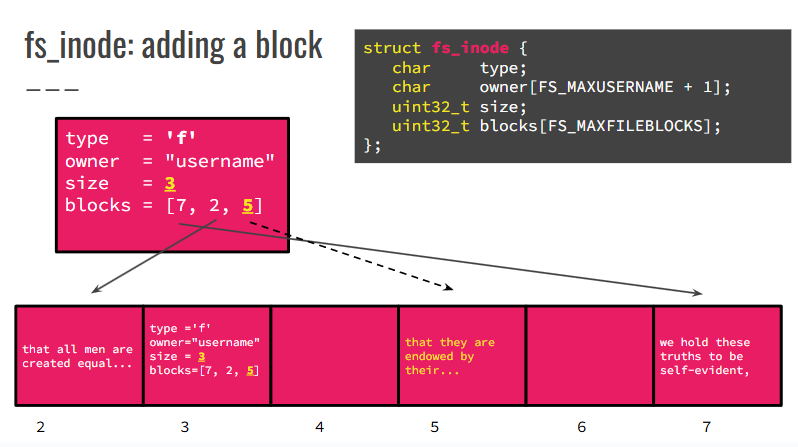
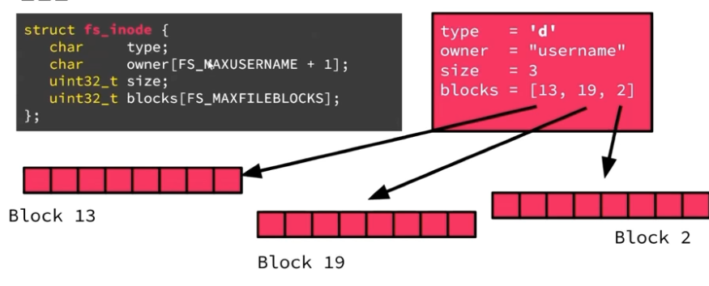
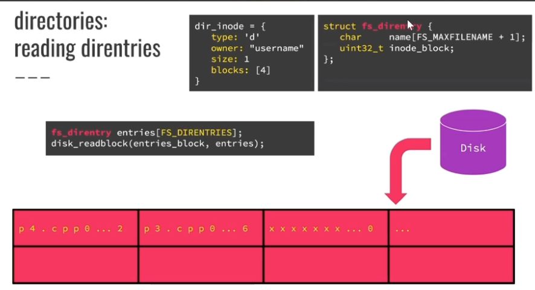
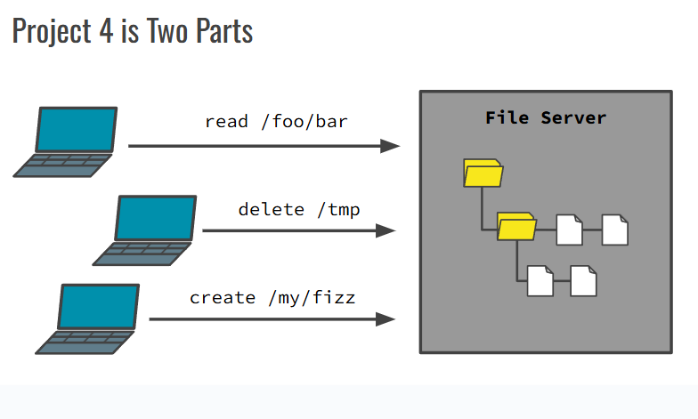
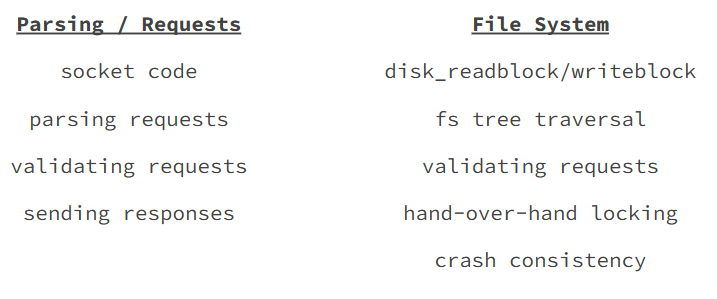
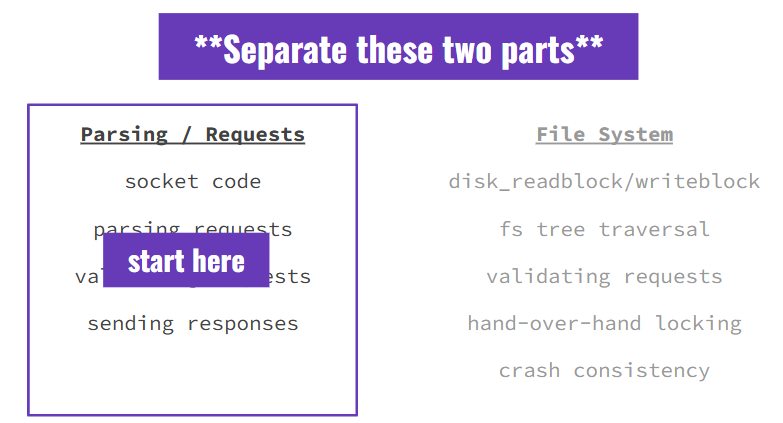

## review file system

在 linear structure (ram) 中表示一个 hierarchy (tree) 的方法: pointer (disk block number)





### file system 层级结构




### inode struct

#### file inode 的例子



添加一个 block:



```c++
fs_inode inode;
disk_readblock(x, &inode);
```


#### directory inode 的例子



问题：一个 data block 里可以放多少个 entries of directory data? 

```c++
struct fs_direntry {
   char     name[FS_MAXFILENAME + 1];
   uint32_t inode_block;
};	//64B

static constexpr unsigned int FS_BLOCKSIZE = 512;
static constexpr unsigned int FS_MAXFILENAME = 59;
```

一个 fs_directory 就是 directory data 中的一个 entry.

**一个 data block 里正好可以放 8 个 fs_directory (name, inode_block) 的信息！**

注意：我们分配 block 的时候是一个 block 一个 block 分配的，这代表每次我们都会分配 8 个 enties，对于 directory 的 data block 而言。

但是 entries 的数量不总是 8 的倍数。因而每次分配新的 block （当有一个新的 entry 诞生时），我们都需要把新 block 的其他的 7 个 entries 的 inode_block 设置为 0.





### 问答

#### 问题 1：要读取 `/etc/passwd` 的第一个 block，我们至少&至多要读取多少个 blocks into memory？


min:

1. 读取 `/` directory 的 inode (0)
2. 读取 `/` 的 data, 直接在第一个 block 找到 `etc` 的对应 inode
3. 读取 `/etc/` 的 inode
4. 读取 `/etc/` 的 data, 直接在第一个 block 找到 `passwd` 的对应 inode
5. 读取 `passwd` 的 inode 
6. 读取 `passwd` 的第一个 block

所以是 6 个.

最多则是：两次都在最后一个 block 找到对应 inode，所以是 4 + 2*MAX_BLOCKS


#### 问题2：Caching

- 文件系统中唯一的文件是 `/bigfile`
- `/bigfile` 是一个大小为 4 blocks 的普通文件（`type='f'`, `size=4`）
- 根目录 `/` 的 inode 永远存在于 block `0`
- 每个目录的 data 是若干个 `fs_direntry`
- 一个 block 可容纳 8 个 `fs_direntry`
- 每个 inode 正好占一个 block
- 每个文件或目录的 data blocks 在 inode 的 `blocks[]` 里按顺序列出


B1. **画出 /bigfile 在磁盘上的布局**

我们要表示的内容有：

- inode of `/` （block 0）
- inode of `/bigfile`（占一个新块）
- `/` 目录的数据块（一个 block，包含一个指向 `/bigfile` 的 `fs_direntry`）
- `/bigfile` 的 4 个 data blocks

**磁盘块布局：**

| Block # | 内容                                            |
| ------- | ----------------------------------------------- |
| 0       | inode of `/`（root）                            |
| 1       | data block of `/`（包含 `bigfile` 的 direntry） |
| 2       | inode of `/bigfile`                             |
| 3       | data block 0 of `/bigfile`                      |
| 4       | data block 1 of `/bigfile`                      |
| 5       | data block 2 of `/bigfile`                      |
| 6       | data block 3 of `/bigfile`                      |

```
         [0] inode /
         └── blocks[0] = 1
             ↓
         [1] fs_direntry: name = bigfile, inode_block = 2

         [2] inode bigfile (type = 'f', size = 4)
         ├── blocks[0] = 3
         ├── blocks[1] = 4
         ├── blocks[2] = 5
         └── blocks[3] = 6

         [3] data block 0 of bigfile
         [4] data block 1 of bigfile
         [5] data block 2 of bigfile
         [6] data block 3 of bigfile
```


B2. **读取 offset 1（block 1）需要多少次磁盘访问？**

我们假设：**没有任何缓存**，一切从 0 开始。

步骤：

1. 从 block 0 读根目录 inode → 1 access
2. 从 block 1 读目录数据 → 找到 `/bigfile` 的 direntry → 1 access
3. 从 block 2 读 `/bigfile` 的 inode → 1 access
4. 从 block 4 读 `/bigfile` 的第 1 个 data block（offset 1）→ 1 access

✅ **合计：4 次磁盘访问**


B3. i) **读取 offset 2（即 data block 2）的访问次数？（无缓存）**

和 B2 类似，只是读取的是 block 5：

1. block 0: inode /
2. block 1: / 的 data block
3. block 2: inode of `/bigfile`
4. block 5: data block 2

✅ 也是 **4 次磁盘访问**


ii) **如果我们已经缓存了所有内容（包括所有 inode 和数据块）？**

- 缓存了 inode `/`
- 缓存了目录 data block
- 缓存了 `/bigfile` 的 inode
- 缓存了所有 4 个 data block

那么：

✅ **读取 offset 2 → 0 次磁盘访问**


🔵 B4. **创建新目录 `/foo` 需要分配几个新 block？更新图**

创建目录 `/foo` 涉及：

1. 创建一个新的 inode block（`foo` 的 inode） → 1 block
2. 分配一个 data block 给 `foo`（哪怕是空目录） → 1 block
3. 在根目录 `/` 中新增一个 entry：`foo`
   - 当前目录 data block （block 1）只有 1 个 entry，还有 7 个空位 → 不需要新 block

✅ 总共 **2 个新磁盘块**

**新增块：**

| Block # | 内容                 |
| ------- | -------------------- |
| 7       | inode of `/foo`      |
| 8       | data block of `/foo` |


🔵 B5. **创建新文件 `/foo/bar` 需要分配多少新 block？更新图**

`/foo/bar` 是一个新文件 → 涉及：

1. inode block for `bar` → 1 block
2. 在 `/foo` 的目录数据中创建一条 entry → 看情况：
   - `/foo` 的 data block（block 8）当前是空的 → 可复用 → 不需要新增
3. `/bar` 的文件数据暂时没有 → 所以 **不需要数据块**（直到写入）

✅ 总共 **1 个新磁盘块**

**新增块：**

| Block # | 内容                |
| ------- | ------------------- |
| 9       | inode of `/foo/bar` |


## p4


client + pre-existing FS 是 test cases

server 是 implementation


要做的

- 包括了 server networking 与 FS 处理的 int main









### parsing 的 tips


- The request header is null-terminated. The body is not.
  - This changes how you do your recv() calls.
- Make use of strings and stringstreams.
  - Don’t worry about raw performance if it jeopardizes possible correctness or readability.
- **Unit test** your parsing code to catch bugs.
  - i.e., call your functions directly in some C++ program
- **Note:** there is only one correct input format, but many incorrect
  - It is easier to check if something is correct than if it is incorrect


p4 中要用：`stringstream`

```c++
// istringstream denotes an input stringstream
std::istringstream iss("  Alice \t\t\t\t\t    Bob \n\n\n   Carl  ???    :) ");
std::string str1, str2, str3;
iss >> str1 >> str2 >> str3;
std::cout << str3 << ' ' << str2 << ' ' << str1; // prints "Carl Bob Alice"
```


### 下载 boost

```sh
sudo apt update
sudo apt upgrade
sudo apt-get install libboost-all-dev
```


- Boost 头文件目录：`/usr/include/boost/`
- Boost 库文件目录：`/usr/lib/x86_64-linux-gnu/`


因而直接:

```shell
export CPLUS_INCLUDE_PATH=/usr/include
export LIBRARY_PATH=/usr/lib/x86_64-linux-gnu
export LD_LIBRARY_PATH=/usr/lib/x86_64-linux-gnu
```

