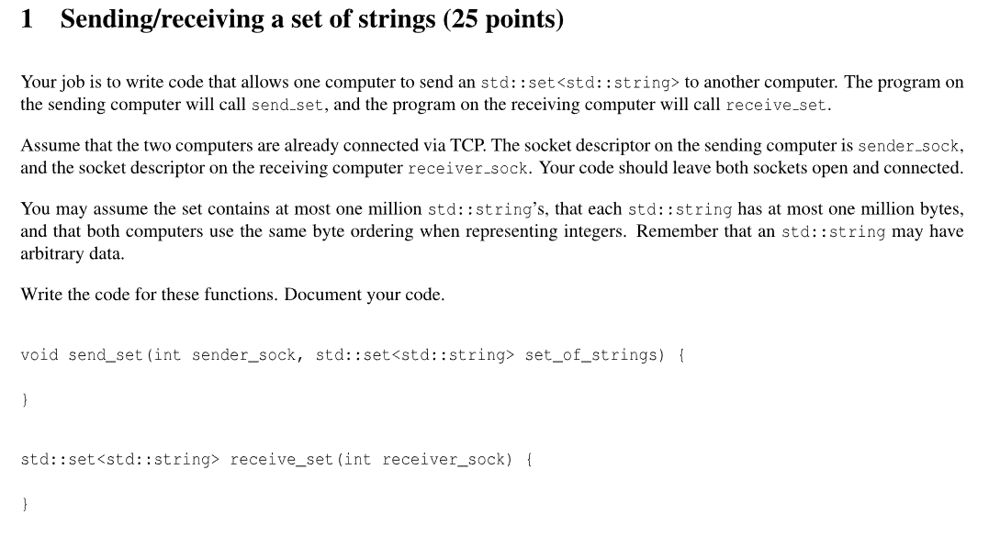
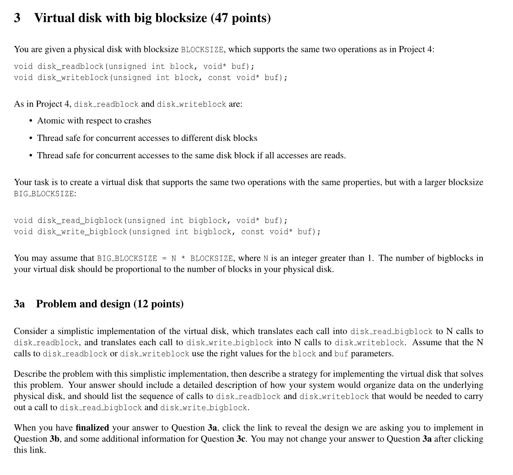
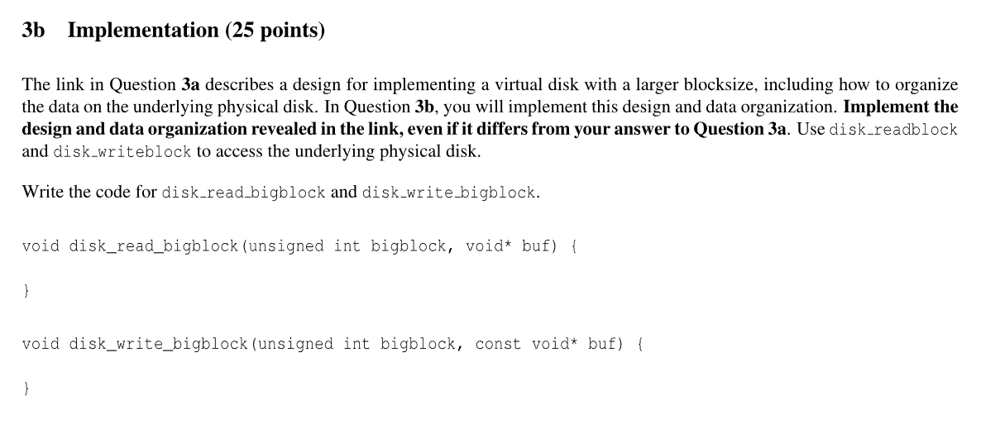
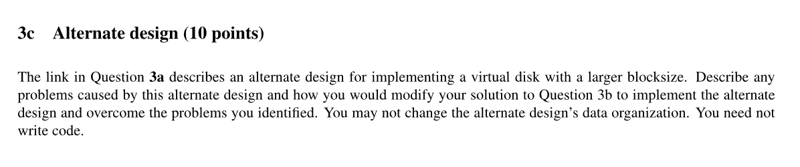
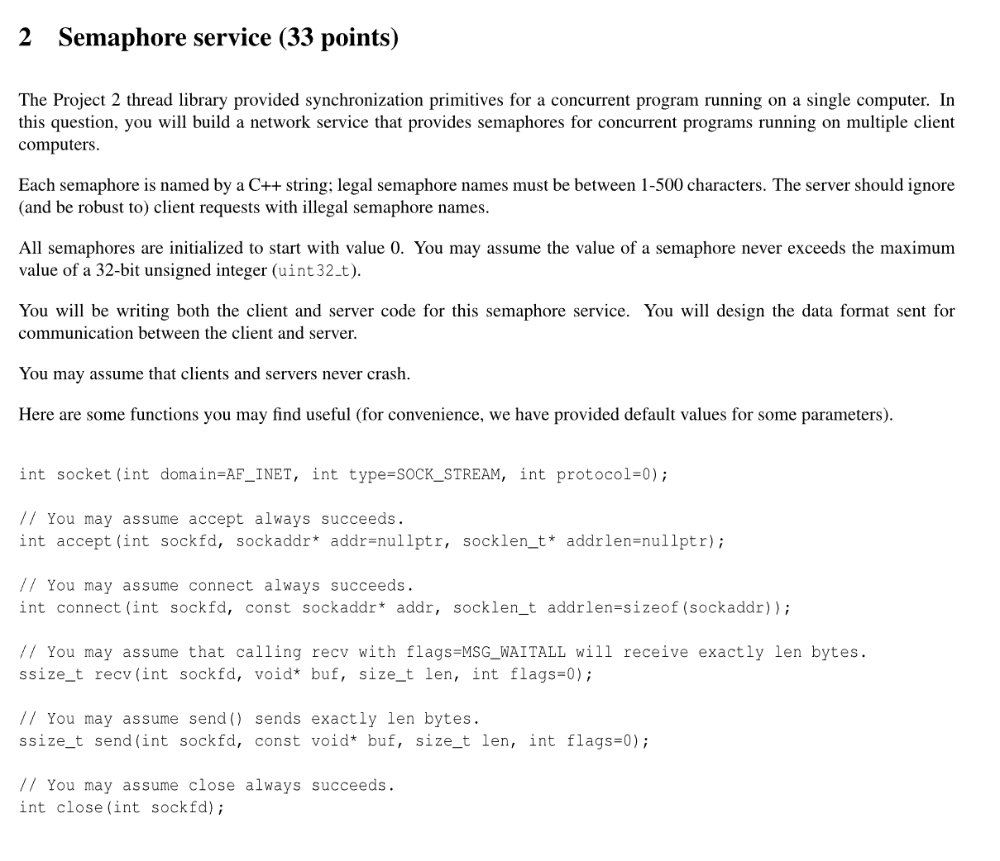
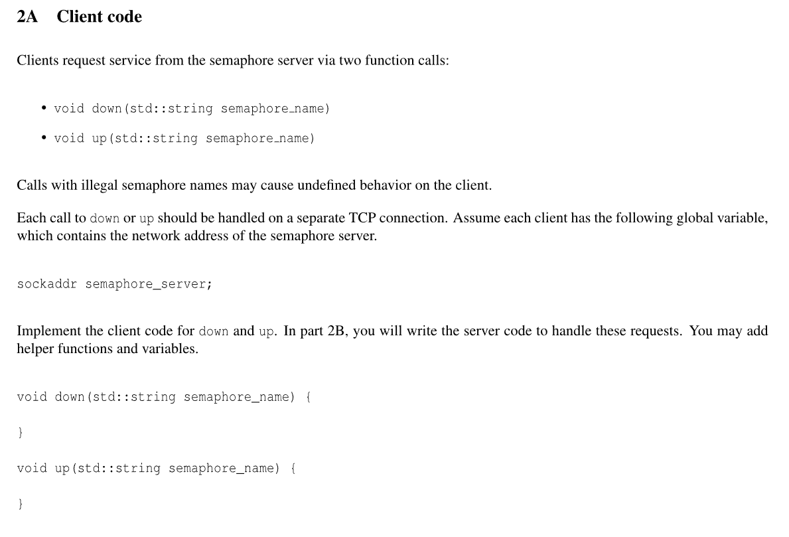
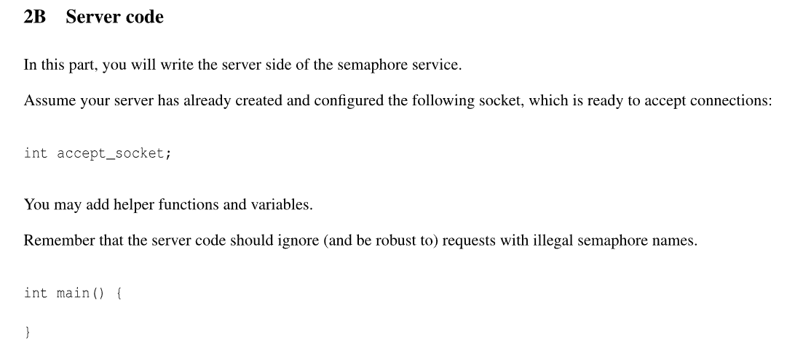
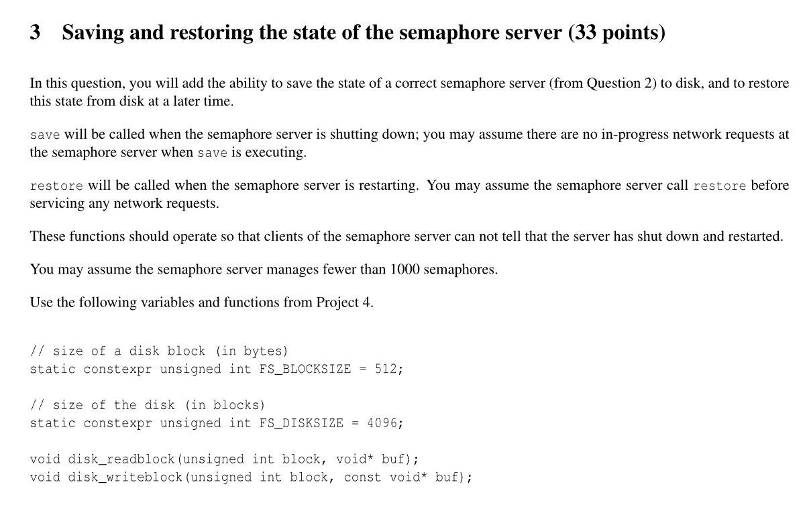
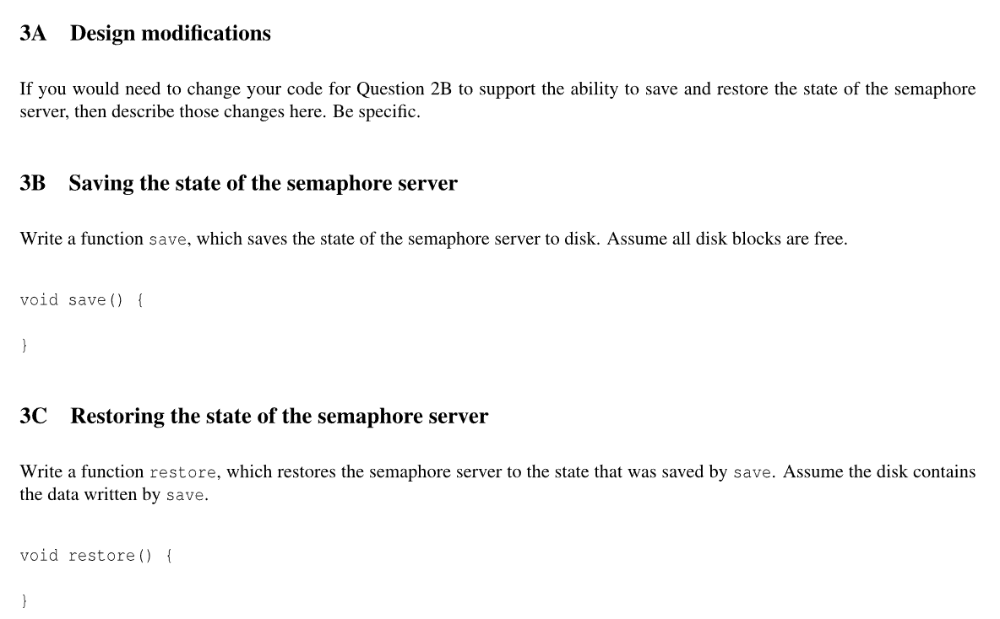

```c++
void helper_send(int sock, void* buf, int size) { 
	int bytes_sent = 0;
	while (bytes_sent < size) {
		bytes_sent += send(sock, char*(buf) + bytes_sent, size - bytes_sent);
	}
}


void send_set(int send_sock, std::set<std::string> set_of_strings) {
	int count = set_of_strings.size();
	helper_send(sender_sock, &count, sizeof(count));
	for (auto &s : set_of_string) { 
		int size = s.size();
		helper_send(sender_sock, &size, sizeof(size));
		helper_send(sender_sock, &s.data(), size);
	}
}

std::set<std::string> receive_set(int receiver_sock) { 
	int count = 0;
	// 先收一个 count
	recv(receiver_sock, &count, sizeof(count), MAS_WAITALL);

	std::set<std::string> out{};
	// 然后对于每个 string, 收它的 size 和 内容
	for (int i = 0; i < count; ++i) { 
		int size = 0;
		recv(receiver_sock, &size, sizeof(size), MSG_WAITALL);
		string s(size, 0);
		recv(receiver_sock, s.data(), size, MSG_WAITALL);

		out.insert(a);
	}

	return out;
}
```




```c++
unsigned int calculate_start(unsigned int bigblock) {
	return bigblock * (2*N + 1);
}


void disk_read_bigblock(unsigned int bigblock, void* buf) { 
	// read version
    unsigned start = calculate_start(bigblock);
    char version[BLOCKSIZE];
    disk_readblock(start++, version);
    
    if (version[0] & 0x1) { 
		start += N;
    }
    
    // read the bigblock
    for (unsigned int i = 0; i <  N; i++) { 
		disk_readblock(start+i, ((char*) buf) + i*BLOCKSIZE);
    }
}


```








### semaphore service






```c++
void send_request(char op, std::string semaphore_name) { 
	int sock = socket(AF_INET, SOCK_STREAM, 0);
    connect(sock, semaphore_server, sizeof(sockaddr));
    
    // send op
    send(sock, &op, 1);
    
    // send length of string
    uint32_t name_len = semaphore_namae.size();
    
    char result;
    recv(sock, &result, 1);  
}

void down(std:string semaphore_name) {
	send_request('d', semaphore_name);
}
```





```c++
map<std::string, share_ptr<semaphore>> semaphores;
mutex map_lock;

void handle_conn(int sock) { 
	// recv operation
    char op;
    recv(sock, &op, 1, MSG_WAITALL);
    
    // recv length of sem name;
    unsigned int name_len;
    recv(sock, &name_len, sizeof(name_len), MSG_WAITALL);
    name_len = ntohl(name_len);
    
    if (name_len <= 500) {
		// recv sem name
        std::string semaphore_name(name_len, 0);
        recv(sock, semaphore_name.data(), name_len, MSG_WAITALL);
        
        map_lock.lock();
        if (!semaphores.contains(semaphore_name)) { 
        	semaphores[semaphore_name] = make_shared<semaphore>();
        }
        shared_ptr<semaphore> sem_ptr = semaphores[semaphore_name];
        map_lock.unlock();
        
        if (op == 'u') { 
        	sem_ptr -> up();
        } else if (op == 'd') { 
			sem_ptr -> down();	
        }
    }
}


int main() { 
	while (true) { 
    	int sock = accept(accept_socket, nullptr, nullptr);
        thread(handle_conn, sock).detach();
   	}
}
```





