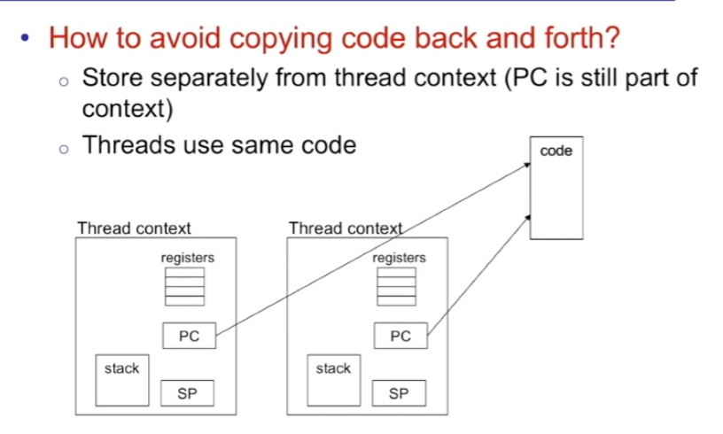
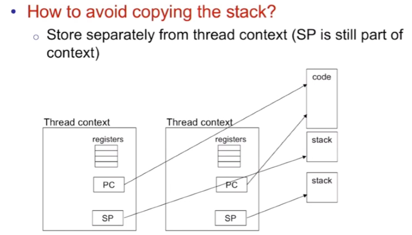
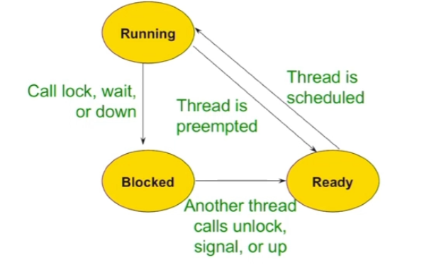

## semaphores v.s. monitors

recall: 

1. 一个 monitor 就是一个 mutex lock + 它的 concerned condition variables, 作为一种 synchronization family 实现 synchronization
2. 而 semaphores 是另一种 synchronization family, 通过一个巧妙的方式来同样实现 mutual exclusion 和 ordering (synchronization)

monotor 和 semaphores 是两种不同但是有交汇之处的 synchronization families! 


我们分别对比 mutex 和 semaphore 对 mutual exclusion 的实现, 以及 condition variable 和 semaphores 对于 ordering 的实现:


### Mutual Exclusion: mutex v.s. semaphore

| Mutex                                          | Semaphore                                  |
| :--------------------------------------------- | :----------------------------------------- |
| `mutex m`                                      | `semaphore m(1)`                           |
| `m.lock(); /*<critical section>*/ m.unlock()`; | `m.down(); /*<critical section>*/ m.up();` |

根本上一模一样.


### Ordering: condition variable v.s. semaphore

`wait` 层面: 

| Condition variable                                        | Semaphore                                                    |
| :-------------------------------------------------------- | :----------------------------------------------------------- |
| `while (condition) {wait(m)}`                             | `down ()`                                                    |
| Waiting condition is in user code and uses user variables | **Waiting condition is in semaphore code and uses semaphore's value** |
| Waiting condition defined by user **(more flexible)**     | Waiting condition defined by semaphore **(wait if semaphore value==0)** |
| User variables are protected by mutex                     | Semaphore's value is protected by `up()`, `down()`           |
| **Must hold lock** when calling wait                      | **Must not hold "lock"** (semaphore) when calling down() for ordering |

我们发现 condition variable 对 ordering 的管理, 要比 semaphore 简单, 灵活.

`signal` 层面:

| Condition variable         | Semaphore               |
| :------------------------- | :---------------------- |
| No memory of past signals: | Remembers past up calls |

意思就是: cv 而言, 如果没有在 `wait` 的 threads, 那么 `signal` 就 do nothing; 但是对于 semaphore 而言, 它的每一次 `up` 和 `down` 都改变了 semaphore value, which 会影响临界点 (0)


总结: Semaphores work best if the shared integer and waiting condition (value $==0$ ) **map naturally to problem domain**！

否则用 cv 更好.


### 用 semaphore 来实现 condition variable

cv, 就是一个 place for threads to wait, 一个 set of waiting threads.


我们已经 (轻松地) 用 semaphore 实现了 mutex. 那么我们是否可以用 semaphore 来实现 cv 呢?

我们可以用一个 set of (ptrs to) semaphores 来做:

`wait` 和 `signal` :

- To `wait`, create a `semaphore(0)`, add the semaphore to the waiting set, then call `down()` on it
- To `signal`, call `up()` on the waiting thread's semaphore


```c++
mutex cokeLock(1);
cv waitingConsumers;
cv waitingProducers;
```

转化为:

```
sem cokeLock(1):
set<sem*> waitingConsumers;
set<sem*> waitingProducers;
```


Consumer:

```c++
cokeLock.lock();
// <>
while (numCokes == 0) {
	waitingConsumers.wait(cokeLock);
}

numCokes--;
waitingProducers.signal();
// <>
cokeLock.unlock()
```

转化为:

```c++
/*
sem cokeLock(1):
set<sem*> waitingConsumers;
set<sem*> waitingProducers;
*/

cokeLock.down();

while (numCokes == 0) {
    sem s(0);
    waitingConsumers.insert(&s);
    CokeLock.up();
    s.down();
    CokeLock.down();
}

numCokes--;

if (!waitingProducers.empty()) {
    waitingProducers.begin()->up();
    waitingProducers.erase(
        waitingProducers.begin());
}

cokeLock.up();
```

`cokeLock` 完全当成 mutex 用就可以. 

这里有点像我们之前用 busy waiting 实现的 waiting on condition (使用 `s.down()` 代替了 busy waiting, 其实是差不多意思)

另一方运行后, 会 call 本方 waiting set 的最前元素的 `up` 使本方被卡在 while 循环中的 `s.down()` 可以被解开, 从而顺利运行下去. 

Producer 同理.


## thread state intro

### pasuing a thread: 不会影响正确的 concurrent program

我们知道: A thread is a sequence of executing instructions

那么什么是一个 non-running thread?

- 一个 non-running thread 就是一个 paused execution!

问题：Can pausing a thread break a correct concurrent program?

回答是：如果是 literally "正确的" concurrent program, 那么 **pausing a thread 是不会 break 它的!**

RECALL: Def of "正确的 concurrent program". 

我们的 assumption about threads: 每个 thread 都有自己的 processor, of unpredictable speed.

但是这显然, 物理上是不可能的. 物理上我们只有固定数量的 cpus. 实际上这个 assumption 是一个更加广泛的条件. (实际上根据不同的调度算法, cpu 会经常切换 threads 运行, 因而安全的做法是在这个广泛的 assumption 下程序也能保证正确 -> 那么程序在 cpu 不断切换 threads 的情况下一定也能运行正确, 这是一个充分条件!)

因而正确的 concurrent program 就是在 **"每个 thread 都有自己的 processor, of unpredictable speed" 的情况下还可以正确运行的 concurrent program.**


那么如何 pause a thread 然后之后 resume it 呢?


### thread context

这里的每个 thread context 都对应了一个 thread 当前的状态, 其中 PC 表示代码运行到哪一行, SP 表示 stack 顶现在的位置. 


CPU 只有一个 PC (Program Counter), 因而一次只能 run 一个 thread!

当一个 thread 进入运行时, thread context 会被 CPU 运行, CPU 上的 PC, SP, regs 会复制 thread context 的内容! 


当一个 thread 被 paused 的时候, 它们的 state 被储存在 memory 里. 

("processor" 和 "core" 是同一个意思, 不过我们用 "processor" 更多一点. "core dump" 的意思就是程序崩溃的时候, cpu memory 的状态, 即各 threads 的 thread context) 


### Optimizations of thread context: code, stack excluded

实际上: **所有 threads 都具有相同的 text segment (code) ! 只不过, 所有 threads 的 PC 的初始位置不同 (运行不同的函数)**

因而 copy context 的时候, 我们不会 copy code




至于 Stack: 每个 thread 具有不同的 stack. 这是当然的. 

但是, 如果我们每次 copy thread context 都要 copy stack back and forth 那也太大量了. 因而 optimization  之后的设计是: 我们把每个 threads 的 stack 直接堆在公共区域, thread context 只需要用 SP 记住自己的 stack 位置就可以了.



从而, thread context 只需要记得 reg values, PC 和 SP 即可 (PC 和 SP 本身也算特殊 regs)


问题: stack 是会 grow 的, 被放在更底部的 thread 的 stack grow 了怎么办?

答: thread library 对于每个 thread 都会分配一个固定大小的 stack, 是在 OS 中被固定好, 在 compile time 就被分配好的. 而对于 C++ 的 `pthread` library 而言, 我们可以在编程时对特定 pthread 自由设置 preserved 的 stack 的大小, 从而让这个 thread 运行 stack 会很深的函数.

| 问题                            | 回答                                              |
| ------------------------------- | ------------------------------------------------- |
| 每个 thread 有自己的 stack 吗？ | 是的，互相独立，私有                              |
| Stack 是固定大小的吗？          | 是的，在创建线程时分配固定大小（如 64KB）         |
| Stack 会自动增长吗？            | 通常不会，尤其在用户线程库中                      |
| 栈大小相同吗？                  | 可以不同，但实际中常设相同以简化实现              |
| 如果 stack 满了？               | 会 stack overflow，崩溃或被 OS 杀死               |
| 为什么不能动态增长？            | 因为 stack 是连续的，搬动它破坏 context，难以维护 |

这样就是更加成熟的 thread context 了


### thread 的三个 states

Two perspectives when sharing a processor:

- Thread (1) view:

  Running $\rightarrow$ Paused $\rightarrow$ Running

- CPU view: 

  Thread 1 $ \rightarrow$ Thread 2 $\rightarrow$ Thread 1 

从一个 thread 自己的角度而言, 是它从 running 到被 pause, 再恢复 running, 由此往复

从 cpu 的角度而言, 它要在多个 threads 之间切换, 一个 cpu 同一时间只能 run 一个 thread, 因而切换时当前的 thread 就被 pause 了.


具体地:

一个 thread 有三种状态: running, blocked 和 ready

blocked 和 ready 的区别是: blocked 是被 lock / down 阻塞或在 waitlist 中; 而 ready 则是, 这个 thread 已经是 free 了, 正在等待被 schdule 

一个 thread:

1. blocked -> ready: 在某个条件发生后, 它进入 ready queue (ex: 另一个 thread `unlock`, `signal` 或者 `up` 了等等), 等待被 schedule; 

2. ready -> running: 在 ready queue 中排到被 schedule, 于是 running.

3. running -> blocked: 在 running 中, call 了 `lock` 而另一 thread 正 hold the lock; 或者 `wait`, `down` 等等. 重新被上锁, 从而重新被 blocked; 

   running -> ready: 要么是被抢占 (preempted, 出现在抢占式调度中), 指时间片到了被 os 中断; 要么是运行完了一小段逻辑后主动让出 cpu (`thread::yield`).



我们发现有两个路是不通的:

1. **blocked 的 thread 不会直接进入 running, 一定要先在 ready 状态排 ready queue**

2. **ready 的 thread 不会重新被 block, 一定是先进入 running 然后发现一上来就行不通所以重新被 block.**

   这种情况其实很常见: 比如一个 waiting thread 被 signal 了并且成功被 schedule, 占到了 cpu; 但是刚刚运行第一行 (while 判断条件) 发现条件又无了, 于是还得重新 wait.

thread info (context) 被存储在 thread control block (TCB) 这一 struct 里.

