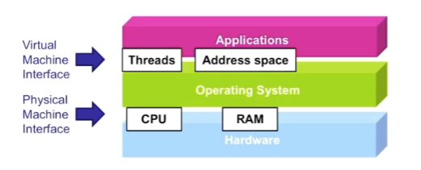
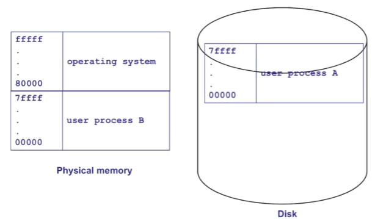

## deadlock

### deadlock prevention (continued)

上次我们讲到 deadlock 发生的四个 necessary conditions:

- limited resources

  如果资源无限, 那么根本不用 waiting for resources

- no preemption

  **有 preemption 就不会有 indefinite waiting**, 因为我们可以 force threads to give up resources.

- hold and wait

  deadlock 的一个前提就是: 某个 thread **wait while holding resources** 了

  如果都像 cv.wait 一样, 在 go to sleep 前 release 自己 hold 的 resource, 那么就不会有 deadlock

  图论上, no hold and wait 就不会有 multi-edge path in wait-for graph

- cycle of hold-wait request

  hold and wait 本身也未必会导致 deadlock, 而是伴随着这个事件: **两个 hold and wait 的 thread 套娃 (cycle) 了, wait 的是彼此 hold 的资源.**


第一个是资源本身的性质, 和我们干涉没关系.

第二个是 os 应该有的 (但也只能解决 preemptable 的资源的 deadlock 问题)

第三第四个则是 concurrent program 自己的 implementation 的问题, 下面展开.


continued 上次:

如何 eliminate hold and wait? 


#### eliminate hold and wait

##### first step: 把 acquire 资源和 work 分开来

我们要避免 hold and wait, 当然是 literally **不要在可能持有资源的时候 wait (acquire 资源)**

所以第一步, 当然是把 acquire 资源和 work 分开来。不要 work 一会儿, acquire 资源一会儿

像这样的肯定是不行的:

```c++
while (!done) {
	acquire some resource
	work
}
release all resources
```

而是应该, 在 thread 的开头就 acquire 全部需要的资源

corrected:

```c++
// phase 1
acquire all needed resources
// phase 2
while (!done) {
	work
}
// phase 3
release all resources
```


##### second: (option A) atomically acquire 所有的资源

光是把 acquire 资源和 work 分开来, 还不能解决问题. 因为: 我们 acquire 资源并不是 atomic 的. 可能 **acquire 到一半, 和别的 thread deadlock 了 (正好 hold 到了别人需要的资源, 并 acquire 了别人持有的资源)**

因而, 我们还需要第二步. 

option A 就是把 acquire 资源这一步变得 atomic

```c++
L.lock()
// <>	acquire
while right chopstick busy or left chopstick busy
    cv.wait (L)
pick up right chopstick
pick up left chopstick
L.unlock()
// <>
  
// eat...
  
L.lock()
// <> release
drop left chopstick
drop right chopstick
cv.broadcast()
// <>
L.unlock()
```

但是, option A 虽然解决了 deadlock 这一问题, 却也保留了另一个问题: 虽然没有 deadlock, 但是可能有 starving.


比如, 下面这个例子: 


A 和 C 持续交替地 acquire, 那么 B 就永远不能吃到饭了.


所以我们还可以考虑 **option B: release and retry if you encounter a busy resource.**

这个 option 更加困难并且不具体, 这里不展开. 遇到具体情况再考虑


#### eliminate cycle of hold-and-wait

如何 eliminate cycle of hold-and-wait? 听起来和前面一个差不多但不是同一个意思.

eliminate cycle of hold-and-wait 就是: 可以允许 hold and wait (这样现实很多), 但是不允许多个 threads 有冲突的 hold and wait.

即, 如何从 wait graph 上去除掉 cycle wait 的情况.


##### define a global order over all resources

一种方法: 如题.

所有 threads 都必须 follow 这个顺序, when acquiring resources, 使得我们**能够 gurarantee 一些 threads 总是会 make progress**.

我们考虑这个 ex:


之前已经说了它会导致 deadlock.

但是我们换一换 lock unlock 的顺序, 


让至少一个 lock 在锁住后一定能够先解开. 这样就不会有问题了.


再比如刚才的 dining 问题: 如果我们 enforce sticks 的大小, 让任何人都 pick up lower sticks first, pick up higher sticks next:


(实际上就是对于 A-D 是一样的, 对于 E 他要先 pick up 自己右边而不是左边的 stick)

就解开了 deadlock! 


这个方法其实很有用: 重点就是保证总是有某个 thread 一定能 Make progress.

再看这个图: 


提问: 当前的时刻, 哪个 thread 一定可以 make progress? 

答案是 thread 3!

因为 thread 3 接下来只会去 acquire 比 R5 order 更高的 resources (R6, R7)

而这两个资源都没有人 hold

于是 thread 3 一定可以继续 make progress.


这些例子还是比较抽象的 (场景很具体, 但是 "ordering" 这个概念抽象)

实际上对于具体的场景我们要具体地做一个推导, 然后确定 "能够使得总有一个 thread 可以继续 make progress" 的 resource ordering.

比如, 如果我们需要使用多个 locks, 那么我们就要确定一个 acquiring locks 的顺序, 使得满足 "能够使得总有一个 thread 可以继续 make progress" 就像刚才的这个例子:


这个顺序是对的.


## address spaces

CPU 的 virtual equivalent: threads

RAM 的 virtual equivalent: address space



operating system 和硬件端的交互媒介就是 CPU 和 RAM, 

而 OS 利用 CPU 和 RAM, 把这些硬件资源封装为 application 端可用的虚拟的接口:  threads 和 address spaces

也就是说, OS 要做的事情(简化而言)基本就是 build threads 和 address spaces 这两个功能, 从而沟通硬件和 applications.


现在我们已经 done with threads. Let's move on to address spaces.


### process: threads in one unique address space

我们之前对 process 的了解是: process 就是 multiple threads.

其实, process = one / more threads in a unique address space.

就是说, 每个 process 都有自己的独立的 address space (text, stack, heap... segments). 它的本质是共享同一个 address space 的 threads 的集合.


(ex: p2 中所有的 threads 都共用一个 address space. 其实就是, p2 支持的一个 program 就是一个 process, 它的 thread 共享一个 address space.)


physical machine interface 是: 所有 jobs 共享 single memory, 但是 virtual machine interface 中每个 process 有自己的 own memory. (因而 one process per job, 由 OS 管理)


### address space abstraction

- **Address independence**: 多个不同的 address spaces 可以使用同一个 numeric address, yet refer to distinct data items. (address 都是 for ex 0-ffffffff, 只不过它们的同一个 numerical address 被映射到的其实是不同的物理 address)
- **Protection (controlled sharing):** one process can't access data in another process's address space. (这这个容易理解, 就是 processes 之间的数据未被允许不能共享, 共享的方式只能是 file-based sharing 等等)
- **Large address space**: address space for a process can be larger than physical memory (recall: 虽然物理 memory 有限, 但是首先我们多级地按需加载 page table, 只加载当前用到了的变量所在的 page tables, 把它放到物理层面; 其次硬盘可以作为扩展, 在 RAM 不足时可以把不活跃的 pages 放进硬盘)


#### uni-programming (×)

计算机早期的 uni-programming:

- 1 process occupies memory at a time
- Always load process into same spot in memory
- Reserve space for OS

这个情况下显然 virtual memory 就等于 physical memory. process view 和 hardware view 是一样的

这个时候如何 swtich process? 做法就是直接在 RAM 和 Disk 之间大块地切换 process




显然 uni programming 可以实现 Address independence 和 protection 但是不能实现 large address space

每个 process 的操作空间太小了.

况且, 它 switch context 太 expensive 了. just swtiching (large and multiple) threads.


因而我们需要 multi-programmming.

#### multi-programming (√)

multi programming 的核心就是允许多个 processes 同时 reside in physical memory.

同时, protection 和 address independence 也变得更困难.

为了提供 protection 和 address independence, 必须要 r**equire OS 去在每次 memory access 都做一些事情.**

这件事情称为 **dynamic address translation.**


### dynamic address translation: enables protection and address independence


MMU: memory management unit

MMU 将不同 process 的同一个 virtual address 翻译为不同的 physical address. 并且, 它在这个过程中需要保护 processes 不会 access 到其他 processes 的 data.

Note: **virtual address 只有在被 access 的时候才需要在 physical memory 里.** (demand paging)

```c++
int *arr = malloc(1000000 * sizeof(int)); // 分配了大约 4MB 空间
arr[0] = 1; // 只访问了第一页, 因而只有 4kb 被加载到 physical memory
```


translator 通常是作为 CPU 的一部分被 implement.

Translator uses translation data:

- Each process has its own translation data

- Changing address spaces = changing data used to translate a virtual address


Many ways (data structures) to implement translator, 它们各有优劣:

- Speed of translation
- Size of data needed to support translation
- Flexibility (sharing, growth, large address space)

