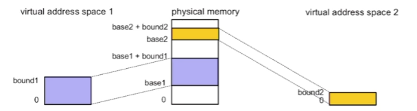
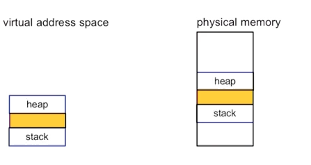
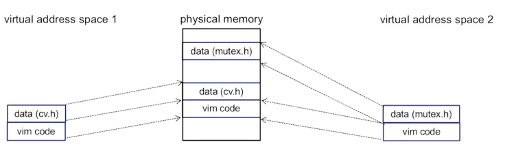

## address spaces

### MMU translation algorithms

#### base and bound

base and bound 就是: 把每个 process load 到一个单独的 contiguous region of physical memory 里.

我们需要在 processor 的 regs 里去取两个, 存储 base & bound 的信息

- base reg: 存储这个 region 的 starting physical address
- bound reg: 储存这个 region 的大小




##### algorithm


```c++
if (virtual address >= bound) {
    trap to kernel; OS kills process (segmentation violation)
        or retries access
} else {
    physical address = virtual address + base
}
```

switching address spaces 也很简单, 只需要 load 另一个 address space 的 base reg 和 bound reg 即可


pros and cons: 

base and bound 的好处是 fast and simple, 并且提供了 address independence 和 protection

但是还缺一点: 我缺的 large address space 这块谁补上来呢


##### con1: 无法实现 large address space (不灵活)

con1: large address space 之所以被需要 (即便 space 很大, 受到 physical space 的限制, 切换也很耗时) 并不在于性能, 而在于灵活性, 可扩展性, 抽象性. 庞大的 program 需要灵活的 RAM 布局.

而 base and bound 只能提供最多和 physical memory 一样大的 address space.


##### con2: 物理内存 swap 一整块太慢

con2: base and bound 的另一个缺点就是, 被分配的 address space (bound)很难 grow. 因为容易触到别人的 base. 这个时候我们只能在物理内存上移动其他的 address spaces, 导致很慢.


##### con3: 必须在 initialization 就预留完整的 stack and heap

con3: 首先思考如何 grow multiple regions? 

```
↓（低地址）
+-------------------------+
|       Text Segment      |  (代码，.text)
+-------------------------+
|       Read-Only Data    |  (.rodata，比如字符串常量)
+-------------------------+
|       Data Segment      |  (.data：已初始化全局变量)
+-------------------------+
|       BSS Segment       |  (.bss：未初始化全局变量)
+-------------------------+
|       Heap              |  (malloc/new分配，从低地址向上增长)
|       ↑                 |
|       ↑↑↑↑↑↑↑↑↑↑↑↑↑↑↑↑↑ |
|                         |
|    未使用的空间（空闲）  |
|                         |
|       ↓↓↓↓↓↓↓↓↓↓↓↓↓↓↓↓ |
|       ↓                 |
|       Stack             |  (局部变量/函数调用，从高地址向下增长)
+-------------------------+
|  Kernel Reserved Space  |  (用户态程序不可访问)
↑（高地址）
```

上面的 heap 是容易 grow 的, 但是下面的 stack 不太好 grow. 


首先 stack 不能往 heap 的方向 grow 然后移动 heap (改变 heap 的 virtual memory 的位置). 因为这个时候指向原来的 heap 里的变量的指针变量就会出现 bad access 问题.



因而, 办法只能是: 在一开始分配时就预留足够的空间. stack 和 heap 只能往相反的方向去 grow.

(PS: stack 和 heap 的 virtual memory 往相反方向 grow 是一个广泛的 virtual memory design, 因为 stack 和 heap 的地址由于是(user)指针变量的目的地, 它们的 virtual memory 肯定是不能乱动的, 因而为了它们必须往相反的方向 grow, 目的是一定保持变动已有的 pages 的 virtual memory 不变 

不过当然 physical memory 可以一直变, 反正由 translator 管理. 

有一个问题是, 就这样一直 grow 不去管的话它们有可能相撞, 所以 memory 设计里会对 stack 和 heap 分别设置 “最大大小限制”, 中间空出一段地址空间做 **缓冲区 (guard pages)**, 超出这块区域时，OS 会抛出错误，终止程序运行.)


所以说, 如果采取 base and bound 的设计的话, 那么我们对于一个 process 从 initialization 起就得预留全部的空间, which is large. 那么 physical memory 肯定不够用, 况且 swap 的代码太大


##### con 4: 没有 shared memory

我们也需要在不同的 processes 之间 share 一部分 address space (shared memory), 从而共享一些数据



我们想要像上图这样 share, 但是 base and bound 就做不到, 因为我们要求的 address space 是 contiguous 的.


##### con5: external fragmentation: 小 processes 结束时留下的空隙 fit 不进其他 processes (效率低)

假设一开始是这样的 (does not seems good for grow though)


现在 p2 结束了, 被清理


但是其他的 ready processes 的 address space 都更大一点, 融入不进去这个小空间,

因而这个区域只能等 p1/p3 好了之后再被利用. 效率很低.


#### segmentation

segmentation 就是把整个 address space 分成 multiple segments

一个 segment 是 continugous 的, both physically and virtually

但是一个 segment 的大小 varies. 同样也是分成 stack, data, code 等不同的类型


segmentation 是 base and bound 的改进, 虽然也是 base and bound, 但是不是把 address space 作为一整块来和 physical memory 映射, 而是各个 segments 分别映射.


##### design

在 segment 中, Virtual address 的形式是: 

- (segment \#, offset)

就是分几个 bits 来表示这是哪个 segment. virtual memory 映射到的 physical memory 是:

- Physical address = seg_info[segment \#].base + offset


How to specify the segment \#: 有以下几种不同的设计

- 直接通过 High bits of address. 
- cpu 使用 Special register 来判断. 这是 x86 架构（CS、DS、SS、FS...）的做法
- Implicit to instruction opcode. 某些指令根据自身的语义**默认使用某个 segment**. 比如`mov` 用 DS, `push` 用 SS 等.


ex:


并不是所有的 virtual memory 都 valid. 当我们尝试 access invalid virtual memory 的时候会 cause trap to OS

在 segmentation 的 translation algorithm 下, 一个 virtual address 是 invalid 的情况就是:

- out of bound offset
- invalid seg number


segmentation 的 translation table 也会储存在 memory, 对于这个 translation algorithm 而言, 每个 process 都有自己独立的 translation table, 由 OS 内核分配并管理

这个 table 不仅会储存不同的 seg numbers 的 base 和 bound, 还会储存其他的信息, 比如读写权限等. 有些 segment 是只读的, 有些 segment 可以读&写

这个 information 会被加入 translation table:


##### translation algorithm

```c++
(base, bound, protection) = segment_info[segment]
if (segment is invalid or protected, or offset >= bound) {
    trap to kernel
} else {
    physical address = offset + base
}
```


##### pro: 允许 shared memory, 以及 multiple growing regions

这些功能都能做到.


不过 cons 仍然:

##### cons: 仍然 grow slow, 仍然 external fragmentation, 不够 large address spaces

copy 一整个 segment 仍然是慢的 (比如 heap)

没有一个固定的最小的分配和删除的单位, 因而仍然有 external fragmentation 问题.

并且一整个 segment 仍然很大, 当然还是不够 large address spaces. 说白了其实一个 address space 最大的还是 heap 和 stack, 几乎占了全部大小, 因而一个 address space 即便分段储存, 比 base and bound 也好不到哪里去.


#### paging 


我们需要一个能够让 memory allocation 更加简单, 不需要担心 external fragmentation, 允许 address space 比 physical memory 更大(许多) 的设计.

所以当然是 paging. 把整个 physical memory 和 virutal memory 都分为大小相同的(比如4kb)许多个 pages, 作为 memory allocation 的最小单位, 并且只在操作 page 的内容时, 才把它映射到 physical memory 里 (其他情况: 要么它只是被 allocate 但是根本没有用到过, 所以只在 page table 里被预定; 要么已经被放进了硬盘的 page file 里等待被 swap)


##### design

Virtual address is of the form: page (page \#, offset)

比如 32bit ($2^{32}$ B 大小) 的 address, 如果每个 page 是 4 KB 那么 address 的格式如下:


mapping:


##### translation algorithm

也是很简化地说:

```c++
if (virtual page is invalid) {
    trap to OS fault handler
} else {
    physical page # = pageTable[virtual page #].physPageNum
    physical address = {physical page #}{offset}
}
```


##### page table 与 PTBR 

question 1: page table, if single level, 有多大?

由于 pages 自身(相对)很小, 确实有很多 entries.


比如 4kb 大小的 pages: 每个既然是 $2^{12}$ B 大, 那么约有 $2^{20}$ 个 available 的位置(无非除去一些不使用的地方, 以及 page table 本身占用的空间等等), 因而 (如果使用 single level page table 的话) entries 就有那么多: 2^20 =1,048,576 个, 也就是 1M 个. 

因而 page table (if single level) 会很大. 

(recall: 通过使用 multi-level page table, 我们可以大大减小 page table(s, then) 占的 memory 大小. first level 可以很小, 而之后的 levels 按需分配. 不过这个之后再讨论.)


Question 2: 更换 address space 时如何更换 page table?

**每个 process 都有自己的 page table.** 

所以每次 swap 某个 process to 别的 processes, 更换 address spaces 时, 都要 change 整个 page table 吗?

答案是一般不用. 因为我们可以把多个 page tables 留在 memory 里, 在切换 process 的时候只需要改写 PTBR 这个专门存放当前 process 的 (first level) page table 位置的 CPU reg 就可以. 这也是设计的一部分.


question 3: 如何实现读写保护?

答案是每个 page 有自己的读写权限. r/w/rw

也 specify 在 page table 里.


