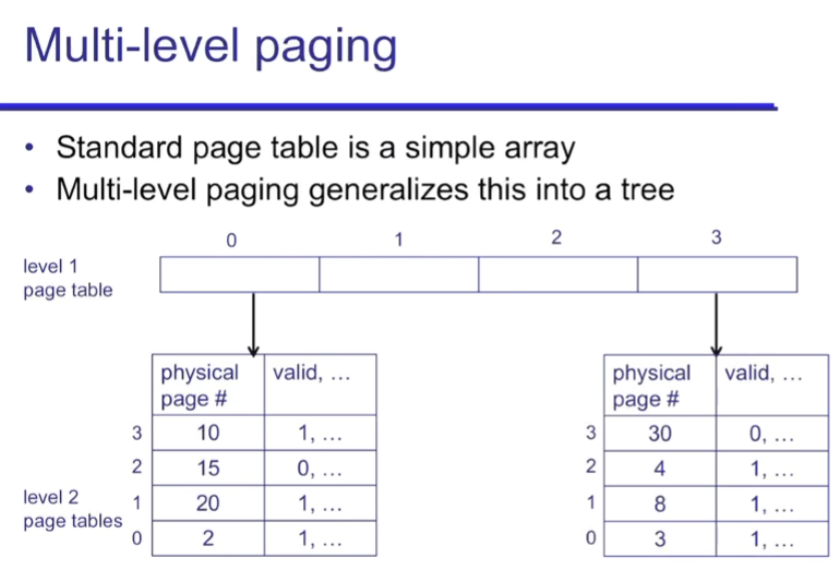
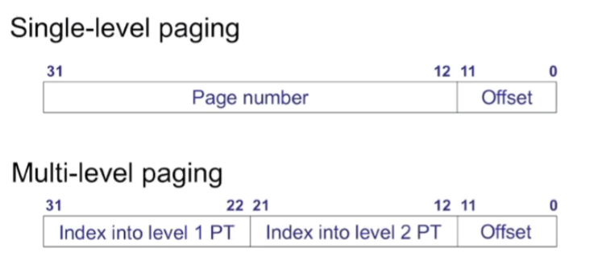
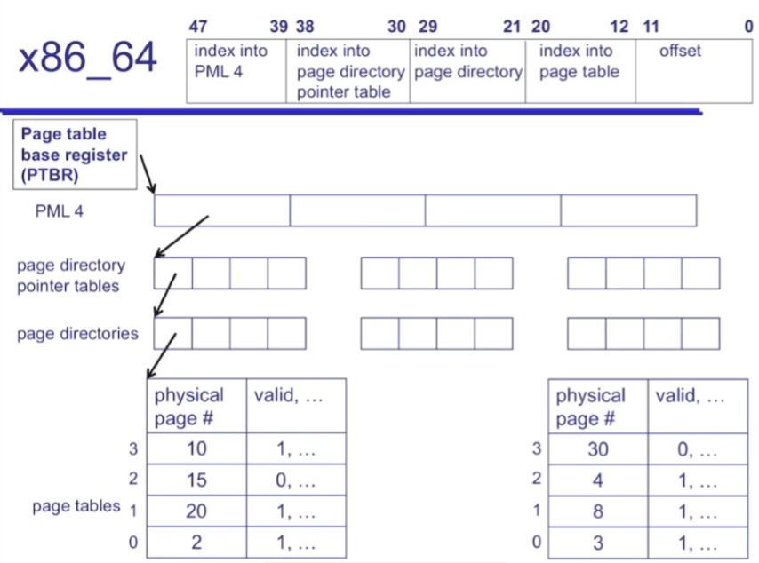

### paging-continued

上次讲到 paging 是能够实现 base-and-bound 以及 segmentation 所做不到的 (1) 任意地 grow; (2) external fragmentation; (3) large address spaces 的 translation algorithm

Virtual address is of the form: page (page \#, offset)

比如 32bit ($2^{32}$ B 大小) 的 address, 如果每个 page 是 4 KB 那么 address 的格式如下:

mapping:

translation algorithm：

```c++
if (virtual page is invalid) {
    trap to OS fault handler
} else {
    physical page # = pageTable[virtual page #].physPageNum
    physical address = {physical page #}{offset}
}
```


#### demand-paging: validity / residency

我们要进行 demand paging, 就是把以前的 pages evict 到磁盘里.

validity: 表示这个 page 你应不应该 access (map 之后才应该, 表示是目前已知的地址). 不 valid 的 page, 即未知的地址, 如果 access 的话是一个 error (segmentation fault 等等)

resident: 表示这个 page 当前在不在 physical memory (还是在磁盘里). access 一个 inresident page 不是一个 error 


(为什么我们需要 invalid page? 就是因为我们需要地址错误这个报错信息. 否则当用户程序出 memory 问题, 访问了不 valid 的 page 时, 你甚至不知道.)


#### pros and cons

pros: 

- 简单的 memory allocation, 
- 容易 grow, 
- flexible sharing, 
- 不需要为 reserved space 占用物理 memory.

cons: 

- page table 比较大

	比如 4KB pages, 4 bytes PTEs 

	-> 1M pages, 4MB size page table for each address space

solution: multi-level paging


### multi-level paging: paging++

paging 是能够实现 base-and-bound 以及 segmentation 所做不到的 (1) 任意地 grow; (2) external fragmentation; (3) large address spaces 的 translation algorithm, 并且有刚才叙述的 pros. 而 con 就是 page table 过大, 解决方案是 multi-level paging


multi-level paging: level n page table 的每个 entry point to 一个 level (n+1) page table






dynamic allocation 使得我们可以 reduce the size of page table. level 2 及以上的 page table 按需分配.

PTBR 指向的是 first level PT. 


#### x86_64 的 address division




#### pros and cons

除了 single level PT 的 pros 外, 还用了更少的 translation data.

但是 cons: 多层 look up, 更加耗时. (one problem that indirection 并不能解决, that is performance)


所以我们的 solution: TLB, PTE 的 cache 

(**Caching 专门解决 indirection 带来的 performance 问题**)


#### TLB (Translation Looksaside Buffer)

TLB 是一个 cache 设计, 专门用来存放 PTEs (最后一层的)

TLB hit -> 不需要多层的 translation steps, 直接在 cache 里拿最后一层的 PTE

TLB miss -> 进行原先的多层 translation, get PTE 并 store in TLB, 取代 LRU


注意: 当我们 switch context 时需要 clear cache, invalidate TLB. (或者 identify entries with address space ID)


##### by caching: load/store 的过程

Review on cache: CPU caches 是一个存放 physical memory blocks 的地方, 

当我们 load/store 的时候, 我们 access memory:


Step 1: TLB

查看 TLB -> 找到的话据就直接查看该 PTE, 得到需要 access 的 physical page -> 

​		-> 找不到的话 multi level translation 找到 PTE 放进 TLB, 正常得到需要 access 的 physical page -> 


Step 2: Data Cache

data cache 寻找该 physical memory page -> 找到直接在 data cache access

​									  -> 找不到还得去 physical memory 找, 然后放入 cache -> 在 physical memory 找到, 结束

​		-> 在 physical memory 也找不到, 说明在磁盘, 最后还得去磁盘找.


##### more: O(1) 查找一个 page 是否在 cache 中

TLB 是 mapping 的 cache

data cache 是 physical memory 的 cache

physical memory 是磁盘的 cache


如何找到一个 page in the cache set? 我们知道, cache 通常是2-way, 4-way associative, 每次访问是

```c++
// 类似伪代码：
set = cache[index];
for (line in set):
    if (line.valid && line.tag == tag):
        return hit
return miss
```

在 **固定 associativity** 下，这个过程是 O(1) 的

不过 associativity 的前提是 “必须让 cache index bits 属于 page offset 范围”


​	


