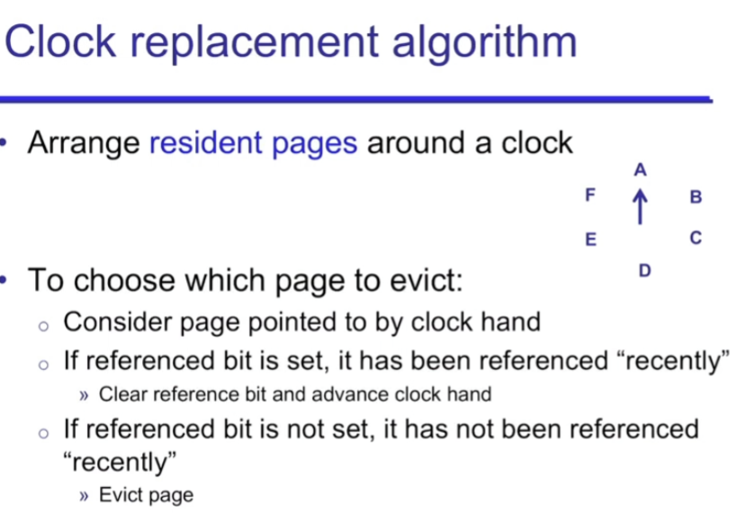
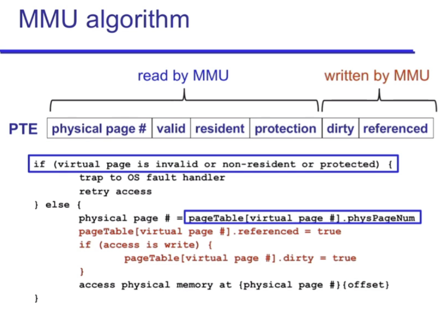
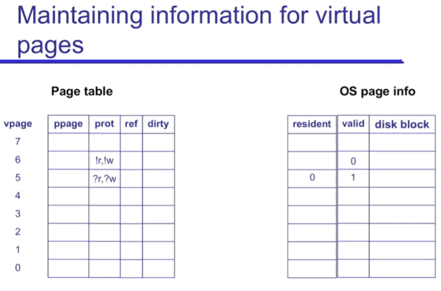
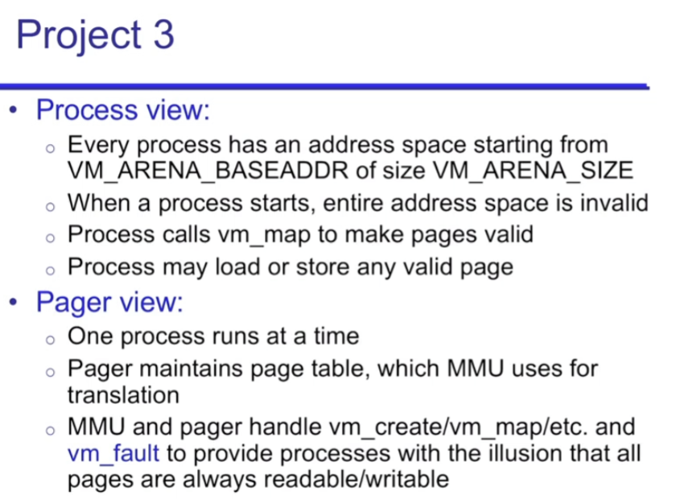
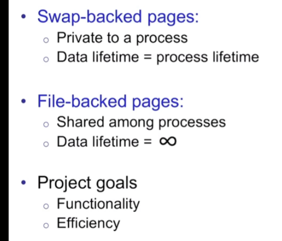

## page eviction

我们需要把一个 page 从磁盘中放入 physical memory 时, 如果此时已经满了, 就不得不 evict 一个 physical page 

那么 evict 哪个?

recall: 我们需要让 page_fault 被 call 的次数越少越好, 即重新从磁盘往 physical memory 里放东西的次数更少.

因而我们就要尽量减少 evict 的次数 <- 不要 evict 常用的 pages 

因而 random eviction 和 FIFO 都不适用. 因为它们并不显示这个 page 是否常用.

### approximating LRU: referenced bit

我们不可能 predict 未来会用到哪个 page (without ml system), 因而我们唯一能做的是: **不要 evict 最近常用的 pages.**

但是不像 cache LRU: page offset 里有专门的 LRU bits. cache 能够做到这件事情是因为, 它的 blocks 本身就很少. 而我们的 physical memory 还是有很多 Blocks 的, 所以没有那么多 translation bits 可以提供来做这件事 

我们只能设置一个 "referenced bit": 一个 Bit 不能再多.

具体怎么做:

### clock queue

如果全部 referenced: 那么就是转一圈, 然后 evict 第一个 page (where we start)

what to do with the evicted page: 放进 disk

什么时候我们 evict 时不需要把 page 写进 disk: 当我们和放进来的时候没有进行过修改时 (not dirty. 类比 write-back cache) 

when to write to disk: only when page is evicted. 如果没有被 evict 就不要把 page 写进 disk! 否则十分 costly. (do work only when necessary, be as lazy as possible to avoid work, thus efficient)

### MMU algorithm (on every access) p3

### p3 overview

