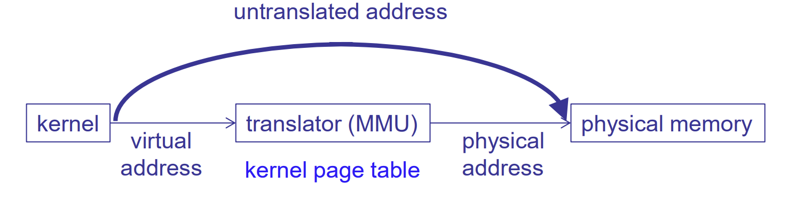
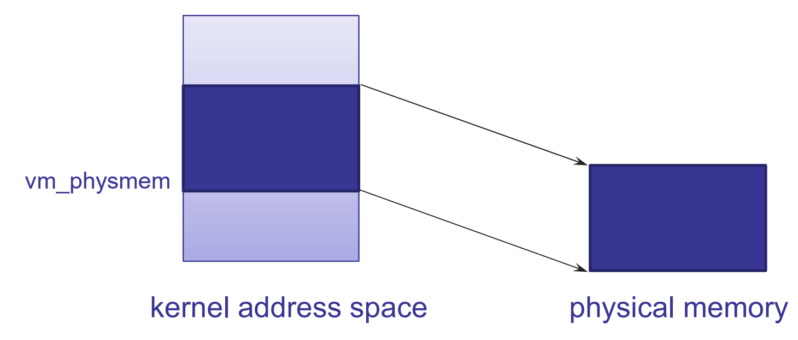

## User and kernel address spaces

where to store page tables:

physically: 要么是 disk 要么是 memory

but virtually: how to access it?

Option 1: store PT in physical memory, 即 PTBR 直接 contain physical address

Option 2: store PT in VM. 

区别只有一个就是要不要 translate. 

benefit of VM: protection, 以及可 specific to processes 的  large address space

但是 infinite recursion: 我们的 translation 本身就需要 page table 来实现. 没有人帮 page table 进行 translation

所以 solution: separate it to kernel address space

(更底层的 infrastructure 来管理 kernel address space)

kernel sets up PT for each process

MMU 通过查看 PTBR 指向的 current PT, 来 look up current process 的 translation

kernel 是一个 privileged process, 有自己的 own address space, 它的 load/store 也会被 translated

### differences between kernel & user address space

1. 有时候不能 evict kernel 的 pages.

	因为我们如果把 demand paging 的管理的 code 给 evict 了, 就死循环了

	因而有些 Pages 是 "pinned" to physical memory 的 (different intention from p3)

2. 有时候 kernel 必须 access 特定的 physical addresses

	user 不会管它自己的 virtual address 被 translate 到哪里

	但是 kernel 

	 

如何做到使 kernel access 特定的 physical memory addresses?

option 1: issue 一个 untranslated address (i.e. bypass the MMU)

(p3 我们无法做到)

option 2: 建立一个 mapping from virtual address range to physical memory range.

reverse mapping 也是简单的 (+ -> -)

（this is what we do in p3. 我们的 `vm_physmem[n]` 就直接 map to bytes n of physical memory)

3. 有时候 kernel 必须 access 另一个 address space 中的数据

	method A: 在 physical memory 里找到它

	method B: 把 kernel address space map 到每个 process 的 address space 中 (把它们 merge 为同一个 address space, 在一开始就要设置 Boundaries for user space, 让它的 virtual address 去除掉一块地方, 留给 kernel), 然后再 issue virtual address 

	​	所有 processes 的 address space 中, kernel 的部分都相同, 因为 e.g. PTEs 都是统一的

	​	this is the common way. 因为更快

### protection: kernel v.s. user address spaces

我们 protect 一个 user process 的 address space from other processes 的方法就是 translation (translate the same virtual addresses into different physical address)

而 translation 是 implemented in kernel. To protect the translation data, 我们需要另一些 help data (但是由于 translation data 更小, 所以 help data 也更小, 从而一层一层简化)

只有 kernel 可以 modify translation data, user 不可以

但是 CPU 怎么知道是 kernel 还是 user 在 running: 通过 mode bit (hardware support)

(how do we protect the mode bit? 

首先, only kernel can change it

但问题是: 如何从 user code 切换回 kernel mode 呢? 

答案是: 

- faults 和 interrupts, 

	因为 faults 和 interrupts 是 kernel code, 我们可以 trust 它

- system calls (User 可以拥有 system call 的 API, 主动要求切换回 kernel, 比如 p3 的 vm_map)

	- process management: `fork()`, `exec()`
	- memory management: `mmap`
	- I/Os
	- system management: `reboot()`
	- ...

)

System calls: 