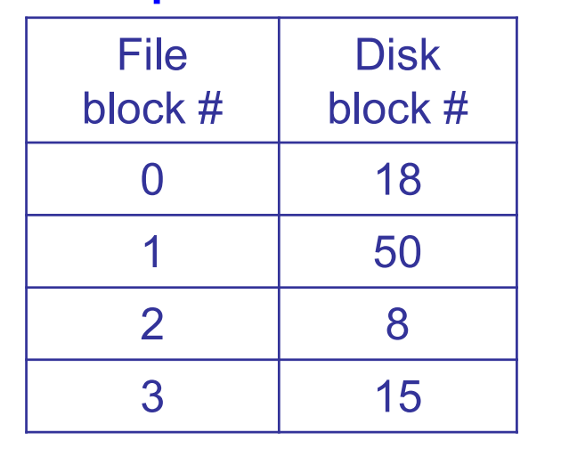
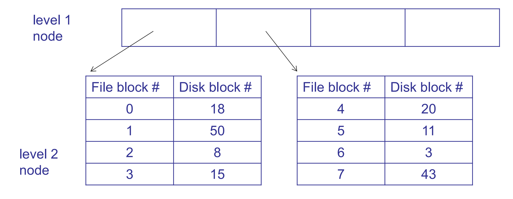
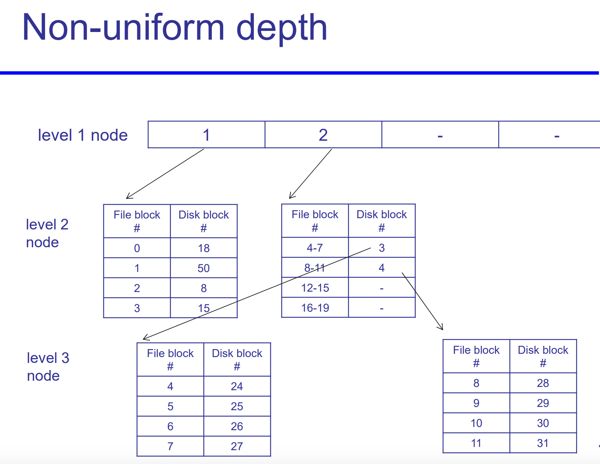
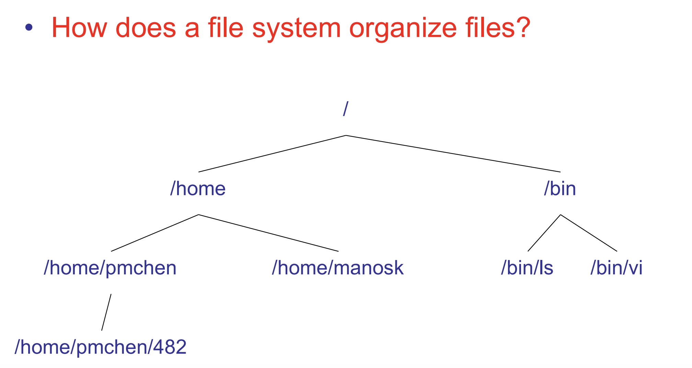
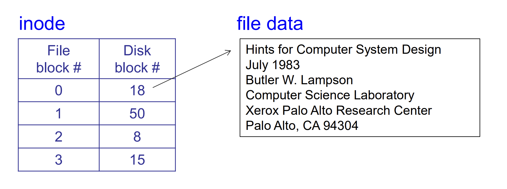
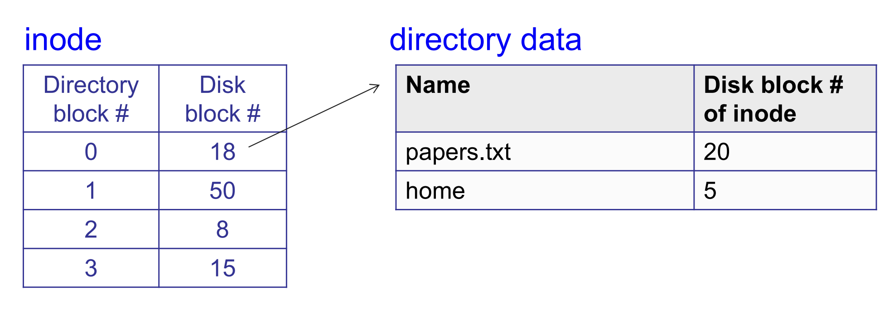

# File System

File system 是一个 persistent data structure

across:

- process creation/exit
- machine crash/reboots
- power outages
- …


How to enable persistence across these events?

- 首先要使用 persistent storage medium
- 其次，我们的 pointer 也要 persistent (addresses that are stable across reboot), e.g., disk block number 
- Write data in a careful order


(Other persistent data structures, than file system:

- SQL database
- Key-value store (aka non-SQL database)

)


Some general rules: 

- Most file accesses are **reads**
- Most programs **access files sequentially and entirely**
- **Most files are small, but most bytes belong to large files**


第三点是一个有趣的点. 其实是 file system 的优化本身的一个矛盾点: 我们的大部分 bytes 都属于大文件. 但是大部分 files 本身都是小的 files.

所以我们不能只为大文件优化, 也不能只为小文件优化


## data structure of file storage (initial handles: inode) : #file block-> #disk block

- 不仅 files, 包括 metadata 也要 store persistently

  “data about the data”: **size, name, owner, permission…**

- 对于任意的 data structure, 都需要 initial handle 来 access (like name(address) of array, root of tree)

  对于 file system 我们称这个 handle 为 file header

  - ex: Unix 中称为 inode, NTFS 中称为 Master File Table record
  - 描述 the file, 并且 allows you to find its data 

- 有很多 possible choices


###  Consideration 1: contiguous allocation (like base and bound)

- 存在一个 contiguous segment on disk
- file header 存储 [starting location, size]
- if file grow: move it to larger free area


pro: 

- fast sequential access
- easy random access


cons:

- external fragmentation (“holes exist, 利用率不高”)
- difficult to grow


### Consideration 2: Indexed files

file header stores an array of block pointers


pros:

- 容易 grow
- easy random access

cons: 

- potential slow for sequential access

  因为不再 contiguous

  

问题 1: 如何 support large files? (容易解决)

- remember: 大部分 files 是小的. 如果对 block size 选择太大, 那么整个 disk 撑不下
- 所以 file block 的大小需要适当


问题 2: 两个 metrics have conflicts:

optimize for space totally (indexed files)-> not good for time

optimize for time totally (contiguous allocation)-> not good for space 


问题 2 的解决方法:

**Extent-based 分配**（如 ext4、NTFS、APFS）：

- 每个文件由一个或多个「起始块 + 长度」的 extent 描述，能更高效访问连续空间。

| 分配方式                      | 顺序访问性能 | 随机访问性能 | 空间利用 | 实现复杂度 |
| ----------------------------- | ------------ | ------------ | -------- | ---------- |
| Contiguous allocation         | ✅ 很快       | ❌ 较慢       | ❌ 易碎片 | ✅ 简单     |
| Linked list allocation        | ❌ 很慢       | ❌ 很慢       | ✅ 好     | ✅ 简单     |
| **Multi-level index**         | ❌ 较慢       | ✅ 高效       | ✅ 好     | ⚠️ 中等     |
| Extent-based (e.g. NTFS, XFS) | ✅ 很快       | ✅ 高效       | ✅ 更优   | ⚠️ 更复杂   |

不过我们这里不展开 Extent-based allocation. 我们这里只谈 multi-level index


### Consideration 3: Multi level indexed files



- File header stores (root of) tree of block pointers
- Files can easily grow 
- Allows large files，但是 small files 也不会 waste header space


Like multi level page table.

也有相似的问题

也有相似的解决方法: Caching (store in phy mem)


#### non-uniform depth

我们说了, “我们的大部分 bytes 都属于大文件. 但是大部分 files 本身都是小的 files.” 

Multi level indexed files 本身就是针对这一点有所优化 (多级分配可以大幅减少总的 map entries 的数量需求, 从而每个 block 的大小可以小一点也没事.) 不过还可以进一步优化. **Non-uniform depth** 的 multi-level index file.


它的做法是: 

- inode 中的指针层级**不固定为同一深度**，
- 而是按需使用：
  - 小文件只用 **直接块指针**
  - 中等文件用 **单重间接指针**
  - 大文件再用 **双重甚至三重间接指针**

所以，不是每个文件都要走三层索引树——**这就是非均匀深度**。 这能够**节省 inode 空间并提高小文件访问效率，同时保留对大文件的支持能力。**


假设 block size = 4KB, inode 的 block 指针布局：

```
inode
├── direct[0..11]       // 12 个直接块指针，共可寻址 12 × 4KB = 48KB
├── single_indirect     // 指向 1 个 block，block 内有 N 个指针
├── double_indirect     // 指向 1 个 block，block 里面是指向单级指针块
├── triple_indirect     // ...
```

```c++
struct inode {
    ...
    uint32_t block[15]; // 其中:
      block[0] ~ block[11]     → 直接 block（file block 0~11）
      block[12]                → single indirect pointer
      block[13]                → double indirect pointer
      block[14]                → triple indirect pointer
};
```

文件大小不同，索引深度也不同：

| 文件大小 | 使用结构          | 层级深度 |
| -------- | ----------------- | -------- |
| 20KB     | direct blocks     | 1        |
| 100KB    | + single indirect | 2        |
| 10MB     | + double indirect | 3        |
| 1GB      | triple indirect   | 4        |





✅ 优点 1：**节省 inode 空间**

- 如果强制所有文件都要用三重索引结构，那 inode 会非常大，浪费大量空间。
- 实际上，大多数文件都很小（<4KB, <64KB），只用 direct blocks 就够了。

✅ 优点 2：**小文件访问更快**

- 直接 block → 直接访问数据，无需间接寻址。
- 对小文件来说，这比走一个三层树（triple indirect）快得多。

✅ 优点 3：**可扩展性强**

- 在不浪费资源的前提下，也能支持 TB 级别大文件。
- 通过 indirect block，空间寻址能力指数级增长。


### 总结

不论使用什么样的数据结构来存储 meta data, 我们最终的目的是, 固定一个 file, 对于传进来的  # file block 翻译为 # disk block.

这个 file 的 inode 主要就是做这件事情.


## data structure to help locate inode of a filename

### directory: filename cstring pointer -> #inode

我们刚才讲了 indexed files 和 multi-level indexed files 的数据结构: 

对于每个 file, 我们可以用一个 inode file 作为其 meta data, 这个 inode file 存储了一个 (可能多级的) 表格, 表示: #file block -> #disk block 的映射; 以及其他 meta data 等. 这个 inode file 的 initial handle 就是 inode 指针.


而, 我们仍然有一个问题: 这其实是一个较为底层的数据结构, 直接沟通了虚拟端 (file block) 和物理端 (disk block), 但是我们要实现的还有一层: 作为 user, 对一个 file 的 access 是通过它的 filename 的.

也就是说, 我们要实现: 从一个 (filename, # file block) 到其 # disk block 的映射


我们已经实现了 inode: #file block -> #disk block 的映射, 那么还差:

filename -> #inode 的映射没有实现.


filename 是一个 string, 但是 computer 是不认识 string 的. 它只认识 pointer. 所以我们得有一个 **filename cstring pointer -> #inode 的映射**, 把一个 filename 映射到一个 disk block, 即存储它的 inode 的 disk block (inode block). 我们把这个映射的数据结构称为 directory.


这样, 我们对于每个传入的  (filename, # file block),

- 先用 directory: filename cstring pointer -> #inode 的映射, 到这个 file 的 inode 的位置.
- 然后通过 access inode 中的 #file block -> #disk block 的 table, 取得其对应的最终的 disk block



(filename, #file block) -> #disk block 的具体流程:

```
(filename, #file block)
  ↓ (search filename by directory)
#inode                 （得到对应的 inode block）
  ↓ (get #file block 对应的 disk block pointers in inode struct, 可能是 direct / indirect / double indirect / ..., through multi-level index)
#data block on disk     (实际存放文件内容的数据块）
```

才能完成完整的映射链, 让 user 通过 filename 来 access disk.


### 如何存储一个 directory: 当作一个 file

怎么存储一个 directory? 

我们可以把 directory 看作一个特殊的 file: 它存储的是一个 filename-> #(disk block of) inode 的映射


一个 file 的 inode, 存储一个 #file block -> #disk block 的 map



一个 directory 的 inode, 也存储这个 directory 的 #directory file block -> #disk block 的 map.



```c++
struct {
    char name[FS_MAXFILENAME + 1];         // name of this file or directory
    uint32_t inode_block;                  // disk block that stores the inode
                                           // for this file or directory (0 if
                                           // this direntry is unused)
} fs_direntry;

struct {
    char type;                             // file ('f') or directory ('d')
    char owner[FS_MAXUSERNAME + 1];        // owner of this file or directory
    uint32_t size;                         // size of this file or directory
                                           // in blocks
    uint32_t blocks[FS_MAXFILEBLOCKS];     // array of data blocks for this
                                           // file or directory
} fs_inode;
```


### 如何访问 `/home/qiulin/report.txt`

如何访问一个 directory 下的 file?

例如:

```
(/home/qiulin/report.txt, block 1)
```

我们经历的过程就是: 

```
1. "/" → inode 0
	 └── directory content blocks: [block 101, 102, ...]
	 		└── parse all, 在某个 block 中找到 { "home" → inode 17 }

2. inode 17 
	 └── directory content blocks: [block 501, 502, ...]
	 		└── parse all, 在某个 block 中找到 { "qiulin" → inode 42 }

3. inode 42
	 └── directory content blocks: [block 201, 204, ...]
	 		└── parse all, 在某个 block 中找到 { "report.txt" → inode 128 }

4. inode 128
   └── file content blocks: [block 1001, 1002, ...]
   		└── parse block 1 (对应即: 1002)
```

简单而言:

| 路径分量     | 读取 inode | 读取内容        | 得到                |
| ------------ | ---------- | --------------- | ------------------- |
| `/`          | inode #0   | directory block | "home" → #17        |
| `home`       | inode #17  | directory block | "qiulin" → #42      |
| `qiulin`     | inode #42  | directory block | "report.txt" → #128 |
| `report.txt` | inode #128 | **data blocks** | 实际内容            |

因而: 每多一层 directory 每深一层, 我们就要多读取一次 file (算上 inode 指向的 metadata file 本身也是 file, 那么就是多读取两次). 这个 读取会给出一个新的 inode.

我们对一一个给定的 filename “/home/qiulin/report.txt”, 会 #inode -> #inode 一直 parse 到最后一层, 即文件名而非 directory 名这一层, 最后 inode 给出的 disk block 不再是 (filename, #inode) map, 而是真实的 content.


### Differences between directories and files

除了: 一个 directory 的 content 就是一个 table, mapping filename -> #inode 之外, 还有一个区别, 就是 user 权限不同.


directory 作为一个特殊的 file, 其内容 (mapping table) 并不是 user 可以随便改写的! 它储存了文件结构信息.

只有在 user 真的想要改变文件层级的时候才能改写. 如果随便改写, 很可能把 table 给破坏掉.


❌ **用户不能随意 read/write 目录的“原始数据内容”**，
 ✅ **但可以通过系统调用（如 `open()`, `readdir()`）以结构化方式读取目录项。**


```
int fd = open("/home/qiulin", O_RDONLY);
char buf[4096];
int n = read(fd, buf, sizeof(buf));  // ❌ 错误或未定义行为
```

你会得到 `EISDIR` 错误：

> ```
> read(): Is a directory
> ```

而如果你用：

```
DIR* dp = opendir("/home/qiulin");
struct dirent* entry;
while ((entry = readdir(dp)) != NULL) {
    printf("%s\n", entry->d_name);
}
```

 你就可以**合法访问目录的结构化内容**
