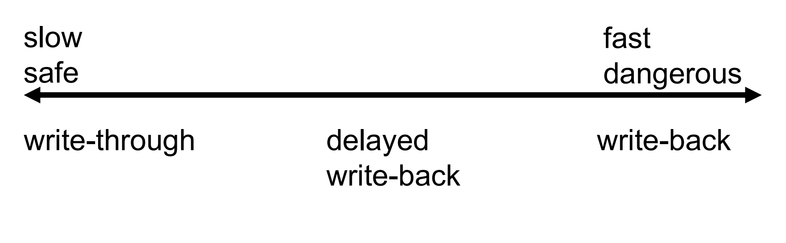

## Hierarchical file system

我们且不看 inode 内部 (#file block -> #disk block), 而把 inode 作为最小的单位来看 (直接以 #file block 为 interface, 不管实际 disk 位置)


一个 file system 如何 manage files? 是以 tree 的形式.


What is needed for a tree?

- Nodes (with one node designated as the root node)

- Pointers between nodes

  

Hierarchical file system 作为一个 tree, 

- **Nodes: directories, files**
- **Pointers between nodes: directory entries**
- Exactly one path from root node to each other node (no cycle)


### review: to read a file

如何读取 `/home/pchen/notes`:

1. read `/` inode
2. read  `/` directory data (找到 `/home` 这个 key 对应的 inode)
3. read `/home` inode (redirect to the directory data)
4. read `/home` directory data (找到 `/home/pchen` 这个 key 对应的 inode)
5. read `/home/pchen` inode (redirect to the directory data)
6. read `/home/pchen` directory data (找到 `/home/pchen/notes` 这个 key 对应的 inode)
7. read `/home/pchen/notes` inode,  redirect to directory data, 从而可以读这个文件内容


 


### multiple storage devices

我们可以 combine 多个 storage devices in one file system

- 每个 device 都有自己的 file system (with own root)

- 一个 directory entry 可以指向另一个 device 的 root.
   → 使用户看起来是在同一个文件树中，但实际上可能已经进入另一个物理或网络设备的文件系统。

  > 举例：你访问 `/afs/engin/qiulin/`，你可能以为你还在本地磁盘，其实你已经进入了一个网络服务器的文件系统（比如 AFS 文件系统）


以  `login.engin.umich.edu` 为例:

```

/           ← 根目录（root），位于主存储设备
├── bin     ← 可执行文件目录，和 / 在同一个设备上
├── tmp     ← 临时目录，挂载了另一个磁盘（不同设备）
└── afs     ← 网络文件系统目录，挂载了网络服务器上的文件系统
```

> 所以说，访问 `/afs` 实际上已经跳出了本地磁盘，进入了一个远程设备。


#### directory entry 的三种类型

我们之前介绍了两种: 

- **文件（File）**：普通文件（如文本、图像、可执行程序等）
- **目录（Directory）**：子目录（可以再包含更多目录或文件）

但是其实还有第三种:

- **设备（Device）**：指向另一个存储设备的挂载点，例如 `/mnt/usb` 或 `/afs`


操作系统允许将不同设备的文件系统无缝组合在一起。用户无需关心在哪个物理设备上，路径结构表现得就像是统一的一棵树。

这依赖于“挂载”机制，挂载点就是目录项指向了另一个设备的文件系统。


比如:

`/afs/bin/c` 就是**另一个 device 上的另一个文件系统里的 bin/c 路径**


### caching



P3 中我们进行的是 write-back cache.

Generally: 各有优劣. 

我们以为 write-back 总是更好, 但是其实它存在安全问题：

1. **突然断电或系统崩溃会导致数据丢失**

   - 缓存中的数据尚未写入主存，此时如果断电、系统崩溃或设备拔出，则：

     **修改过但尚未写回的数据会丢失**；

     导致文件系统损坏、数据库不一致等问题。

2. **数据一致性风险（Inconsistency）**

   - 如果多个设备或系统共享某个内存或磁盘区域：

     设备A缓存了修改内容但未写回，设备B读的还是旧数据；造成**缓存与主存内容不一致（Stale data）**，从而引发安全漏洞或数据破坏。

等等.


折中策略. 

delayed write-back: 设定一定时间. 如果 dirty 后在一定时间内没有 write back, 则自动 write back then.


#### comparison and 合并 solution: virtual memory 和 file system 的 caching

virtual memory 的实际映像是 disk (swapspace, files) 里的内容, 只是用 physical mem 作为 cache. (不过对于 virtual mem 而言, 在 physical mem 才是常态, 它把实际映像放在 disk 反而是为了扩充空间实现 large address space)

而 file system 的 caching 是另一个相似的概念. 实际映像也在 disk 里, 但是我们也会把常用的 file content 放进 physical mem 作为 cache, 目的是提升速度.


- **虚拟内存**（Address Spaces）：
  - 主要是为了**扩展容量**：当内存不够用时，可以把数据暂存在磁盘（swap space），再从磁盘换入内存。
- **文件系统**（File Systems）：
  - 主要是为了**提升性能**：从磁盘读取文件慢，因此把常访问的文件内容缓存到内存中（file cache）。


两者都希望使用内存，但系统资源有限：

- VM 可能会将应用数据换出到 swap。
- 文件系统也可能将热文件缓存页替换掉。

- 所以涉及到**页面置换策略**（Local vs Global Replacement）的问题：
  - VM 页面替换是以“进程”为单位还是全局考虑？
  - 文件缓存替换是否应该与 VM 联动？


两者**目标不同**（capacity vs performance），但**实现重叠**（都把磁盘内容搬到内存）。

所以为什么不统一管理呢？解决方案：**memory-mapped files**, **将虚拟内存机制与文件系统缓存机制结合**

其实我们已经用过这个策略了！就是我们在 p3 中的 file-backed pages.


使用虚拟内存的分页系统（paging system）来管理文件数据：

1. **vm_map (mmap) 文件到虚拟地址空间**
   - 文件的某些 block 会被映射到虚拟地址空间。
   - 文件系统的数据就好像是某个进程的一部分“虚拟内存页”一样。
2. **Backing store 是文件的 data blocks**
   - 换句话说，虚拟内存缺页时，不从 swap 加载，而是从对应文件 block 加载。


🔷 举例说明：加载可执行程序（executable）进程的启动流程

- 使用 `vm_map` 把程序 的可执行文件映射到进程地址空间中。
- 程序运行时，如果访问到这段地址空间，就会触发 page fault。
- 操作系统再把可执行文件的内容加载到内存里。


 **内存映射文件的最大好处是**：统一用 VM 的页表、缺页机制和替换算法处理缓存，而不必再为文件系统专门设计一套替换策略。


