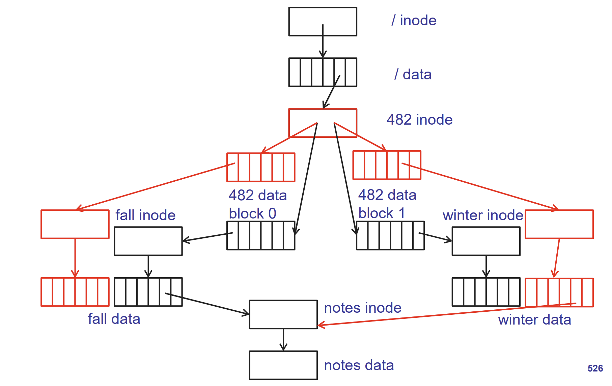
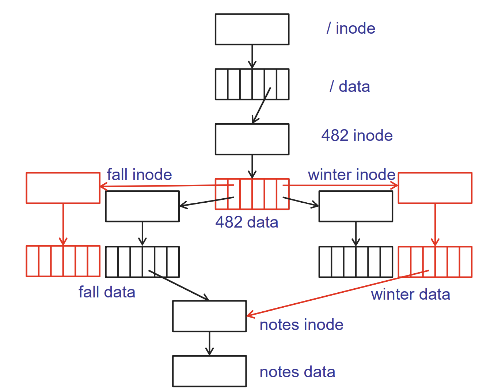

## Crash Consistency

### Careful order 的重要性

What disk I/Os are needed to create a new file?

我们要做两件事：

- 一个是创建这个 file 的 inode, 
- 另一个是更新 (包含这个 file 的)  directory 的内容

问题是顺序是什么？

Option 1: 

1. Update directory to point to new file header 
2. Write new file header

What happens if crash occurs between #1 and #2? The directory now has an entry (e.g. "newfile.txt") pointing to a file inode. But that inode hasn't been written yet (or may contain garbage).

❗ Consequence:

- **Dangling pointer** in directory

Option 2: 

1. Write new file header 
2. Update directory to point to new file header 

The inode exists on disk.

But no directory entry points to it yet — it’s **orphaned**.

❗ Consequence:

- File cannot be accessed by name.
- But it **doesn't corrupt** the directory structure.
- Some filesystems (e.g. ext3/ext4) can clean these up or treat them as "unlinked inodes."

This is **much safer**.

因而我们要选择 

- 先创建这个 file 的 inode, 
- 再更新 (包含这个 file 的)  directory 的内容

的顺序

### Careful Order is not enough (enough for p4 though)

Example: Create new file and update free block list

p4 中没有这个结构，但是现实的 os 在创建一个文件时会分配一个 block, 并更新 free block list

🔹 Option 1:

1. ✅ 写入新文件头（inode）
2. ✅ 目录更新，指向这个 inode
3. 更新 free block list，把新分配的 block 标记为“已用”

❗ 如果在步骤 #2 和 #3 之间崩溃：

- **目录中有了对新文件的引用**
- **inode 也存在**
- **但 free block list 仍然认为那块是空闲的！**

⚠️ 后果：

- 该 block **可能被重新分配给其他文件** ⇒ **数据破坏 / 脏数据**
- 文件系统出现**不可检测的双重分配错误**
- 可能只有在 `fsck` 中才发现

🔹 Option 2:

1. ✅ 写入新文件头（inode）
2. ✅ 先更新 free block list，把 block 标记为已用
3. 最后更新目录，引用 inode

❗ 如果在步骤 #2 和 #3 之间崩溃：

- free block list 正确地把 block 标记为已用
- inode 存在
- 但目录中没有引用这个 inode

⚠️ 后果：

- **不会有双重分配风险**（free block list 是正确的）
- inode 成为**孤儿**（orphan inode）
- 某些文件系统（如 ext 系列）可以在启动后清理掉这些未连接的 inode

**Option 2 更安全**

- 但仍然不是万无一失：文件系统仍需 **journaling** 或 **copy-on-write** 才能完全保证原子性

为什么需要 journaling 或 COW？

仅靠顺序写入不足以保证一致性，原因包括：

- 写入操作可能被**重排序**（硬盘控制器、电源断电）
- 崩溃可能导致**部分写入**（write tearing）

因此现代文件系统如：

- **ext3/ext4** 使用 **journaling**（记录意图日志后再执行）
- **ZFS / Btrfs** 使用 **copy-on-write**（不覆盖旧数据，写入新版本后原子更新指针）

### shadowing

(luckier case: ptr to the two inode data blocks are in the same data block of 482 directory

)

### logging

记录一个 log of the transaction

log 里记录所有需要更新的变量

记录完后, commit!

commit 完后, 把 log 里卖弄的

每次我们 reboot: 查看是否有

commit 如果到一半的时候 crash 了: 
