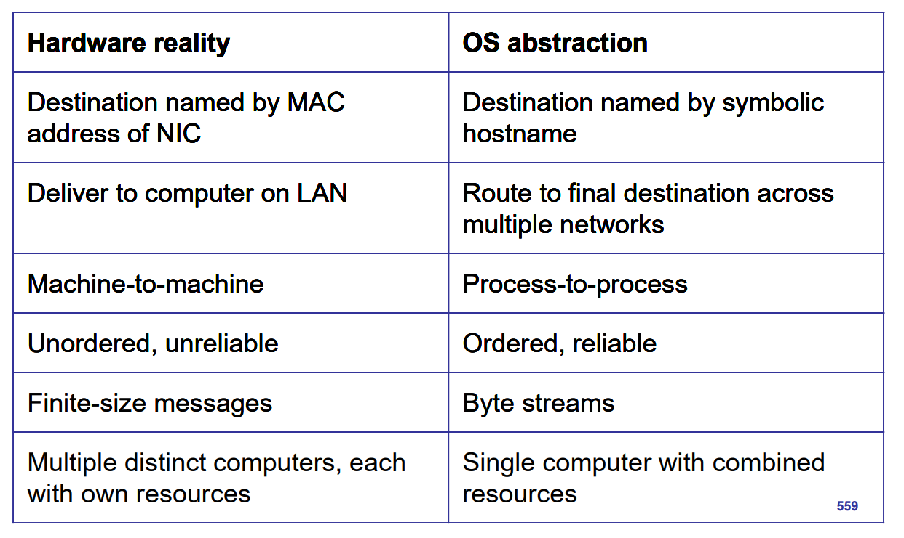
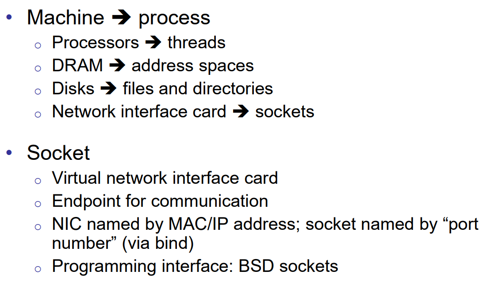
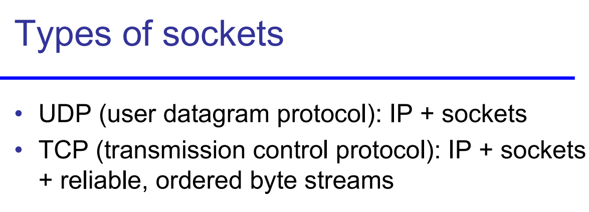
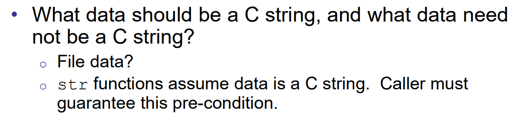
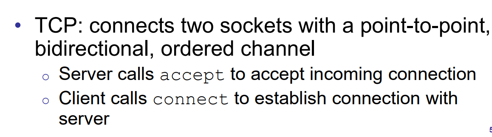
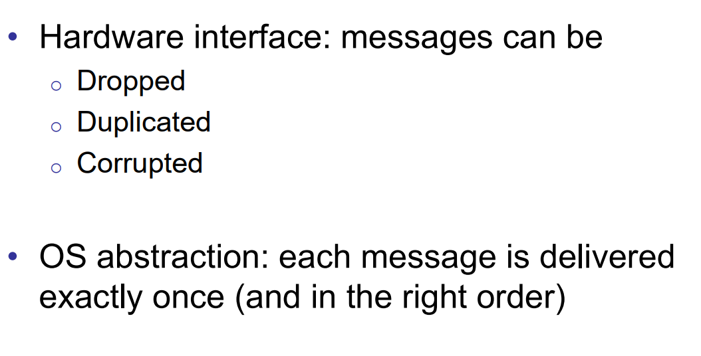
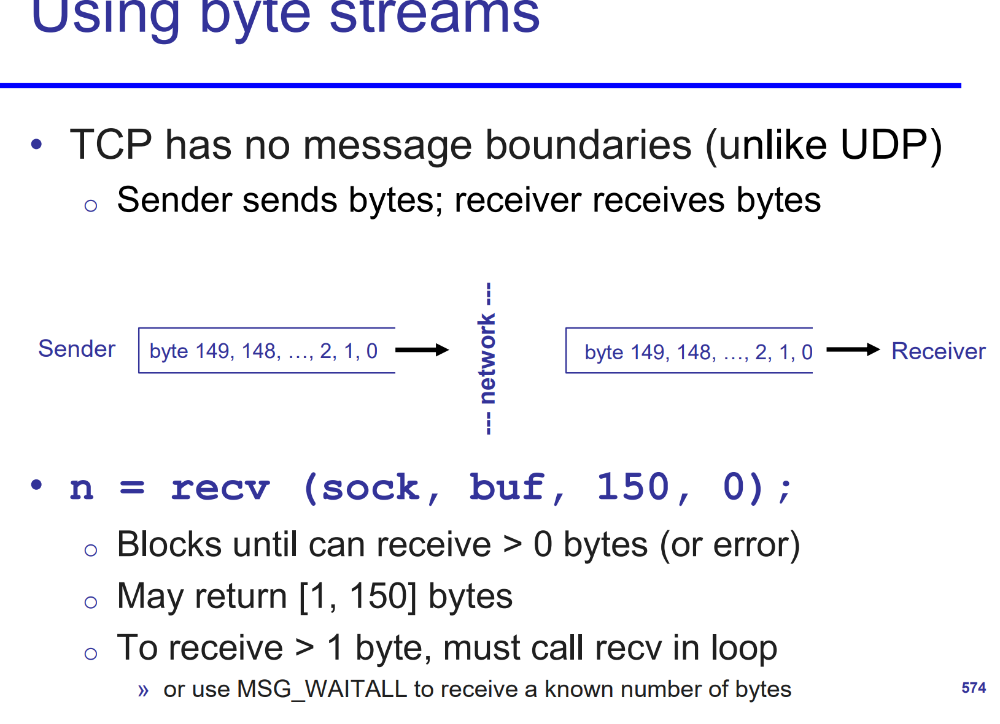
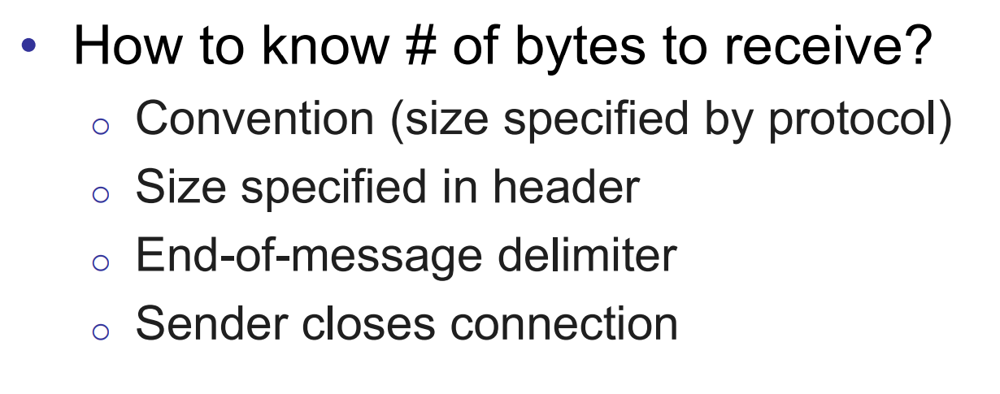
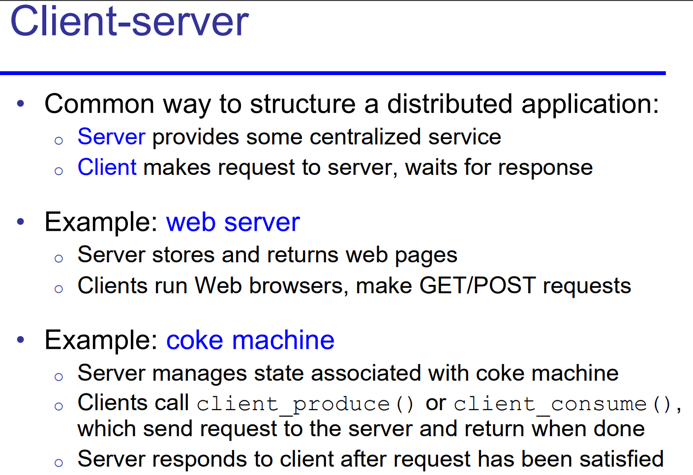

### unordered -> ordered messages

基于 unreliable 且 unordered 的 packets, 我们如何提供出 reliable 并且 ordered 的 byte streams?


（BTW：



string functions 只能用于 string, 而我们不能假设 recved data 一定是 string. 不能信任 client）


有很多做法。TCP 的做法是：


对于两个 channels 之间的通信：

invariance:  首先，网络传输的最小单位是一个段。一个段内的数据一定是有序的。

TCP 的“段”（segment）是**传输层构造的最小交付单元**，它在发送端的内存里就是一块连续的字节区间，并且有一个首字节序号（Sequence Number）和长度（LEN）。硬件/IP 层只能把它整体拆成多个 IP 包（分片）去传输，**不会在段内部重新打乱字节顺序**。

所以：

- 在一个 TCP 段内，字节顺序在传输过程中是保持不变的（无论 IP 分片、重组，还是链路层传输）。
- “乱序”只会出现在**段与段之间**（即一个段的 SEQ 比另一个段小，却后到）。


在 **TCP** 里，每个段（segment）的 TCP 首部里都有一个 **Sequence Number** 字段，表示**这个段第一个字节在整个连接字节流中的位置**。

- 如果这个段的数据部分长度是 `LEN`，那么它覆盖的字节区间就是
  $$
  [SEQ, \; SEQ + LEN)
  $$

- 因为 TCP 按字节编号，所以即使段大小不同、到达顺序乱了，接收方也能根据 `SEQ` 把它们放回正确位置。


因而，我们只需要关注段间的序就可以。

1. **按字节编号（Sequence Number）**
    TCP 不是“包序”，而是**字节序**。每个段携带首字节序号 `SEQ` 和数据长度 `LEN`，因此其覆盖区间是 `[SEQ, SEQ+LEN)`。
2. **接收端的重组队列（Reassembly Queue）**
   - 维护“下一个期望字节”`RCV.NXT`。
   - 到达的数据若 `SEQ == RCV.NXT`（正好是想要的下一段），立刻**提交给上层**，并向后**尽可能地合并**已经缓存的后续连续片段，推进 `RCV.NXT`。
   - 若 `SEQ > RCV.NXT`（**超前/乱序**），把该段放入**重组缓存**（形成“洞/holes”），暂不交付应用。
   - 若到达的是**重复**或**重叠**数据，按实现策略丢弃或去重后保留一次。
3. **确认（ACK）与窗口（Window）**
   - TCP 的 ACK 字段承载**累计确认**：`ACK = RCV.NXT`，表示“到 ACK-1 的字节都收到了、按序了”。
   - 对于乱序段，接收端**仍旧 ACK 旧的 RCV.NXT**（即“我还缺前面的字节”），并通告**接收窗口 RCV.WND**用于流量控制。


### unreliable -> reliable



同样，我们也是通过段序来判断。

只需要：确认每个段的内容都被收到且仅被收到一次就行。

所以 

- dropped：再次 require
- duplicated：drop it
- corrupted：再次 require

就好了


唯一的问题：sender 怎么直到 the message 被 dropped 了呢? 

答案当然是 Extra communication

- TCP 接收端会用 ACK 字段告诉发送端：
   **“到 `ACK-1` 这个字节为止的所有数据我都收到了并按序了。”**
- 如果某个段被丢了，比如：

```
发送： 1000~1499  ✅ 收到
       1500~1999  ❌ 丢了
       2000~2499  ✅ 收到
```

- 接收端的 ACK 还是会停在 `1500`，因为它不能跳过缺口（即便 2000 以后的字节收到了）。
- 发送端持续收到 **重复 ACK=1500**，就知道 1500~1999 这个区间有问题。


两种主要的重传触发机制

(1) **超时重传**（RTO, Retransmission Timeout）

- 每发送一个段，发送端会启动一个定时器。
- 如果在 RTO 到期前没有收到该段覆盖区间的 ACK，就认为这个段可能丢了，**重新发送**。
- 这是最基础、最稳妥的方法，但速度慢。

(2) **快速重传**（Fast Retransmit）

- 当收到 **3 个或以上的重复 ACK**（同一个 ACK 值反复出现）时，就提前推测缺口段丢了，立刻重传。
- 不用等到 RTO 超时，可以显著加快恢复速度。
- 如果支持 **SACK**，还能精准知道丢的是哪一段，只重传缺失区间。








这里一个例子：recv 一直到收到 `\n` 为止:

```c++
ssize_t recv_until_newline(int sock, char *buf, size_t maxlen) {
    size_t total = 0;
    while (total < maxlen - 1) {
        ssize_t n = recv(sock, buf + total, maxlen - 1 - total, 0);
        if (n <= 0) break;
        total += n;
        if (memchr(buf, '\n', total) != NULL) break;
    }
    buf[total] = '\0';
    return total;
}
```


## server-client

一种形式的 distributed system.

