## Lec 1 intro

### Ex0: Gaussian Elimination

Consider 
$$
\begin{cases}
\epsilon x + y = 1 + \epsilon \\
x + y = 2
\end{cases}
$$
这个简单的二元不等式, 其中 $\epsilon$ 表示一个很小的 error const

我们需要用 Gaussian Elimination 来解决这个问题. 并分别采用以下三个形式:

- Exactly over reals,
- In floating arithmetic in which $ϵ≈10^{−16}$ so ϵ can be stored in a straightforward way but 1+ϵ is rounded off to 1
- In floating point again, but swap the rows before beginning.

这个是 symbolic sol, 得到 $(x,y) = (1,1)$

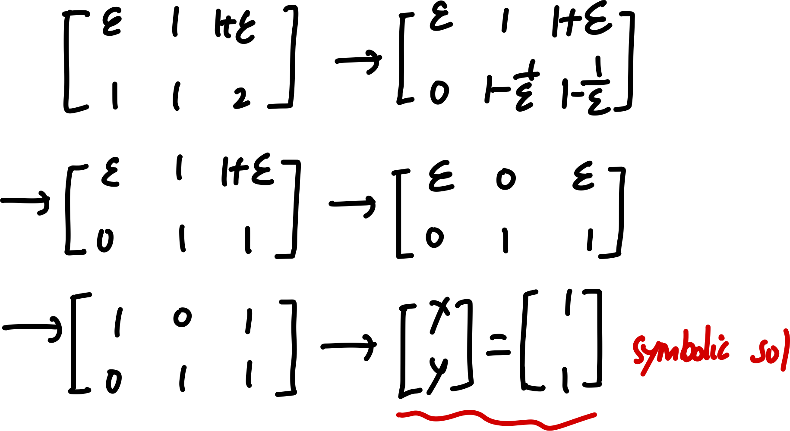

而现实的 numerical sol 中, 由于 $\epsilon$ 太小, 在右边的常数项很可能被 round 为 1, 因而得出错误的结果.

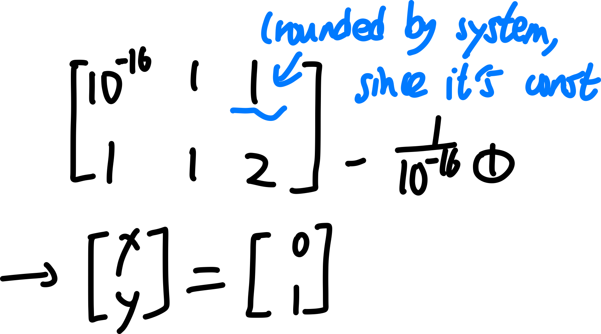

但是如果我们进行一次 pivot(换行)，可以避免对两个很接近的小 floats 进行相减并作为分子（从而被 round 为 0），从而减小误差.

### matrix-vector prod

review on definition: 

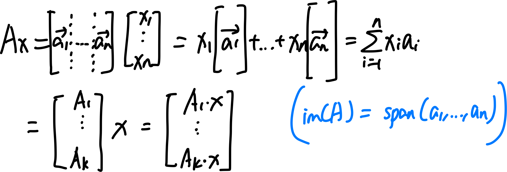

#### ex1: Vandermonde matrix

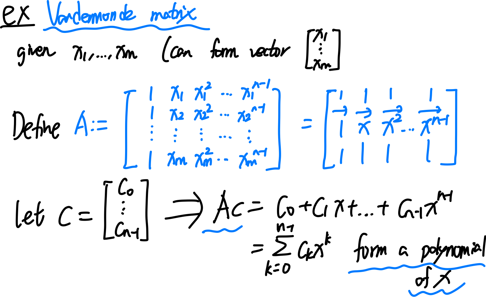

#### ex2: linear regression using high-order polynomial

我们在 linear regression 中会使用 polynomials 作为 basis function, 但是通常这并不是一个很好的 regression 方式，因为多项式函数会在小数值上表现非常相近，但是在远处分岔越来越大，并且 high order 的 polynomials，对 inputs 进行很小的改变，会造成曲线的总体走向变化很大. 

为什么我们要避免使用高阶的 polynomials 来进行 linear regression 拟合（例如用100次多项式拟合99个点）：

1. **过拟合（Overfitting）**：高阶多项式会精确通过所有点，但可能在数据间插值时产生剧烈振荡。
2. **数值不稳定性**：在计算高阶多项式系数时，矩阵条件数很高，容易导致数值误差放大。
3. **泛化能力差**：高阶多项式对未见数据的预测往往不准确。

这就是为什么在实际应用中，通常选择低阶拟合（例如直线或低阶多项式）来平衡精度与稳定性。

### matrix-matrix prod

review on def:

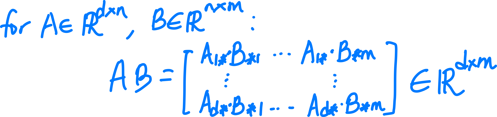

#### tensor product and outer product

我们可以通过 outer product 的定义，把 dxn 和 nxm 的矩阵的乘积，写成它们**对应的 n 个 col vectors 与 row vectors 的 outer product 的 sum.**

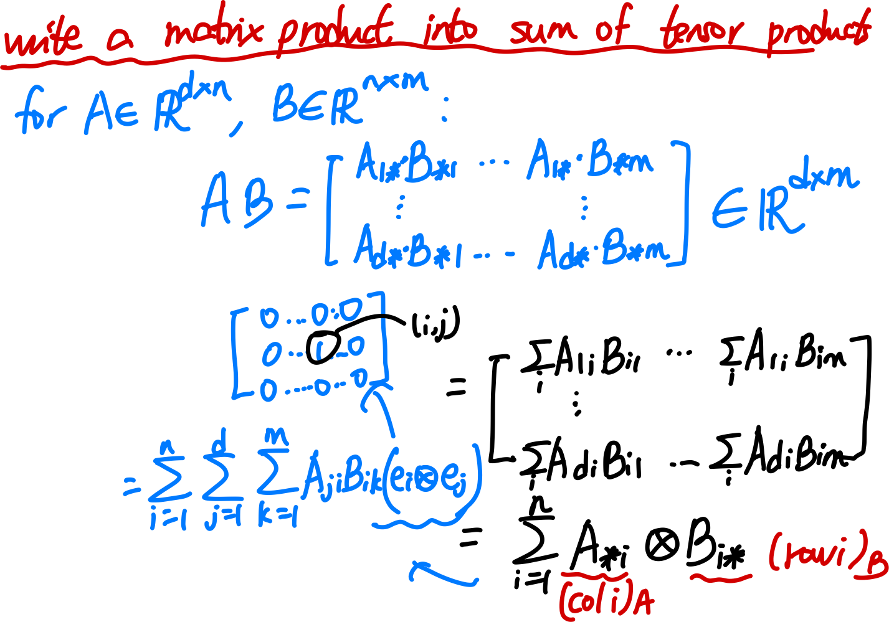

## Lec 2 orthogonal vectors and matrices

### Hermitian conjugate, complex inner product

Def: Hermitian conjugage(又称 adjoint): 即 transpose 并且对每个 entry 进行 conjugate.

$$
A \rightarrow A^*
$$
ex: real matrix 的 Hermitian conjugate 就是 transpose.

Def: **如果 $A = A^*$, 则称 A 是 Hermitian 的.**

Note: **real matrix 是 Hermitian 的 iff 它是 symmetric 的.**

我们可以对一个 vector 进行 hermitian conjugate 而后乘另一个 vector，由此定义 **complex inner product**

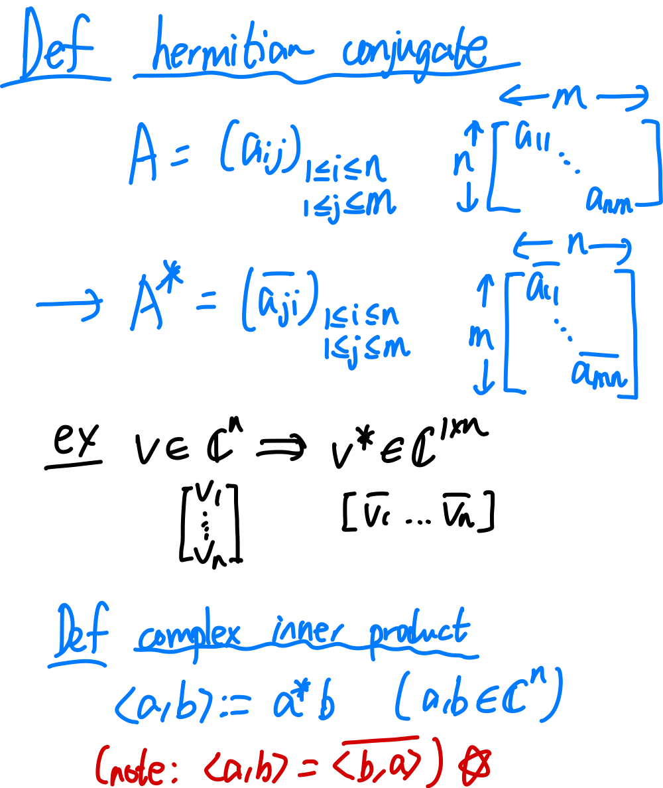

Note: **complex inner product 是 conjugate symmetric 且 bilinear 的.**

#### ex: DFT matrix

我们看到这个 matrix, 称为 discrete Fourier transform, of length n=4 (later).

我们现在可以知道，这是一个 **Vandermonde orthogonal matrix.**(并且 symmetric)

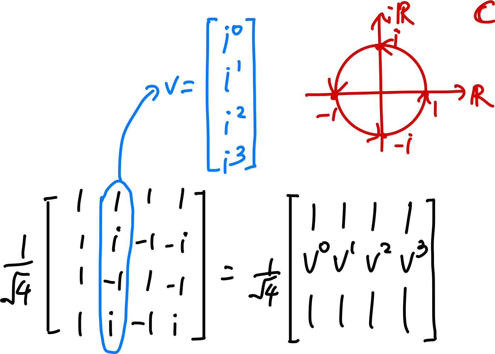

以下证明 orthogonality:

Proof:

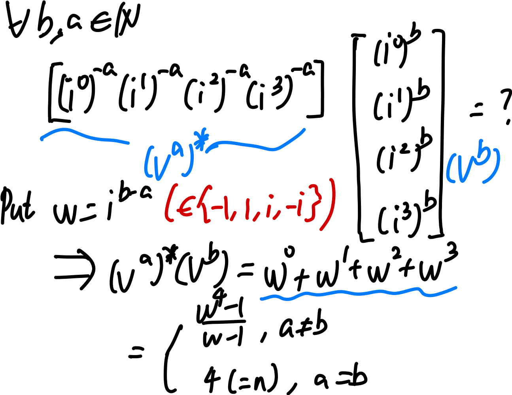

## lec 3 orthogonal matrices and norms

### decompose arbitrary vector by orthjonormal basis

## norms

以 R^2 为例

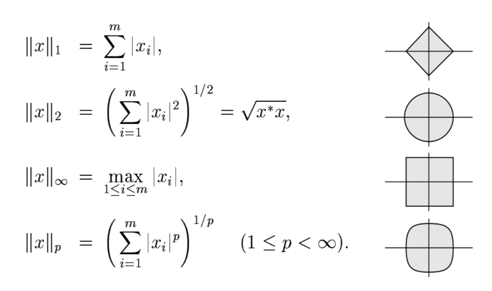

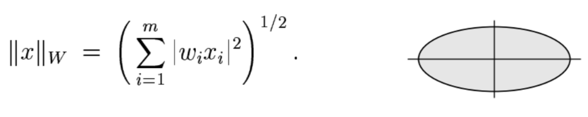

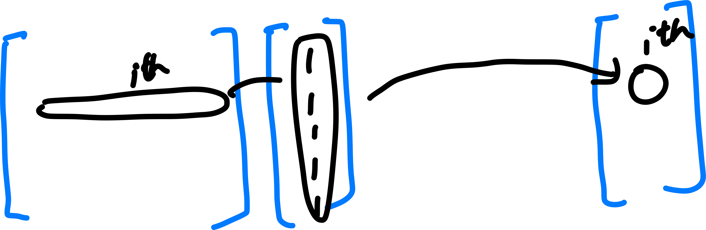

## lec 4 SVD

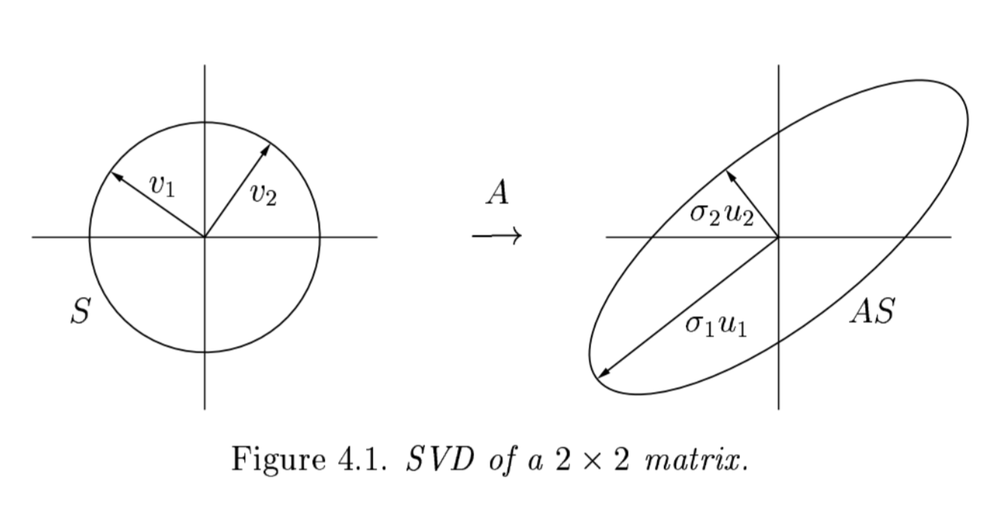

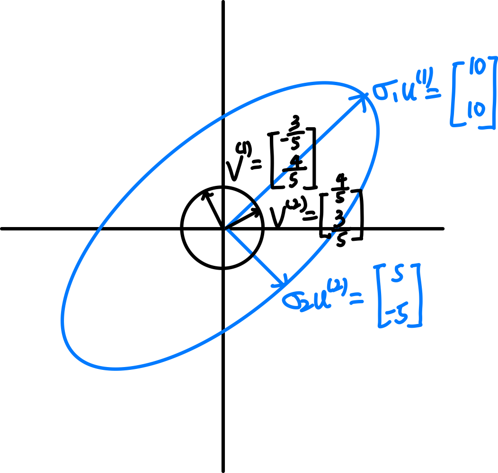
