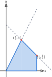
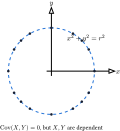

---
author:
- Qiulin Fan
authority: typst
bibliography:
- reference.bib
course: Math 525
date: 2026
description: Probability notes migrated from the complete LaTeX course source.
keywords:
- probability
- random variables
- law of large numbers
- central limit theorem
lang: zh-CN
qlnotes-schema: qlnotes-v2
semantic-node-count: 26
source: main.typ
subtitle: Typst-first course notes
title: "Math 525: Probability"
---
# joint and conditional distributions

## random vector and joint distributions

### random vector

> **Definition: --[[random vector]]--**
>
> 对于 prob space $(\Omega,\mathcal{F},P)$, 一个 function $\mathbf{X}:\Omega\rightarrow{\mathbb{R}}^{n}$ 如果是一个 $(\mathcal{F},\mathcal{B}({\mathbb{R}}^{n}))$-measurable function (即 [[$(\mathcal{M},\mathcal{N})$-measurable function]] 在这两个 measurable spaces 上的情形), 则 称它为一个 $n$-dimensional [[random variable]], 或者 $n$-dimensional random vector.
>
> 通常我们将 random vector 写成分量形式
>
> $$
> \mathbf{X}(\omega) = (X_{1}(\omega),X_{2}(\omega),\ldots,X_{n}(\omega))^{T}
> $$

random vector 相当于在一个 prob space 上, 考虑多个重新分配 mass 的方法, 并把它们并列起来.

> **Proposition: --[[由 $n$ 个 random variable 构成的 vector 是一个 random vector]]--**
>
> 令 $X_{1},X_{2},\cdots,X_{n}$ 是定义在**同一个 prob space** $(\Omega,\mathcal{F},{\mathbb{P}})$ 上的 $n$ 个 random variables. 则函数 $\mathbf{X}:\Omega\rightarrow{\mathbb{R}}^{n}$ defined by
>
> $$
> \omega\mapsto(X_{1}(\omega),X_{2}(\omega),\cdots,X_{n}(\omega))^{T}
> $$
>
> 是一个 random vector.

> **Proof**
>
> 我们在 measure theory 中证明过: 对于任意的 finite seq of Borel measureable functions $(f_{i}:\Omega\rightarrow{\mathbb{R}})_{i = 1}^{k}$, 其各作为一个维度组成的函数 $f = (f_{1},\cdots,f_{k})$ 也是一个 Borel measurable function (from $\Omega$ 到 ${\mathbb{R}}^{k}$).

> **Proposition: --[[一个 random vector 的每个分量都是一个 random variable]]--**
>
> 令 $\mathbf{X} = (X_{1},X_{2},\cdots,X_{n})^{T}$ 是一个 random vector. 则对于任意 $i$, $X_{i}$ 都是一个 random variable.

> **Proof**
>
> 对于 $\mathbf{X}:\Omega\rightarrow{\mathbb{R}}^{n}$ 是 $(\mathcal{F},\mathcal{B}({\mathbb{R}}^{n}))$-measurable, 我们可以将第 $i$ 个分量 $X_{i}$ 看作是 composition of two maps:
>
> $$
> X_{i} = \pi_{i} \circ \mathbf{X}
> $$
>
> 其中 $\pi_{i}:{\mathbb{R}}^{n}\rightarrow{\mathbb{R}}$ projection map $\pi_{i}(x_{1},\ldots,x_{n}) = x_{i}$.\
> 由于 projection map $\pi_{i}$ 是一个 Borel measurable function, 我们可以得出: $X_{i} = \pi_{i}(\mathbf{X})$ 也是 一个 Borel measurable function, 也就是一个 random variable.

> **Remark**
>
> 上两条 propositions 说明了一个事情: random vectors 和其分量 random variables 完全相互决定.
>
> - **random variables 组合起来一定是一个 random vector.**
>
> - **random vector 拆开每个分量一定是 random variable.**
>
> 因而, 研究一个 random vector 也就相当于研究分量 random variables 之间的关系.
>
> 这一章节我们会从 random vector 的性质 (比如 **joint distribution 和 marginal distribution, conditional distribution**) 出发, 研究分量 random variables 之间的关系.
>
> (但是注意: 前提是这些 random variables 必须定义在同一个 prob space 上. 也就是, 它们的 base probability measure 一定相同. 如果我们考虑不同 prob space 上的 random variables 的话, 那它们没有一个公共的 base probability measure, 很难说它们之间有什么关系. 这种情况下, 我们需要 coupling: 构造一个新的 prob space (说白了就是 product space), 让这两个 random variables 都有一个新 version. 这一问题我们之后再讨论.)

### joint distribution

> **Definition: --[[joint distribution]]-- and --[[joint cdf]]--**
>
> 令 $X_{1},\cdots,X_{n}$ 为 RV from the same prob space. 即 $\mathbf{X} := (X_{1},\cdots,X_{n})$ 是一个 random vector. 下面的两个对象分别将 [[probability distribution]] 和 [[distribution function (也称 **cumulative distribution function, cdf**)]] 推广到 random vector.
>
> 我们称 ${\mathbb{P}}^{\mathbf{X}}:{\mathbb{R}}^{n}\rightarrow{\mathbb{R}}$ defined by
>
> $$
> {\mathbb{P}}^{\mathbf{X}}(B) = {\mathbb{P}}(\mathbf{X}^{- 1}(B)),\quad\forall B \in \mathcal{B}({\mathbb{R}}^{n})
> $$
>
> 为 $X_{1},\cdots,X_{n}$ 的 **joint distribution**.
>
> 而我们称 $F_{\mathbf{X}} = F_{X_{1},\cdots,X_{n}}:{\mathbb{R}}^{n}\rightarrow{\mathbb{R}}$ defined by
>
> $$
> F_{\mathbf{X}}(x_{1},\cdots,x_{n}) = {\mathbb{P}}(X_{1} \leq x_{1},\cdots,X_{n} \leq x_{n})
> $$
>
> (即 ${\mathbb{P}}^{\mathbf{X}}$ restricted to the set of rectangles $\left\{ {( - \infty,x_{1}\rbrack \times \cdots \times ( - \infty,x_{n}\rbrack:(x_{1},\cdots,x_{n}) \in {\mathbb{R}}^{n}} \right\}$) 为它们的 **joint distribution function (或称 joint cdf)**.

joint distribution 的定义已经包括了如何从多个 random variables 的 distributions 得到一个 joint distribution. 而, 我们也可以从一个 joint distribution 的 limit behavior 得到每个 random variable 分量的 distributions, 称之为 marginal distribution:

> **Definition: --[[marginal distribution]]--**
>
> 令 $\mathbf{X} = (X_{1},\cdots,X_{n})^{T}$ 是一个 random vector. 则对于任意 $i$, $X_{i}$ 的 distribution ${\mathbb{P}}^{X_{i}}$ 被称为 $\mathbf{X}$ 的第 $i$ 个分量的 **marginal distribution**.

我们以 ${\mathbb{R}}^{2}$ 为例. 得出的结论可以推广到 ${\mathbb{R}}^{n}$.

> **Proposition: --[[通过 joint distribution 的极限得到 marginal distribution]]--**
>
> 令 $\mathbf{X} = (X_{1},X_{2})^{T}$ 是一个 random vector. 则对于任意 $x \in {\mathbb{R}}$, 有
>
> $$
> {\mathbb{P}}(X_{1} \leq x) = \lim\limits_{y\rightarrow\infty}F_{\mathbf{X}}(x,y)
> $$
>
> $X_{2}$ 的 marginal distribution 也可以通过同样的方法得到.
>
> 此外, joint distribution 有其他明显的 limit behaviors:
>
> - $$
>   \lim\limits_{x\rightarrow - \infty}F(x,y) = \lim\limits_{y\rightarrow - \infty}F(x,y) = 0
>   $$
>
> - $F_{\mathbf{X}}$ 对于每个维度都是 increasing 且 right-continuous 的.
>
> - $$
>   {\mathbb{P}}(X \leq x,Y \leq y) = \lim\limits_{z \uparrow y}F(x,z) = \lim\limits_{z \uparrow x}F(z,y) = \lim\limits_{z_{1} \uparrow x,z_{2} \uparrow y}F(z_{1},z_{2})
>   $$
>
> - $$
>   {\mathbb{P}}(x_{1} \leq X \leq x_{2},y_{1} \leq Y \leq y_{2}) = F(x_{2},y_{2}) - F(x_{1},y_{2}) = F(x_{2},y_{1}) + F(x_{1},y_{1})
>   $$

> **Remark**
>
> 最后一条: 右边相当于
>
> $$
> {\mathbb{P}}(x_{1} < X < x_{2},Y < y_{2}) - {\mathbb{P}}(x_{1} < X < x_{2},Y < y_{1})
> $$
>
> 因而成立.

discrete random vector 很容易处理. 我们可以直接定义 joint pmf. 而 continuous random vector 需要展开讨论. 接下来我们讲单独讨论 continuous random vector 的 joint distribution.

### condinuous joint cdf 与 joint pdf

recall: [[continuous random variable]] $X$ 的 cdf 是 absolutely continuous 的. 这个条件也等价于, 存在一个函数 $f_{X}:{\mathbb{R}}\rightarrow\lbrack 0,\infty)$ 使得

$$
F_{X}(x) = \int_{- \infty}^{x}f_{X}(t)\, dt
$$

这个定义可以 generalize 到 random vector 上.

> **Definition: --[[continuous random vector]]-- 和 --[[continuous joint cdf]]--**
>
> 对于 random vector $\mathbf{X} = (X_{1},\cdots,X_{n})^{T}$ 如果 ${\mathbb{P}}^{\mathbf{X}} \ll \lambda^{n}$, 即它满足 [[absolute continuity of signed measures]] 中的绝对连续性条件, 即存在一个函数 $f_{\mathbf{X}}:{\mathbb{R}}^{n}\rightarrow\lbrack 0,\infty)$ 使得对于任意 Borel set $B \subseteq {\mathbb{R}}^{n}$, 有
>
> $$
> {\mathbb{P}}^{\mathbf{X}}(B) = \int_{B}f_{\mathbf{X}}(x_{1},\cdots,x_{n})\, d\lambda^{n}(x_{1},\cdots,x_{n})
> $$
>
> 则称 $\mathbf{X}$ 是一个 **continuous random vector**.
>
> 注意: 由于是在 ${\mathbb{R}}^{n}$ 上, 这等价于存在一个函数 $f_{\mathbf{X}}:{\mathbb{R}}^{n}\rightarrow\lbrack 0,\infty)$ 使得对于任意 $x_{1},\cdots,x_{n}$, 有
>
> $$
> F_{\mathbf{X}}(x_{1},\cdots,x_{n}) = \int_{- \infty}^{x_{1}}\cdots\int_{- \infty}^{x_{n}}f_{\mathbf{X}}(t_{1},\cdots,t_{n})\, dt_{n}\cdots dt_{1}
> $$

> **Remark**
>
> 这个函数 $f_{\mathbf{X}}$ 就是 continuous random vector $\mathbf{X}$ 的 **joint probability density function (joint pdf).** 它是 [[probability density function (pdf)]] 在 random vector 上的对应概念. 它是 joint distribution measure ${\mathbb{P}}^{\mathbf{X}}$ 对于 Lebesgue measure $\lambda^{n}$ 的 [[Radon-Nikodym derivative]]:
>
> $$
> \frac{d{\mathbb{P}}^{\mathbf{X}}}{d\lambda^{n}} = f_{\mathbf{X}}
> $$

> **Remark**
>
> 我们已经知道, 只要存在导数 $f_{\mathbf{X}}$ 可以对于任意 $\mathbf{x} \in {\mathbb{R}}^{n}$ 还原出 joint cdf $F_{\mathbf{X}}$ 的值, 那么 $f_{\mathbf{X}}$ 就是 joint pdf, 这个 random vector 就是一个 continuous random vector.
>
> 那么这个还原积分的计算可以任意换序吗?
>
> 显然是可以的. 因为 recall [[Fubini's Theorem]]: 只要 $f$ 绝对可积, 即 $\left. \int_{{\mathbb{R}}^{n}} \middle| f \middle| \, d\lambda^{n} < \infty \right.$, 那么对于任意的 permutation $\sigma$ of $\left\{ {1,2,\cdots,n} \right\}$, 我们都可以将积分的顺序换成
>
> $$
> \int_{- \infty}^{x_{\sigma(1)}}\cdots\int_{- \infty}^{x_{\sigma(n)}}f(t_{1},\cdots,t_{n})\, dt_{\sigma(n)}\cdots dt_{\sigma(1)}
> $$
>
> 而我们知道, $f$ 一定是非负的, 而且积分一定是 1, 因而可以任意换序积分.
>
> 这就很舒服. 这也给出了 margin distribution 的计算方法: 只要对 joint pdf $f_{\mathbf{X}}$ 在其他维度上积分掉就行了.

> **Remark**
>
> 注意: **多个 continuous random variables 的 joint distribution 不一定是 continuous 的.** 反例: 考虑 random vector $\mathbf{X} = (X,X)^{T}$ where $X \sim \text{Uniform}(0,1)$ 则 ${\mathbb{P}}((X,X) \in \left\{ {y = x} \right\}) = 1$. 而注意, $\left\{ {y = x} \right\}$ 在 ${\mathbb{R}}^{2}$ 中的 Lebesgue measure 为 0, 而 absolute continuity 要求: 对于一个零测集, 其 ${\mathbb{P}}^{\mathbf{X}}$ 测度也必须是 0 (这是 ${\mathbb{P}}^{\mathbf{X}} \ll \lambda^{n}$ 的标准定义), 因而 joint distribution 不是 continuous 的.

> **Proposition: --[[joint pdf 和 joint cdf 的性质]]--**
>
> 令 $\mathbf{X} = (X_{1},\cdots,X_{n})^{T}$ 是一个 continuous random vector, 则它的 joint pdf $f_{\mathbf{X}}$ 和 joint cdf $F_{\mathbf{X}}$ 有以下性质:
>
> - $f_{\mathbf{X}} \geq 0$ a.e. 并且 $\int_{{\mathbb{R}}^{n}}f_{\mathbf{X}}\, d\lambda^{n} = 1$.
>
> - (如果一个集合 $A$ 有一个零测维度, 那么 ${\mathbb{P}}^{\mathbf{X}}(A) = 0$)
>
>   $$
>   {\mathbb{P}}(X_{1} = x_{1},x_{2} \leq X_{2} \leq x_{2}'\cdots,x_{n} \leq X_{n} \leq x_{n}') = 0
>   $$
>
> - 每个 $X_{i}$ 的 marginal distribution 也是 (absolutely) continuous 的, 并且
>
>   $$
>   f_{X_{i}}(x) = \int_{{\mathbb{R}}^{n - 1}}f_{\mathbf{X}}(t_{1},\cdots,t_{i - 1},x,t_{i + 1},\cdots,t_{n})\, dt_{1}\cdots dt_{i - 1}dt_{i + 1}\cdots dt_{n}
>   $$
>
>   例如,
>
>   $$
>   f_{X}(x) = \int_{- \infty}^{\infty}f_{\mathbf{X}}(x,y)\, dy
>   $$
>
> - 对每个 $x_{1},\cdots,x_{n} \in {\mathbb{R}}$, 都可以通过偏导数从 joint cdf 得到 joint pdf (这个偏导数一定 (a.e.) 存在):
>
>   $$
>   f_{\mathbf{X}}(x_{1},\cdots,x_{n}) = \frac{\partial^{n}}{\partial x_{1}\cdots\partial x_{n}}F_{\mathbf{X}}(x_{1},\cdots,x_{n})
>   $$
>
>   并且 by Fubini's theorem 可以 (a.e.) 任意换序:
>
>   $$
>   \frac{\partial^{n}}{\partial x_{\sigma(1)}\ldots\partial x_{\sigma(n)}}F_{\mathbf{X}}\overset{a.e.}{=}f_{\mathbf{X}}
>   $$

> **Proof**
>
> - 由于 $f_{\mathbf{X}}$ 是 ${\mathbb{P}}^{\mathbf{X}}$ 对于 $\lambda^{n}$ 的 Radon-Nikodym derivative, 因为任何 Borel 集 $B$ 都有 $P^{\mathbf{X}}(B) \geq 0$, 假设存在一个集合 $A \in \mathcal{B}({\mathbb{R}}^{n})$ 使得在其上 $f_{\mathbf{X}} < 0$ 且 $\lambda^{n}(A) > 0$, 那么根据积分定义
>
>   $$
>   {\mathbb{P}}^{\mathbf{X}}(A) = \int_{A}f_{\mathbf{X}}\, d\lambda^{n} < 0
>   $$
>
>   因而反证得 $f_{\mathbf{X}} \geq 0$ a.e.
>
>   并且
>
>   $$
>   \int_{{\mathbb{R}}^{n}}f_{\mathbf{X}}\, d\lambda^{n} = {\mathbb{P}}^{\mathbf{X}}({\mathbb{R}}^{n}) = 1
>   $$
>
> - natural.
>
> - 即 marginal distribution 的定义在 continuous case 中的展开
>
> - by Fubini's theorem, 以及 joint cdf 的定义.

> **Example**
>
> 考虑
>
> $$
> f_{X,Y}(x,y) = \left\{ \begin{matrix}
> {ce^{- x}e^{- 2y},} & {\text{if}\ x,y > 0} \\
> {0,} & \text{otherwise}
> \end{matrix} \right.
> $$
>
> Find $c$ 使得这是一个合法的 joint pdf, 并且计算 $X$ 和 $Y$ 的 marginal pdfs, 以及 ${\mathbb{P}}(X > 1,Y < 1)$.

> **Solution**
>
> 我们需要
>
> $$
> c\left( {\int_{0}^{\infty}e^{- x}dx} \right)\left( {\int_{0}^{\infty}e^{- 2y}dy} \right) = 1
> $$
>
> evaluate 这两个积分:
>
> $$
> \int_{0}^{\infty}e^{- x}dx = \left\lbrack {- e^{- x}} \right\rbrack_{0}^{\infty} = 1,
> $$
> $$
> \int_{0}^{\infty}e^{- 2y}dy = \left\lbrack {- \frac{1}{2}e^{- 2y}} \right\rbrack_{0}^{\infty} = \frac{1}{2}
> $$
>
> 因为 $c$ 必须为 2.
>
> 计算 $X$ 的 marginal pdf:
>
> $$
> f_{X}(x) = \int_{0}^{\infty}2e^{- x}e^{- 2y}dy = 2e^{- x}\left\lbrack {- \frac{1}{2}e^{- 2y}} \right\rbrack_{0}^{\infty} = e^{- x}
> $$
>
> 然后计算 $Y$ 的 marginal pdf:
>
> $$
> f_{Y}(y) = \int_{0}^{\infty}2e^{- x}e^{- 2y}dx = 2e^{- 2y}\left\lbrack {- e^{- x}} \right\rbrack_{0}^{\infty} = 2e^{- 2y}
> $$
>
> 最后计算 ${\mathbb{P}}(X > 1,Y < 1)$:
>
> $$
> {\mathbb{P}}(X > 1,Y < 1) = \int_{1}^{\infty}\int_{0}^{1}2e^{- x}e^{- 2y}dydx = \left( {\int_{1}^{\infty}e^{- x}dx} \right)\left( {\int_{0}^{1}2e^{- 2y}dy} \right)
> $$
>
> 这两个定积分分别为:
>
> $$
> \int_{1}^{\infty}e^{- x}dx = \left\lbrack {- e^{- x}} \right\rbrack_{1}^{\infty} = e^{- 1},
> $$
> $$
> \int_{0}^{1}2e^{- 2y}dy = \left\lbrack {- e^{- 2y}} \right\rbrack_{0}^{1} = 1 - e^{- 2}
> $$
>
> 因而
>
> $$
> {\mathbb{P}}(X > 1,Y < 1) = e^{- 1}(1 - e^{- 2}) = e^{- 1} - e^{- 3}
> $$

> **Theorem**
>
> 对于 continuous random vector $\mathbf{X} = (X_{1},\cdots,X_{n})^{T}$, 取任意 Borel measurable function $g:{\mathbb{R}}^{n}\rightarrow{\mathbb{R}}$, 则 $g(\mathbf{X})$ 是一个 random variable, 并且如果 $\left. {\mathbb{E}}\lbrack \middle| g(\mathbf{X}) \middle| \rbrack < \infty \right.$, 则 , 则
>
> $$
> {\mathbb{E}}\lbrack g(\mathbf{X})\rbrack = \int_{{\mathbb{R}}^{n}}g(\mathbf{x})f_{\mathbf{X}}(\mathbf{x})\, d\lambda^{n}(\mathbf{x})
> $$

> **Example**
>
> Let $(X,Y)$ be a two-dimensional random variable with joint density function
>
> $$
> f_{X,Y}(x,y) = \left\{ \begin{matrix}
> {1,} & {0 < \frac{y}{2} < x < 1} \\
> {0,} & \text{otherwise}
> \end{matrix} \right.
> $$
>
> - 求 marginal density $f_{Y}$
>
> - 计算概率 ${\mathbb{P}}(X = 1/2)$ 和 ${\mathbb{P}}(X + Y \leq 3/2)$

> **Solution**
>
> - 对固定 $y$ 需要满足 $0 < y < 2x$ 且 $x < 1$, 等价于 $x > y/2$ 且 $x < 1$. 因而 $0 < y < 2$
>
>   $$
>   f_{Y}(y) = \int_{- \infty}^{\infty}f_{X,Y}(x,y)dx = \int_{y/2}^{1}1dx = 1 - \frac{y}{2},\quad 0 < y < 2
>   $$
>
>   否则 $f_{Y}(y) = 0$.
>
> - 由于 $X$ 是一个 continuous random variable, ${\mathbb{P}}(X = 1/2) = 0$.
>
>   ${\mathbb{P}}(X + Y \leq 3/2)$ 略微难算一点: 满足条件的区域为 $\left\{ {(x,y):0 < \frac{y}{2} < x < 1,y \leq 3/2 - x} \right\}$,
>
>   $$
>   0 < y < \min(2x,3/2 - x)
>   $$
>
>   比较两条上界直线: $2x = 3/2 - x\Rightarrow x = 1/2$ 当 $0 < x < 1/2$, 有 $2x < 3/2 - x$, 所以上界是 $2x$; 当 $1/2 < x < 1$, 上界是 $3/2 - x$.
>
>   所以概率等于面积积分：
>
>   $$
>   {\mathbb{P}}(X + Y \leq 3/2) = \int_{0}^{1/2}\int_{0}^{2x}1dydx + \int_{1/2}^{1}\int_{0}^{3/2 - x}1dydx
>   $$
>
>   计算：
>
>   $$
>   \begin{matrix}
>   {\int_{0}^{1/2}2xdx = \left\lbrack x^{2} \right\rbrack_{0}^{1/2} = \frac{1}{4}} \\
>   {\int_{1/2}^{1}\left( {\frac{3}{2} - x} \right)dx = \left\lbrack {\frac{3}{2}x - \frac{x^{2}}{2}} \right\rbrack_{1/2}^{1} = 1 - \frac{5}{8} = \frac{3}{8}}
>   \end{matrix}
>   $$
>
>   合并得
>
>   $$
>   {\mathbb{P}}(X + Y \leq 3/2) = \frac{1}{4} + \frac{3}{8} = \frac{5}{8}
>   $$
>
>   也可以通过画图来做. 我们画出 support set 的图:
>
>   {#fig-prob-03-joint-conditional-distribution-diagram-01 alt="The shaded portion of the support lies below x+y=3/2, split at x=1/2."}
>
>   在这个图上对联合函数积分即可.

## independence of two random variables

### independence of two random variables 的三种等价定义

> **Definition: --[[independence via product distribution of marginal distributions]]--**
>
> 两个 random variables $X,Y:\Omega\rightarrow{\mathbb{R}}$ 被称为 independent 的, 如果对于任意的 Borel sets $A,B \subseteq {\mathbb{R}}$, 都有
>
> $$
> {\mathbb{P}}(X \in A,Y \in B) = {\mathbb{P}}(X \in A) \cdot {\mathbb{P}}(Y \in B)
> $$
>
> 注意这个定义等价于 for all points $(x,y) \in {\mathbb{R}}^{2}$,
>
> $$
> F_{X,Y}(x,y) = F_{X}(x)F_{Y}(y)
> $$
>
> 即**它们的 joint distribution 是它们 marginal distributions 的 product.**

对于 discrete 和 continuous random variables 而言, 这还意味着 independence 等价于:

- joint pmf 是 marginal pmfs 的 product, for discrete case.

- joint pdf 是 marginal pdfs 的 product, for continuous case.

这里离散情形沿用 [[discrete random variable]] 的定义. 详细而言:

> **Theorem: --[[independence via joint-density factorization marginal densities]]--**
>
> 令 $X,Y$ 是两个 random variables.
>
> - 如果 $X,Y$ 是 discrete random variables, 则它们 independent 的条件等价于对于任意 $x,y$, 都有
>
>   $$
>   p_{X,Y}(x,y) = p_{X}(x) \cdot p_{Y}(y)
>   $$
>
> - 如果 $X,Y$ 是 continuous random variables, 则它们 independent 的条件等价于对于任意 $x,y$, 都有
>
>   $$
>   f_{X,Y}(x,y) = f_{X}(x) \cdot f_{Y}(y)
>   $$

> **Proof**
>
> discrete case: 显然可得.
>
> continuous case:
>
> - $F_{X,Y}(x,y) = F_{X}(x)F_{Y}(y)\Longrightarrow f_{X,Y}(x,y) = f_{X}(x) \cdot f_{Y}(y)$: 取偏导数即可.
>
> - $f_{X,Y}(x,y) = f_{X}(x) \cdot f_{Y}(y)\Longrightarrow F_{X,Y}(x,y) = F_{X}(x)F_{Y}(y)$: 积分即可.

因而对于 independent 的两个 random variables, 固定 $X = x_{0}$, 那么联合密度函数 $f_{X,Y}(x_{0},y)$ 就是 $Y$ 的边际密度函数 $f_{Y}(y)$ 乘上 一个常数 $f_{X}(x_{0})$.\

> **Remark**
>
> Recall [[independence of events]] 的定义:
>
> $$
> {\mathbb{P}}(A \cap B) = {\mathbb{P}}(A) \cdot {\mathbb{P}}(B)
> $$
>
> 也等价于对于任意的 Borel sets $A,B$ where ${\mathbb{P}}(B) > 0$, 都有
>
> $$
> {\mathbb{P}}(A \mid B) = {\mathbb{P}}(A)
> $$
>
> 即: 一个事件发生与否都不会对另一个事件发生的概率产生任何影响.
>
> 而再看到两个 random variables independence 的定义是:
>
> $$
> {\mathbb{P}}(X \in A,Y \in B) = {\mathbb{P}}(X \in A) \cdot {\mathbb{P}}(Y \in B)
> $$
>
> 这个定义也当然等价于:
>
> > **Proposition: --[[independence via conditional distribution: marginal distribution]]--**
> >
> > 两个 random variables $X,Y$ 是 independent 的, iff: 对于任意的 Borel sets $A,B$, 如果${\mathbb{P}}(Y \in B) > 0$, 则
> >
> > $$
> > {\mathbb{P}}(X \in A \mid Y \in B) = {\mathbb{P}}(X \in A)
> > $$
> >
> > 即: **$X$ 的 conditional distribution, 不论给定 $Y$ 的任何信息, 都等于 $X$ 的 marginal distribution.**
>
> 所以它实际上意义是: **知道一个 random variable 的任何信息, 对于另外一个都没有任何帮助.**
>
> 因而**它们的 joint distribution 可以分解成 marginal distributions 的 product**.\

> **Remark**
>
> Furthermore: 我们不难发现一件事情, 可以**在 independence of two events 和 independence of two random variables 之间建立一个桥梁:**
>
> > **Proposition: --[[independence via generated sigma-algebras]]--**
> >
> > 令 $X,Y$ 是两个 random variables. 则 $X,Y$ 是 independent 的 iff: $X$ 和 $Y$ 按 [[$\sigma$-algebra generated by a random variable (measurable function)]] 分别生成的 $\sigma(X)$ 和 $\sigma(Y)$ 中分别任取一个事件, 这两个事件都是 independent 的. 即:
> >
> > $$
> > \forall A \in \sigma(X),\forall B \in \sigma(Y),\quad{\mathbb{P}}(A \cap B) = {\mathbb{P}}(A) \cdot {\mathbb{P}}(B)
> > $$
>
> 这严格说明了: **两个 random variables 之间的 independence, 本质上是它们各自蕴含的 information (由 generated sigma-algebra 严格刻画) 的完全不相关**: 对 $X$ 的观测对于 预测 $Y$ 的任何行为都不提供任何帮助, 反之亦然.\

以上就是 independence of two random variables 的定义, 以及其 information geometric intuition.

下面我们讲 independence between two random variables, generalize 到 mutual independence among 任意的 family of random variables.

### mutual independence of a family of random variables: 强于 pairwise independence

我们定义了两个 random variables 的 independence, 但是这个定义可以推广到多个 (甚至 uncountably many) random variables 上.

> **Definition: --[[**mutual independence** of multiple random variables]]--**
>
> 令 $\left\{ {X_{i}:i \in I} \right\}$ 是一个 random variables 的 family, 其中 $I$ 是一个 index set. 则如果对于任意的 finite subset $J \subseteq I$, 以及对于任意的 Borel sets $\left\{ {A_{j}:j \in J} \right\}$, 都有
>
> $$
> {\mathbb{P}}(X_{j} \in A_{j},\forall j \in J) = \prod\limits_{j \in J}{\mathbb{P}}(X_{j} \in A_{j})
> $$
>
> 则称这个 family of random variables 是 independent 的.

注意: **joint mass[ ]{style="white-space: pre-wrap"} density 的 factorization 也可以推广到多个 random variables 上.** 有一件事情值得说明: 这里定义的是**mutual independence**, 也就是说, 对于任意的 finite subset $J$, 它们的 joint distribution 都 factorizes into product of marginal distributions.

而**两两 independent 的 random variables family 不一定是 mutual independent 的.** 即: 如果对于任意的 $i \neq j$, $X_{i}$ 和 $X_{j}$ 是 independent 的, 并不意味着对于任意的 finite subset $J$, $\left\{ {X_{j}:j \in J} \right\}$ 是 independent 的.

举个例子:

> **Example: pairwise independence does NOT imply mutual independence**
>
> 假设我们抛掷两枚公平的硬币. 令 $X,Y$ 是两个 independent 的 random variables, 且都服从 uniform distribution on $\left\{ {- 1,1} \right\}$. 即:
>
> $$
> {\mathbb{P}}(X = 1) = {\mathbb{P}}(X = - 1) = \frac{1}{2},\quad{\mathbb{P}}(Y = 1) = {\mathbb{P}}(Y = - 1) = \frac{1}{2}
> $$
>
> 现在, 我们定义第三个 random variable $Z$ 为前两者的 product:
>
> $$
> Z = X \cdot Y
> $$
>
> 容易验证: $X,Y,Z$ 两两 independent, 但不 mutual independent. 因为如果只是知道 $X$ 的值, 那么我们对于 $Z$ 的值完全没有信息 (因为有一个完全随机的 $Y$ 没有任何已知信息); 同样, 如果只是知道 $Y$ 的值, 那么我们对于 $Z$ 的值也完全没有信息;
>
> 但是, 如果我们同时知道 $X$ 和 $Y$ 的值, 那么 $Z$ 的值就完全确定了.
>
> 这说明 **pairwise independence 只能保证局部的信息解耦, 而 mutual independence 则保证了在这个 family of random variables 之间的全局信息解耦.**

### independent $\Longrightarrow$ uncorrelated

Independence 的概念会让我们回忆起另外一个刻画两个 random variables 之间关系的概念: covariance, 它丈量了**两个 random variables 之间的线性关系**.

[[covariance]] 的定义:

$$
\text{Cov}(X,Y) := {\mathbb{E}}\lbrack(X - {\mathbb{E}}\lbrack X\rbrack)(Y - {\mathbb{E}}\lbrack Y\rbrack)\rbrack = {\mathbb{E}}\lbrack XY\rbrack - {\mathbb{E}}\lbrack X\rbrack{\mathbb{E}}\lbrack Y\rbrack
$$

我们称 covariance 为 0 的两个 random variables 为 --[[uncorrelated random variables]]-- . 我们容易发现: **independence 是一个比 uncorrelated 更强的概念:**

> **Proposition: --[[independent 严格强于 uncorrelated]]--**
>
> 令 $X,Y$ 是两个 random variables. 则 $X,Y$ 是 independent 的 $\Longrightarrow$ $\text{Cov}(X,Y) = 0$. 但是 $\text{Cov}(X,Y) = 0$ 不一定 $\Longrightarrow$ $X,Y$ 是 independent 的.

> **Proof**
>
> - independence $\Longrightarrow$ covariance 是 0, 因为 independence 显然 imply$E\lbrack XY\rbrack = E\lbrack X\rbrack E\lbrack Y\rbrack$, 从而 covariance 的定义式中 $E\lbrack XY\rbrack - E\lbrack X\rbrack E\lbrack Y\rbrack = 0$.
>
> - 有一个经典反例: 考虑 $X$ 是任意按原点对称的分布, 比如一个 standard normal distribution; 而定义 $Y = X^{2}$, 此时
>
>   $$
>   \text{Cov}(X,X^{2}) = E\lbrack X \cdot X^{2}\rbrack - E\lbrack X\rbrack E\lbrack X^{2}\rbrack = E\lbrack X^{3}\rbrack - E\lbrack X\rbrack E\lbrack X^{2}\rbrack
>   $$
>
>   由于 $X$ 的分布是关于原点对称的, $E\lbrack X^{3}\rbrack = 0$ 且 $E\lbrack X\rbrack = 0$, 因而 covariance 是 0. 但是 $X$ 和 $Y$ 显然不是 independent 的.

> **Remark**
>
> 本质上, independence 是一种最强的全局信息不相关性. 而 covariance 只度量 linear relationship. 试想: 如果这两个随机变量之间的关系是这样的呢?
>
> {#fig-prob-03-joint-conditional-distribution-diagram-02 alt="Points constrained to a circle have zero covariance but remain dependent."}
>
> 那么它们的 covariance 是 0, 但是它们显然不是 independent 的. 所以 covariance 忽略了很多非线性的关系, 而 independence 则完全捕捉了所有的关系.\

刚才说到, 两个 random variables 的 independence 显然 imply ${\mathbb{E}}\lbrack XY\rbrack = {\mathbb{E}}\lbrack X\rbrack{\mathbb{E}}\lbrack Y\rbrack$. 而 BTW: 这个性质其实**可以 generalize 到任意 finite number of independent random variables 的 product 上, 并且 我们可以在这些 random variables 上任意地施加 Borel measurable functions**, 只要保证这些函数的 expectation 是 finite 的,

> **Theorem: --[[independence $\Longrightarrow$ expectation is closed under product]]--**
>
> 令 $\left\{ {X_{i}:i \in I} \right\}$ 是一个 independent 的 random variables 的 family, 则对于任意的 finite subset $J \subseteq I$, 以及对于任意的 Borel measurable functions $\left\{ {g_{j}:j \in J} \right\}$, 如果 $\left. {\mathbb{E}}\lbrack \middle| g_{j}(X_{j}) \middle| \rbrack < \infty \right.$ for all $j \in J$, 则
>
> $$
> {\mathbb{E}}\left\lbrack {\prod\limits_{j \in J}g_{j}(X_{j})} \right\rbrack = \prod\limits_{j \in J}{\mathbb{E}}\lbrack g_{j}(X_{j})\rbrack
> $$
>
> 特别地, 取每个 $g_{j}(x) = x$, 则
>
> $$
> {\mathbb{E}}\left\lbrack {\prod\limits_{j \in J}X_{j}} \right\rbrack = \prod\limits_{j \in J}{\mathbb{E}}\lbrack X_{j}\rbrack
> $$

> **Proof**
>
> 令 $J = \left\{ {1,2,\ldots,n} \right\}$. 由于 $X_{1},\ldots,X_{n}$ 是 independent 的, 它们的 joint distribution $\mu_{\mathbf{X}}$ 是其 marginal distributions $\mu_{X_{j}}$ 的 product measure:
>
> $$
> \mu_{\mathbf{X}} = \mu_{X_{1}} \times \mu_{X_{2}} \times \ldots \times \mu_{X_{n}}
> $$
>
> 根据 Change of Variables Formula,
>
> $$
> {\mathbb{E}}\left\lbrack {\prod\limits_{j = 1}^{n}g_{j}(X_{j})} \right\rbrack = \int_{{\mathbb{R}}^{n}}\left( {\prod\limits_{j = 1}^{n}g_{j}(x_{j})} \right)\, d\mu_{\mathbf{X}}(x_{1},\ldots,x_{n}) = \int_{\mathbb{R}}\ldots\int_{\mathbb{R}}\left( {\prod\limits_{j = 1}^{n}g_{j}(x_{j})} \right)\, d\mu_{X_{1}}(x_{1})\ldots d\mu_{X_{n}}(x_{n})
> $$
>
> 由于被积函数 $\prod g_{j}(x_{j})$ 是变量分离的, 根据 Fubini's Theorem 可以把积分分解成多个积分的 product:
>
> $$
> = \left( {\int_{\mathbb{R}}g_{1}(x_{1})\, d\mu_{X_{1}}(x_{1})} \right) \times \ldots \times \left( {\int_{\mathbb{R}}g_{n}(x_{n})\, d\mu_{X_{n}}(x_{n})} \right)
> $$
>
> 其中每一项都是${\mathbb{E}}\lbrack g_{j}(X_{j})\rbrack$.

> **Remark**
>
> recall: expectation is a linear operator (因而 linearity 是 regardless of independence). 但是它不一定是一个 multiplicative operator.
>
> 而这里我们说, **如果 random variables 是 independent 的, 那么 expectation 就是一个 multiplicative operator.**

实际上: 当这些 Borel measurable functions $\left\{ {g_{j}:j \in J} \right\}$ 全都 bounded 时, 这个定理其实反向也是成立的:

> **Theorem**
>
> 令 $\left\{ {X_{i}:i \in I} \right\}$ 是一个family of random variables. 如果对于任意的 finite subset $J \subseteq I$, 以及任意的 bounded Borel measurable functions $\left\{ {g_{j}:j \in J} \right\}$, 都有
>
> $$
> {\mathbb{E}}\left\lbrack {\prod\limits_{j \in J}g_{j}(X_{j})} \right\rbrack = \prod\limits_{j \in J}{\mathbb{E}}\lbrack g_{j}(X_{j})\rbrack
> $$
>
> 则这个 family of random variables 是 independent 的.

> **Proof**
>
> 不妨特取 indicator functions. 对于任意的 Borel sets $A,B \subseteq {\mathbb{R}}$, 令 $f(x) = I_{A}(x)$, $g(y) = I_{B}(y)$. 代入等式得到:
>
> $$
> {\mathbb{E}}\lbrack I_{A}(X) \cdot I_{B}(Y)\rbrack = {\mathbb{E}}\lbrack I_{A}(X)\rbrack \cdot {\mathbb{E}}\lbrack I_{B}(Y)\rbrack
> $$
>
> 注意到 $I_{A}(X) \cdot I_{B}(Y) = I_{\{{X \in A,Y \in B}\}}$. 根 据 expectation of indicator function 等于 probability, 我们立刻得到:
>
> $$
> {\mathbb{P}}(X \in A,Y \in B) = {\mathbb{P}}(X \in A) \cdot {\mathbb{P}}(Y \in B)
> $$

注意: **$g(x) = x$ 并不是 bounded 的 function, 因而 uncorrelation $\operatorname{\Longrightarrow\not{}}$ independence.**\
OK. 以上是 pretty much general properties of independence. 最后我们看一下, 对于 discrete 和 continuous random variables 而言, independence 的 characterization 具体长什么样子.

### discrete RV independence 的 characterization

> **Remark**
>
> 关于两个 discrete random variables $X,Y$ 是否 independent 的判断, 还有一个直观的方法.
>
> > **Proposition: --[[discrete RV independence 的 characterization]]--**
> >
> > 两个 discrete random variables $X,Y$ 是 independent 的 iff 它们的 joint pmf as a matrix 有 rank 1(每行每列都互为倍数).
>
> > **Proof**
> >
> > note: 一个矩阵 $M$ 的 rank 等于 1 iff 它可以被分解为两个向量的 outer product :
> >
> > $$
> > M = \mathbf{u}\mathbf{v}^{\top}
> > $$
> >
> >  where $\mathbf{u}$ 和 $\mathbf{v}$ 是非零列向量.
> >
> > ($\Longrightarrow$): 如果 independent, 那么对于所有 $i,j$, joint probability $p_{ij} = {\mathbb{P}}(X = x_{i},Y = y_{j})$ 满足:
> >
> > $$
> > p_{ij} = {\mathbb{P}}(X = x_{i}) \cdot {\mathbb{P}}(Y = y_{j})
> > $$
> >
> > 如果我们定义向量 $\mathbf{p}_{X} = \lbrack p_{X}(x_{1}),p_{X}(x_{2}),\ldots\rbrack^{\top}$ 和 $\mathbf{p}_{Y} = \lbrack p_{Y}(y_{1}),p_{Y}(y_{2}),\ldots\rbrack^{\top}$, 那么整个联合分布矩阵 $P$ 就可以写成:
> >
> > $$
> > P = \mathbf{p}_{X}\mathbf{p}_{Y}^{\top}
> > $$
> >
> > 这正是 Rank 1 矩阵的标准形式.
> >
> > ($\Longleftarrow$) 如果 $P$ 的 rank 为 1, 那么存在向量 $\mathbf{u}$ 和 $\mathbf{v}$ 使得 $p_{ij} = u_{i}v_{j}$.由于 $\sum_{i,j}p_{ij} = 1$, 我们可以归一化这两个向量, 使得 $\sum u_{i} = 1$ 且 $\sum v_{j} = 1$.此时, $u_{i}$ 恰好就是 $X$ 的 marginal PMF, $v_{j}$ 恰好就是 $Y$ 的 marginal PMF. 因此满足 $p_{ij} = p_{i} \cdot p_{j}$, 即两个变量独立.
>
> > **Example**
> >
> > $$
> > \begin{matrix}
> > {P = X \smallsetminus Y} & 0 & {1\ } & {\text{Marginal}\ {\mathbb{P}}(X)} \\
> > 0 & 0.4 & 0.1 & 0.5 \\
> > 1 & 0.4 & 0.1 & 0.5 \\
> > {\text{Marginal}\ {\mathbb{P}}(Y)} & 0.8 & 0.2 & 1.0
> > \end{matrix}
> > $$
> >
> > 这里的 $X,Y$ 就是 independent 的 random variables.

### continuous RV independence 的 geometric intuition

对于 independent continuous random variables $X,Y$, 它的 characterization 我们已经知道了: 即 joint pdf factorizes into marginal pdfs. 这一个 characterization 的 geometric intuition 是:

- joint pdf 的 support set 一定是一个矩形 (不一定 bounded)

- joint pdf 的**每个维度上的任意截面的形状都是一样的** (因为固定 $x$, 则 $y$ 方向的性质只由 $f_{Y}$ 决定.)

  即: 固定 $x$, $y$-distribution 的横截面永远长得像 $f_{Y}$, 只是乘上了一个常数 $f_{X}(x)$ 而已. 同样的, 固定 $y$, $x$ 分布的横截面永远长得像 $f_{X}$, 只是乘上了一个常数 $f_{Y}(y)$ 而已.

{#fig-prob-03-joint-conditional-distribution-diagram-03 alt="A rectangular joint support whose vertical cross-sections share one shape at different scales."}

## conditional distribution function and density

### conditional distribution and its distribution function

> **Definition: --[[conditional distribution]]--**
>
> 给定 random variables $X,Y:\Omega\rightarrow{\mathbb{R}}$, 其中下面极限里的条件概率按 [[conditional probability]] 理解. 我们定义 the conditional distribution of $X$ given $Y = y$ 为 the probability measure ${\mathbb{P}}^{X|Y = y}$:
>
> $$
> {\mathbb{P}}^{X|Y = y}(A) := \lim\limits_{h\rightarrow 0^{+}}{\mathbb{P}}(X \in A \mid y \leq Y \leq y + h),\quad\forall A \in \mathcal{B}({\mathbb{R}})
> $$
>
> 并将 function $F_{X|Y = y}:{\mathbb{R}}\rightarrow{\mathbb{R}}$ defined by $F_{X|Y = y}(x) := {\mathbb{P}}^{X|Y = y}(( - \infty,x\rbrack)$:
>
> $$
> \left. F_{X|Y}(x \middle| y) := \lim\limits_{h\rightarrow 0^{+}}{\mathbb{P}}(X \leq x \mid y \leq Y \leq y + h) \right.
> $$
>
> 称为 the conditional distribution function of $X$ given $Y = y$.

> **Remark**
>
> 注意: 每个取值 $y$ 都对应一个 conditional distribution measure ${\mathbb{P}}^{X|Y = y}$ 和一个 conditional distribution function $F_{X|Y = y}$. 因此, conditional distribution 和 conditional distribution function 都是一个 family of measures/functions, 而不是一个 measure/function.
>
> 也就是说, 一个 random variable 可以 induce 出另一个 random variable 的可能 uncountably many 个 conditional distribution.

> **Remark**
>
> 如果 $X,Y$ 是两个 discrete random variables, 那么它们的 conditional distribution 就很简单了.
>
> $$
> {\mathbb{P}}^{X|Y = y}(\left\{ x \right\}) = \frac{{\mathbb{P}}(X = x,Y = y)}{{\mathbb{P}}(Y = y)}
> $$
>
> 以及
>
> $$
> F_{X|Y = y}(x) = \sum\limits_{t \leq x}\frac{{\mathbb{P}}(X = t,Y = y)}{{\mathbb{P}}(Y = y)}
> $$
>
> 其他情况稍复杂一些. 但是我们可以确定的是:

### conditional density for random variables jointly continuous

> **Theorem: --[[jointly continuous RVs 之间所有 defined 处总有 conditional density]]--**
>
> 令 $\mathbf{X} = (X,Y)^{T}$ 是一个 continuous random vector, 则对于任意 $y$ 使得 $f_{Y}(y) > 0$, 都有 conditional distribution of $X$ given $Y = y$ 的 pdf:
>
> $$
> \left. f_{X|Y}(x \middle| y) := \frac{f_{X,Y}(x,y)}{f_{Y}(y)} \right.
> $$
>
> 即: $\forall x \in {\mathbb{R}}$ 有:
>
> $$
> \left. F_{X|Y}(x \middle| y) = \int_{- \infty}^{x}\frac{f_{X,Y}(t,y)}{f_{Y}(y)}\, dt \right.
> $$

> **Proof**
>
> 注意: $(X,Y)^{T}$ 是 continuous random vector $\Longrightarrow$ $Y$ 是一个 continuous random variable. 因而 因而 $f_{Y}(y)$ 是 well-defined 的. (反过来不成立) 取 $y$ s.t. $f_{Y}(y) > 0$.
>
> 则
>
> $$
> \begin{matrix}
> {{\mathbb{P}}^{X \mid Y = y}(A)} & {= \lim\limits_{h\rightarrow 0^{+}}{\mathbb{P}}(X \in A \mid y \leq Y \leq y + h)} \\
>  & {= \lim\limits_{h\rightarrow 0^{+}}\frac{{\mathbb{P}}(X \leq x,y \leq Y \leq y + h)}{{\mathbb{P}}(y \leq Y \leq y + h)} = \lim\limits_{h\rightarrow 0^{+}}\frac{F_{X,Y}(x,y + h) - F_{X,Y}(x,y)}{F_{Y}(y + h) - F_{Y}(y)}} \\
>  & {= \frac{\partial_{y}F_{X,Y}(x,y)}{f_{Y}(y)} = \int_{- \infty}^{x}\frac{f_{X,Y}(s,y)}{f_{Y}(y)}ds}
> \end{matrix}
> $$
>
> 因而, $\left. f_{X|Y}(x \middle| y) := \frac{f_{X,Y}(x,y)}{f_{Y}(y)} \right.$ 是 $F_{X|Y = y}$ 的 pdf.

> **Remark**
>
> 为了保证 continuous random vector 下分量之间的 conditional distribution 总是 (a.e.) 拥有 pdf 的, 我们可以 给 not well-defined 处下定义: 如果 $f_{Y}(y) = 0$, 就直接 set $\left. f_{X|Y}(x \middle| y) = 0 \right.$ for all $x$.
>
> 在这个定义下: continuous random vector 下分量之间的 conditional distribution 也总是 continuous 的.

### Law of Total Probability for continuous random vector

> **Theorem**
>
> 令 $\mathbf{X} = (X,Y)^{T}$ 是一个 continuous random vector, 则对于任意 $A \in \mathcal{B}({\mathbb{R}})$,
>
> $$
> {\mathbb{P}}((X,Y) \in A) = \int_{- \infty}^{+ \infty}{\mathbb{P}}((X,y) \in A \mid Y = y)f_{Y}(y)dy
> $$

> **Proof**
>
> 注意:
>
> $$
> {\mathbb{P}}\left( {Y \in \left\{ {y \in {\mathbb{R}}:f_{Y}(y) = 0} \right\}} \right) = 0
> $$
>
> 即, $\left\{ {Y \in f_{Y}^{- 1}(\left\{ 0 \right\})} \right\}$ 是一个 null set. (不是说 $f_{Y}(y) = 0$ 的 $y$ 是 null set, 意思是说 $Y$ 落在这些 $y$ 上的事件是 null set.)
>
> 因而 compute:
>
> $$
> \begin{matrix}
> {{\mathbb{P}}(X \in ( - \infty,x\rbrack,Y \leq y)} & {= {\mathbb{P}}\left( {X \in ( - \infty,x\rbrack,\left\{ {Y \leq y} \right\} \cap \left\{ {Y \notin f_{Y}^{- 1}(\left\{ 0 \right\})} \right\}} \right) = \int_{( - \infty,y\rbrack \cap f_{Y}^{- 1}{({\{ 0\}}^{c})}}\int_{- \infty}^{\infty}f_{X,Y}(s,t)dsdt} \\
>  & {= \int_{( - \infty,y\rbrack \cap f_{Y}^{- 1}((0, + \infty))}\left( {\int_{- \infty}^{x}\frac{f_{X,Y}(s,t)}{f_{Y}(t)}ds} \right)f_{Y}(t)dt} \\
>  & {= \int_{( - \infty,y\rbrack \cap f_{Y}^{- 1}((0, + \infty))}{\mathbb{P}}(X \leq x \mid Y = t)f_{Y}(t)dt} \\
>  & {= \int_{( - \infty,y\rbrack \cap f_{Y}^{- 1}((0, + \infty))}{\mathbb{P}}(X \leq x \mid Y = t)f_{Y}(t)dt + \int_{( - \infty,y\rbrack \cap f_{Y}^{- 1}({\{ 0\}})}{\mathbb{P}}(X \leq x \mid Y = t)f_{Y}} \\
>  & {= \int_{( - \infty,y\rbrack}{\mathbb{P}}(X \leq x \mid Y = t)f_{Y}(t)dt} \\
>  & {= \int_{- \infty}^{y}{\mathbb{P}}(X \leq x \mid Y = t)f_{Y}(t)dt}
> \end{matrix}
> $$

> **Remark**
>
> recall 最普通的全概率公式: 把样本空间 partition 成几个 disjoint 的事件 $B_{1},\cdots,B_{n}$, 则任意事件$A$ 等于它在每个 $B_{i}$ 上的 conditional probability 的和:
>
> $$
> {\mathbb{P}}(A) = \sum\limits_{i = 1}^{n}{\mathbb{P}}(A \cap B_{i}) = \sum\limits_{i = 1}^{n}{\mathbb{P}}(A \mid B_{i}){\mathbb{P}}(B_{i})
> $$
>
> 这很容易理解. 而这里的 law of total probability for continuous random vector 就是这个公式在 continuous case 的推广:
>
> 由于在每一点 $y$ 上, $(X,Y) \in A$ 的概率都有一个 conditional distribution $\left. (X,Y) \in A \middle| Y = y \right.$, 因而 $(X,Y) \in A$ 的概率就等于这个 conditional distribution 在所有 $y$ 上的加权和, 权重就是 $Y$ 的 pdf $f_{Y}(y)$. 因而才有
>
> $$
> {\mathbb{P}}((X,Y) \in A) = \int_{- \infty}^{+ \infty}{\mathbb{P}}((X,y) \in A \mid Y = y)f_{Y}(y)dy
> $$

> **Example**
>
> 考虑 random vector $\mathbf{X} = (X,Y)^{T}$ with joint pdf
>
> $$
> f_{X,Y}(x,y) = \left\{ \begin{matrix}
> {4xy,} & {\text{if}\ 0 \leq x \leq 1,0 \leq y \leq 1} \\
> {0,} & \text{otherwise}
> \end{matrix} \right.
> $$
>
> 计算: $f_{X},f_{Y},f_{X|Y},f_{Y|X}$.

> **Solution**
>
> 首先计算 margianl pdfs:
>
> $$
> f_{X}(x) = \int_{- \infty}^{+ \infty}f_{X,Y}(x,y)dy = \int_{0}^{1}4xydy = 2x,\text{for}\ 0 \leq x \leq 1
> $$
>
> and
>
> $$
> f_{Y}(y) = \int_{- \infty}^{+ \infty}f_{X,Y}(x,y)dx = \int_{0}^{1}4xydx = 2y,\text{for}\ 0 \leq y \leq 1
> $$
>
> 由于这是一个 continuous random vector, 因而根据[Theorem 3.17](#thm-03-joint-conditional-distribution-jointly-continuous-rvs-defined-conditional-density) 可以得到:
>
> $$
> f_{X \mid Y}(x \mid y) = \left\{ \begin{matrix}
> {\frac{f_{X,Y}(x,y)}{f_{Y}(y)} = \frac{4xy}{2y} = 2x,} & {\text{if}\ x \in \lbrack 0,1\rbrack,} \\
> {0,} & \text{otherwise.}
> \end{matrix} \right.
> $$
>
> 同理计算出
>
> $$
> f_{Y \mid X}(y \mid x) = \left\{ \begin{matrix}
> {\frac{f_{X,Y}(x,y)}{f_{X}(x)} = \frac{4xy}{2x} = 2y,} & {\text{if}\ y \in \lbrack 0,1\rbrack,} \\
> {0,} & \text{otherwise.}
> \end{matrix} \right.
> $$

## conditional expectation

> **Definition: --[[conditional expectation]]--**
>
> 令 $X,Y:\Omega\rightarrow{\mathbb{R}}$ 为 RVs. 这里沿用 [[expectation and variance of random variable]] 中 expectation 的积分定义. 对于 $y \in {\mathbb{R}}$ where $F_{X|Y} = {\mathbb{P}}^{X|Y = y}(X \leq x)$ is defined (这个条件对于 discrete 是筛选掉 ${\mathbb{P}}(y) = 0$ 的点, 对于 continuous 这是为了筛选掉 $f_{Y} = 0$ 的点), 我们定义 conditional expectation:
>
> $$
> \left. {\mathbb{E}}\lbrack X \middle| Y = y\rbrack := \int_{- \infty}^{\infty}x\, d{\mathbb{P}}^{X|Y = y}(x) \right.
> $$
>
> 特别地, 如果$(X,Y)$ 是一个 discrete random vector, 则它即是:
>
> $$
> \left. {\mathbb{E}}\lbrack X \middle| Y = y\rbrack = \sum\limits_{x}x{\mathbb{P}}(X \middle| Y)(x \middle| y) = \sum\limits_{x}x{\mathbb{P}}(X = x \middle| Y = y) \right.
> $$
>
> 而如果 $(X,Y)$ 是一个 (absolutely) continuous random vector, 则它即是:
>
> $$
> \left. {\mathbb{E}}\lbrack X \middle| Y = y\rbrack = \int_{- \infty}^{\infty}xf_{X|Y}(x \middle| y)\, dx \right.
> $$

> **Remark**
>
> 注意: conditional expectation 对于给定的 $y$ 是一个值; 而它也整体是一个 function of $y$, 同时也是 function from the sample space $\Omega$ (更准确而言是 $\left\{ {\omega \in \Omega:f_{Y}(Y(\omega)) > 0} \right\}$, 但是去掉的 这个集合的测度为零, 所以不用管, a.e. define 即可).
>
> 对于 $\omega \in \Omega$,
>
> $$
> \left. {\mathbb{E}}\lbrack X \middle| Y\rbrack:\omega\mapsto{\mathbb{E}}\lbrack X \middle| Y = Y(\omega)\rbrack \right.
> $$
>
> Notice: 这个函数是一个 random variable. 同理, 我们可以构造 conditional expectation given multiple random variables $\left. {\mathbb{E}}\lbrack X \middle| Y_{1},\cdots,Y_{n}\rbrack \right.$. 但是暂时不谈论这个.

> **Proposition: --[[independence 下 conditional distribution 不变]]-- , --[[independence 下 conditional density 不变]]-- 和 --[[independence 下 conditional expectation 不变]]--**
>
> 如果 $X,Y$ 是 independent 的, 那么在任意 defined $y$ 上,
>
> $$
> F_{X|Y = y} = F_{X},\quad f_{X|Y = y} = f_{X},
> $$
>
> 以及
>
> $$
> \left. \quad{\mathbb{E}}\lbrack X \middle| Y\rbrack = {\mathbb{E}}\lbrack X\rbrack \right.
> $$

> **Example**
>
> **(constant random variable 的 conditional expectation)**
>
> 令 $X := b$ 为一个 constant random variable. $Y$ 为一个 (absolutely) continuous random variable. compute: $\left. {\mathbb{E}}\lbrack X \middle| Y\rbrack \right.$ when $f_{Y}(y) > 0$.

> **Solution**
>
> $$
> \begin{matrix}
> {F_{X,Y}(x,y) = {\mathbb{P}}(X \leq x,Y \leq y) = \{ F_{Y}(y),} & {\text{if}\ x \leq b,} \\
> {0,} & {\text{if}\ x > b = F_{X}(x) \cdot F_{Y}(y)}
> \end{matrix}
> $$
>
> 因而它们 independent (当然,,) 因而
>
> $$
> \left. {\mathbb{E}}\lbrack X \middle| Y\rbrack = {\mathbb{E}}\lbrack X\rbrack = b \right.
> $$

为什么我们要提及这个很呆的例子 因为我们要说一个很呆但是要说一下的事情:

> **Proposition**
>
> conditional expectation 满足 linear property. 即任取 $a,b \in {\mathbb{R}}$,
>
> $$
> \left. {\mathbb{E}}\lbrack aX + b \middle| Y\rbrack = a{\mathbb{E}}\lbrack X \middle| Y\rbrack + b \right.
> $$

> **Example**
>
> (computation exercise) 令 $X,Y$ 为 RVs with joint pdf
>
> $$
> f_{X,Y}(x,y) = \left\{ \begin{matrix}
> {\frac{1}{y}e^{- \frac{x}{y}}e^{- y},} & {x > 0,y > 0} \\
> {0,} & \text{otherwise}
> \end{matrix} \right.
> $$
>
> 计算: $\left. {\mathbb{E}}\lbrack X \middle| Y = y\rbrack \right.$.

> **Solution**
>
> 根据 [Theorem 3.17](#thm-03-joint-conditional-distribution-jointly-continuous-rvs-defined-conditional-density) 和 [Definition 3.34](#def-03-joint-conditional-distribution-conditional-expectation), 我们就是要做两件事情: 一个是计算 $f_{Y}$, 然后 根据 $f_{Y}$ 和 $f_{X,Y}$ 计算出 $f_{X|Y}$, 最后根据 $f_{X|Y}$ 积分计算出 $\left. {\mathbb{E}}\lbrack X \middle| Y\rbrack \right.$.
>
> 那么
>
> $$
> f_{Y}(y) = \int_{- \infty}^{+ \infty}f_{X,Y}(x,y)dx = e^{- y}\int_{0}^{+ \infty}\frac{1}{y}e^{- x/y}dx = e^{- y},y > 0
> $$
>
> 我们发现 $Y \sim \text{Exp}(1)$. 然后对于 $y > 0$,
>
> $$
> f_{X \mid Y}(x \mid y) = \frac{f_{X,Y}(x,y)}{f_{Y}(y)} = \frac{1}{y}e^{- x/y}
> $$
>
> 因而 $\left. X \middle| Y = y \sim \text{Exp}(1/y) \right.$. 最后,
>
> $$
> {\mathbb{E}}\lbrack X \mid Y = y\rbrack = \int_{- \infty}^{+ \infty}xf_{X \mid Y}(x \mid y)dx = \frac{1}{y}\int_{0}^{+ \infty}xe^{- x/y}dx = y
> $$
>
> 而对于 $y \leq 0$, 因为 $f_{Y}(y) = 0$, ${\mathbb{E}}\lbrack X \mid Y = y\rbrack$ is not defined.

//TODO: 如果 $X$ 是 continous 的, 而 $Y$ 是 discrete 的, 那么我们怎么 define conditional distribution, 以及 expectation 呢? 这个时候我们就需要用到 之前说的 generated $\sigma$-algebra 的概念了.

## law of total expectation

> **Theorem: --[[law of total expectation]]--**
>
> 令 $X,Y:\Omega\rightarrow{\mathbb{R}}$ 为 RVs, 我们知道它们的 conditional expectation $\left. {\mathbb{E}}\lbrack X \middle| Y\rbrack \right.$ 也是一个 $\Omega\rightarrow{\mathbb{R}}$ 的 RV.
>
> 如果 $\left. {\mathbb{E}}\lbrack \middle| {\mathbb{E}}\lbrack X \middle| Y\rbrack \middle| \rbrack < \infty \right.$, 则
>
> $$
> \left. {\mathbb{E}}\lbrack X\rbrack = {\mathbb{E}}\lbrack{\mathbb{E}}\lbrack X \middle| Y\rbrack\rbrack \right.
> $$

> **Proof**
>
> 对于更加严格的 conditional expectation 的定义而言 (as an orthogonal projection from $L^{2}(\Omega,\mathcal{F},{\mathbb{P}})$ onto the subspace of $Y$-measurable functions), 这个定理是 trivial 的, 直接 follow from def. 这个定义在 indicator function 上也包含 [[Kolmogorov definition of conditional probability]] 的情形. 在该定义中, $\left. {\mathbb{E}}\lbrack X \middle| Y\rbrack \right.$ 被定义为一个 $\sigma(Y)$-measurable function $Z$, 使得对于任意 $A \in \sigma(Y)$, 都有
>
> $$
> \int_{A}Z\, d{\mathbb{P}} = \int_{A}X\, d{\mathbb{P}}
> $$
>
> 那么取 $A = \Omega$, 自然得到.
>
> 而我们目前的定义下, 要证明它则要对于 discrete 和 continuous 两种情况分别计算证明. (recall Lebesgue Decomposition Theorem: 任意 measure 都可以被分解成一个 discrete 的部分和一个 continuous 的部分以及一个 可以忽略的 singular 的部分. 因而证明了 discrete 和 continuous 两种情况即可.)
>
> For discrete case:
>
> $$
> \begin{matrix}
> {{\mathbb{E}}\lbrack{\mathbb{E}}\lbrack X \mid Y\rbrack\rbrack} & {= {\mathbb{E}}_{\omega}\lbrack{\mathbb{E}}\lbrack X \mid Y = Y(\omega)\rbrack\rbrack = {\mathbb{E}}_{\omega}\left\lbrack {\sum\limits_{x}x{\mathbb{P}}(X = x \mid Y = Y(\omega))} \right\rbrack} \\
>  & {= \sum\limits_{x}x{\mathbb{E}}_{\omega}\lbrack{\mathbb{P}}(X = x \mid Y = Y(\omega))\rbrack} \\
>  & {= \sum\limits_{x}x\sum\limits_{y}{\mathbb{P}}(X = x \mid Y = y) \cdot {\mathbb{P}}(Y = y)} \\
>  & {= \sum\limits_{x}x\sum\limits_{y}{\mathbb{P}}(X = x,Y = y)} \\
>  & {= \sum\limits_{x}x{\mathbb{P}}(X = x) = {\mathbb{E}}\lbrack X\rbrack}
> \end{matrix}
> $$
>
> For continuous case:
>
> $$
> \begin{matrix}
> {{\mathbb{E}}\lbrack{\mathbb{E}}\lbrack X \mid Y\rbrack\rbrack} & {= {\mathbb{E}}_{\omega}\left\lbrack {\int_{- \infty}^{+ \infty}xf_{X \mid Y}(x \mid Y(\omega))dx} \right\rbrack = \int_{- \infty}^{+ \infty}x{\mathbb{E}}_{\omega}\left\lbrack {f_{X \mid Y}(x \mid Y(\omega))} \right\rbrack dx} \\
>  & {= \int_{- \infty}^{+ \infty}x\int_{- \infty}^{+ \infty}f_{X \mid Y}(x \mid y)f_{Y}(y)dydx} \\
>  & {= \int_{- \infty}^{+ \infty}\int_{- \infty}^{+ \infty}xf_{X,Y}(x,y)dxdy} \\
>  & {= \int_{- \infty}^{+ \infty}x\int_{- \infty}^{+ \infty}f_{X,Y}(x,y)dxdx} \\
>  & {= \int_{- \infty}^{+ \infty}xf_{X}(x)dx = {\mathbb{E}}\lbrack X\rbrack}
> \end{matrix}
> $$

> **Example**
>
> (**fair coin toss**) 我们投掷一枚 fair coin. $X_{1}$: 直到 HH 出现钱, 投掷的次数;
>
> $X_{2}$: 直到 HT 出现钱, 投掷的次数.
>
> 问题: 计算 ${\mathbb{E}}\lbrack X_{1}\rbrack$ 和 ${\mathbb{E}}\lbrack X_{2}\rbrack$.

> **Solution**
>
> We condition on 第一次 toss $Y_{1}$, 以及第二次 toss $Y_{2}$.
>
> $$
> \begin{matrix}
> {{\mathbb{E}}\left\lbrack X_{1} \right\rbrack} & {= {\mathbb{E}}\left\lbrack {{\mathbb{E}}\left\lbrack {X_{1} \mid Y_{1}} \right\rbrack} \right\rbrack = \frac{1}{2}{\mathbb{E}}\left\lbrack {X_{1} \mid Y_{1} = H} \right\rbrack + \frac{1}{2}{\mathbb{E}}\left\lbrack {X_{1} \mid Y_{1} = T} \right\rbrack} \\
>  & {= \frac{1}{2}\left( {\frac{1}{2}{\mathbb{E}}\left\lbrack {X \mid Y_{1} = H,Y_{2} = H} \right\rbrack + \frac{1}{2}{\mathbb{E}}\left\lbrack {X \mid Y_{1} = H,Y_{2} = T} \right\rbrack} \right) + \frac{1}{2}\left( {1 + {\mathbb{E}}\left\lbrack X_{1} \right\rbrack} \right)} \\
>  & {= \frac{1}{2}\left( {\frac{2}{2} + \frac{1}{2}\left( {{\mathbb{E}}\left\lbrack X_{1} \right\rbrack + 2} \right)} \right) + \frac{1}{2}\left( {1 + {\mathbb{E}}\left\lbrack X_{1} \right\rbrack} \right).}
> \end{matrix}
> $$
>
> 解出 ${\mathbb{E}}\lbrack X_{1}\rbrack = 6$. 同理, 可以解出 ${\mathbb{E}}\lbrack X_{2}\rbrack = 4$.

> **Example**
>
> 一只鸡在一段时间内下 $N$ 个蛋, 其中 $N \sim \text{Pois}(\lambda)$. 每只蛋孵化成小鸡的概率为 $p$, 互相独立. 令 $K$ 表示孵化成小鸡的蛋的数量, 计算 $\left. K \middle| N,{\mathbb{E}}\lbrack K\rbrack \right.$, 以及 $K$ 的 distribution.

> **Solution**
>
> 由题意得
>
> $$
> \left. {\mathbb{P}}(K = k \middle| N = n) = \left( \frac{n}{k} \right)p^{k}(1 - p)^{n - k} \right.
> $$
>
> 因此, $\left. K \middle| N = n \sim \text{Bin}(n,p) \right.$ 因而 $\left. {\mathbb{E}}\lbrack K \middle| N = n\rbrack = np \right.$. 由 law of total expectation,
>
> $$
> \left. {\mathbb{E}}\lbrack K\rbrack = {\mathbb{E}}\lbrack{\mathbb{E}}\lbrack K \middle| N\rbrack\rbrack = {\mathbb{E}}\lbrack N\rbrack \cdot p = \lambda \right.
> $$
>
> 然后由 law of total probability,
>
> $$
> \begin{matrix}
> {{\mathbb{P}}(K = k)} & \left. = \sum\limits_{n = k}^{+ \infty}{\mathbb{P}}(K = k,N = n) = \sum\limits_{n = k}^{+ \infty}{\mathbb{P}}(K = k \middle| N = n) \cdot {\mathbb{P}}(N = n) \right. \\
>  & {= \sum\limits_{n = k}^{+ \infty}\left( \frac{n}{k} \right)p^{k}(1 - p)^{n - k} \cdot \frac{\lambda^{n}e^{- \lambda}}{n!}} \\
>  & {= \sum\limits_{n = k}^{+ \infty}\frac{n!}{k!(n - k)!}p^{k}(1 - p)^{n - k} \cdot \frac{\lambda^{n}e^{- \lambda}}{n!}} \\
>  & {= \sum\limits_{n = k}^{+ \infty}\frac{\lambda^{n}e^{- \lambda}}{k!(n - k)!}p^{k}(1 - p)^{n - k}} \\
>  & {= \sum\limits_{n = k}^{+ \infty}\frac{(\lambda p)^{k}(\lambda(1 - p))^{n - k}e^{- \lambda}}{k!(n - k)!}} \\
>  & {= \frac{(\lambda p)^{k}e^{- \lambda}}{k!}\sum\limits_{n = k}^{+ \infty}\frac{(\lambda(1 - p))^{n - k}}{(n - k)!}} \\
>  & {= \frac{(\lambda p)^{k}e^{- \lambda}}{k!}\sum\limits_{m = 0}^{+ \infty}\frac{(\lambda(1 - p))^{m}}{m!}} \\
>  & {= \frac{(\lambda p)^{k}e^{- \lambda}}{k!} \cdot e^{\lambda(1 - p)} = \frac{(\lambda p)^{k}e^{- \lambda p}}{k!}}
> \end{matrix}
> $$
>
> 因而 $K \sim \text{Pois}(\lambda p)$.

> **Example**
>
> 令 $(X,Y)$ 为一对 continuous RVs with joint pdf:
>
> $$
> f_{X,Y}(x,y) = 2e^{- (x + 2y)}\mathbf{1}_{\{{x > 0,y > 0}\}}
> $$
>
> 首先, verify $f_{X,Y}$ is a valid joint pdf, 然后计算 $\left. {\mathbb{E}}\lbrack X \middle| Y = y\rbrack \right.$ 和 ${\mathbb{E}}\lbrack X\rbrack$.

> **Solution**
>
> $$
> \int_{0}^{\infty}\int_{0}^{\infty}2e^{- (x + 2y)}dxdy = \int_{0}^{\infty}2e^{- 2y}\left( {\int_{0}^{\infty}e^{- x}dx} \right)dy = \int_{0}^{\infty}2e^{- 2y}dy = 1
> $$
>
> verify 很简单. 然后我们首先计算 density of $Y$:
>
> $$
> f_{Y}(y) = \int_{0}^{\infty}2e^{- (x + 2y)}dx = 2e^{- 2y},\quad y > 0
> $$
>
> 然后计算 conditional density of $X$ given $Y = y$:
>
> $$
> f_{X \mid Y}(x \mid y) = \frac{f_{X,Y}(x,y)}{f_{Y}(y)} = e^{- x},\quad x > 0
> $$
>
> 因而 by [Definition 3.34](#def-03-joint-conditional-distribution-conditional-expectation),
>
> $$
> {\mathbb{E}}\lbrack X \mid Y = y\rbrack = \int_{0}^{\infty}xe^{- x}dx = 1
> $$
>
> 然后 by law of total expectation,
>
> $$
> \left. {\mathbb{E}}\lbrack X\rbrack = {\mathbb{E}}\lbrack{\mathbb{E}}\lbrack X \middle| Y\rbrack\rbrack = {\mathbb{E}}\lbrack 1\rbrack = 1 \right.
> $$
>
> since $\left. {\mathbb{E}}\lbrack X \middle| Y\rbrack \right.$ is a constant function.

