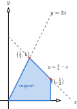

---
author:
- Qiulin Fan
authority: typst
bibliography:
- reference.bib
course: QLNotes Export Contract
date: 2026
description: An end-to-end export fixture with semantic math and a CeTZ diagram.
keywords:
- probability
- Typst
- LaTeX
- Markdown
lang: zh-CN
qlnotes-schema: qlnotes-v1
semantic-node-count: 3
source: export-roundtrip.typ
subtitle: One Typst source, editable LaTeX and Markdown
title: Probability export round-trip / 概率论导出试验
---

# Joint distributions / 联合分布

::: {#def-joint-support .definition depends="random-variable, density" concepts="joint-distribution, support" aliases="联合分布支撑集"}
**Definition: Support / 支撑集**

The support of a joint density $f_{X,Y}$ is the set on which $f_{X,Y}\left( {x,y} \right) > 0$. In the region below, $\mathbb{P}\left( {\left( {X,Y} \right) \in A} \right)$ is obtained by integrating over $A$.
:::

::: {#lem-probability-nonnegative .lemma depends="measure" concepts="probability-measure"}
**Lemma: Non-negativity**

For every measurable event $A$, $\mathbb{P}(A) \geq 0$.
:::

::: proof
**Proof**

This follows directly from the codomain of a probability measure.
:::

::: {#cor-probability-bound .corollary depends="probability-measure" concepts="probability-bound"}
**Corollary**

Every event satisfies $0 \leq \mathbb{P}(A) \leq 1$.
:::

::: remark
**Remark**

The semantic IDs above are preserved in both exported formats.
:::

:::: example
**Example: A direct calculation**

If $\mathbb{P}(A) = \frac{1}{2}$, compute $\mathbb{P}\left( A^{c} \right)$.

::: solution
**Solution**

Since $A$ and $A^{c}$ partition the sample space, $\mathbb{P}\left( A^{c} \right) = 1 - \mathbb{P}(A) = \frac{1}{2}$.
:::
::::

{#fig-joint-support alt="The support region bounded by y equals 2x, y equals three halves minus x, and the x-axis."}

The geometric interpretation is consistent with the standard measure-theoretic development in [@folland1999].
