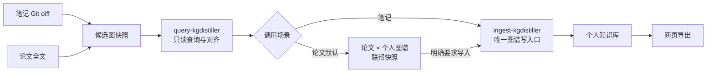

这是一份面向实现的需求文档。它记录为什么要把现有的知识图谱工作流拆成四个职责明确的 Skill，以及 kgdistiller 作为“外接大脑”时必须提供怎样的查询、对齐和入库边界。

## 用户原始需求（逐字记录）

```text
你说的有一点是不对的, 需要我纠正:
- "qlblog 固定使用仓库内的 kgdistiller 版本，CI 不再偷偷跟随外部 main"
恰恰相反, 我会经常更新 qlblog 中, kgdistiller 的版本. 并且我正在计划, 把这个流程按照职能划分给多个 skills.
现在我需要实现:

我希望原本的:
- 1. 笔记 export  web-> 顺便提取知识图谱的 skill, 只负责好(识别我直接写的知识图谱以及) 从 git 改动中提取知识图谱的这一步. 而它原本还需要
  - 在提取的知识图谱的过程中, 确认哪些是现有的知识图谱中已经有的. 不添加新的词条, 而是给 ref
  - 负责把知识图谱合进大的知识图谱里
- 2. 从论文中提取知识图谱的 skill, 只负责好从论文中提取知识图谱; 而它有一步是: 在给出所有知识词条的解释之前, 先查询现有的知识图谱(现在改成查询现有的知识库), 确认哪些知识是已经有的, 便:
  - 不再给出这些知识的词条
  - 并且通过这些知识节点, 连接两张图谱(不并进大的个人知识图谱里, 只是给一个快照. 只有额外要求时才会并进去并给出源)
这些行为, 原本都是属于这两个 skills 的职能. 但是太冗长. 一方面, 单个 skill 负责太多功能会导致幻觉; 另一方面, 它们原本阅读大的知识图谱, 会导致 tokens 消耗过多.

我希望职能分责. 现在我们做了这个仓库, 本质就是: 给它们一个外接大脑. 这个知识图谱的知识源全部封装在这个kgdistiller 的数据库里. 它提供入库和查询 api 即可!

入库和查询, 分别做成一个 skill, 伴随着 kgdistiller. 它们给现有的两个 skills 调用.

这是一件宏大的事情, 其实就是精简现有的两个 skills, 以及创造两个新的 skills. 我们可以暂时不管现在的这个 graphRAG 知识库系统实现的精准度如何, 先精确地规划这一套流程.
```

后续交付要求同样逐字记录：

```text
非常好, 把我的要求 (原话) 以及你刚才的这段理解全部写成 dev blog: 需求文档
然后推送. 然后先实现全部的 skills, 再交给我 review
```

## 已确认的理解与方案

正确的版本策略应该是：

> **kgdistiller 高频升级，单次运行可追溯。**

`qlblog` 会持续跟随 kgdistiller 的 `main` 并经常更新 submodule revision；每个 qlblog commit 记录当次实际使用的版本，以便复现，而不是永久固定在某个版本。

## 一、最终只保留四个职责

| Skill | 唯一职责 | 不再负责 |
|---|---|---|
| `extract-and-export-notes`（原 `export-typst-math-notes`） | 从任意领域 Git 改动和用户显式 marker 中提取候选图，按查询结果写 `kn/ref`，最后导出网页 | 读取完整知识图谱、执行身份匹配、直接合并全局图谱 |
| `extract-paper-concepts` | 通读论文，生成独立论文候选图和论文内部学习关系 | 读取个人大图谱、重复解释已知词条、默认导入个人图谱 |
| 新建 `query-kgdistiller` | 只读查询、批量消歧、GraphRAG、候选图对齐和比较 | 修改 authority、alignment 或个人图谱 |
| 新建 `ingest-kgdistiller` | 将已经审查的 marker、entry、ref、edge 事务性写入知识库 | 从原文发现概念、猜测歧义身份、读取整篇论文 |

现有 `kgdistiller-distill` 与新结构重复，完成迁移后退出主流程，只保留短期兼容入口或直接删除。

## 二、外接大脑的真正边界

从其他 Skill 看，kgdistiller 是一个不透明知识库：



上游 Skill 禁止：

- 打开或遍历 `knowledge/graph/*.jsonl`；
- 直接读取 SQLite；
- 自己实现名字匹配、别名判断或图遍历；
- 自己执行 `apply/sync` 合并全局图谱。

它们只能传入候选图路径或查询条件，并接收一个受预算限制的结构化结果。

内部仍保持“Markdown/Typst/LaTeX 是权威源、SQLite 是可重建索引”的原则。所谓“知识全部封装在数据库里”，是对调用方的封装，而不是丢弃来源文件和 provenance。

## 三、笔记工作流

`extract-and-export-notes` 的新流程：

1. 用 Git diff 找出新增、修改、删除、重命名的 authority。
2. 阅读完整改动文件，但只提取：
   - 用户直接写出的 `kn/ref`；
   - 改动中值得成为节点的候选概念；
   - 候选 entry、直接关系及来源证据。
3. 生成隔离的 `qlkg-agent-snapshot-v1`，不读取个人图谱。
4. 调用 `$query-kgdistiller` 批量比较。
5. 根据确定性结果修改源文件：
   - `known`：改为现有节点的格式原生 `ref`，不生成 entry；
   - `new`：保留或添加 authority marker，生成 entry；
   - `partial`：只处理缺失的部分，不复制已有定义；
   - `uncertain/conflict`：停止自动写入，进入 review。
6. 调用 `$ingest-kgdistiller`。
7. 收到成功回执后才允许导出网页。

因此，导出 Skill 仍然理解 Typst/Markdown/LaTeX marker，但不理解知识库内部实现。

## 四、论文工作流

`extract-paper-concepts` 分成两个阶段。

第一阶段只生成轻量候选图：

- 概念名、论文局部别名；
- 在论文中的作用；
- 精确来源位置；
- 论文内部的直接 prerequisite；
- 不先撰写所有完整词条。

然后调用 `$query-kgdistiller`。

第二阶段按比较结果生成最终快照：

- `known`：
  - 不再生成该概念的知识词条；
  - 只保留论文角色、来源位置和指向个人节点的 bridge。
- `partial`：
  - 只解释个人知识库中缺失的条件、限定或论文特定部分。
- `new`：
  - 生成完整、来源支持的论文词条。
- `uncertain/conflict`：
  - 保留候选匹配和证据，禁止自动合并。

最终产物是一张联邦快照：

```text
paper namespace
    ├── 新概念和论文特定概念
    ├── 论文内部关系
    └── alignment bridges ──> personal namespace
```

个人图谱的 digest 在默认论文流程前后必须完全不变。

只有用户明确提出“把这篇论文的新知识加入我的知识库”时，论文 Skill 才：

1. 选择需要导入的 `new/partial` 节点；
2. 创建带论文来源的 research authority；
3. 将已知概念写成 ref；
4. 调用 `$ingest-kgdistiller`。

## 五、两个新 Skill 的接口

### `query-kgdistiller`

只调用只读 MCP：

- `kg_status`
- `kg_resolve_concepts`
- `kg_search`
- `kg_build_context`
- `kg_align_graph`
- `kg_compare_graph`

输入可以是批量名字或候选 snapshot 路径。输出沿用现有：

- `qlkg-alignment-report-v1`
- `qlkg-graph-comparison-v1`
- `qlkg-context-bundle-v1`

它不保存 reviewed mapping。需要持久化 mapping 时，也必须交给 ingest Skill。

### `ingest-kgdistiller`

新增统一事务协议：

```text
qlkg-ingest-request-v1
├── mode
├── base_graph_sha256
├── candidate_snapshot_sha256
├── query_report_sha256
├── authority files
├── expected marker/ref state
├── reviewed qlkg-agent-delta-v2
└── review evidence
```

kgdistiller 负责执行：

```text
precondition check
→ scan
→ apply reviewed delta
→ sync
→ curate-check
→ global check
→ rebuild disposable index
→ emit receipt
```

输出 `qlkg-ingest-receipt-v1`，包含：

- 写入前后 graph digest；
- engine version 和 capability；
- 新增、复用、更新的节点；
- ref 与 edge 变化；
- authority/source hashes；
- 所有验证结果。

如果查询后图谱发生了变化，digest 不匹配，入库必须拒绝并要求重新查询。

## 六、Skill 的归属与升级

建议采用：

- kgdistiller 仓库维护：
  - 引擎 API；
  - `query-kgdistiller`；
  - `ingest-kgdistiller`；
  - schema 和兼容性测试。
- qlblog 维护：
  - `extract-and-export-notes`；
  - `extract-paper-concepts`；
  - 个人知识源和网页策略。

`make kgdistiller-update` 更新到 kgdistiller `main`，同时更新两个伴随 Skill。每次调用先通过 `kg_status.capabilities` 做版本握手。

即：

```text
持续跟随 main
+ 每次升级后跑兼容性测试
+ qlblog commit 记录本次解析到的 revision
```

## 七、实施顺序

1. 在 kgdistiller 固化上述职责和 ingest request/receipt 协议。
2. 实现事务型 `kgdistiller ingest` API 和 capability 握手。
3. 创建两个薄 Skill；核心逻辑放在 API，不把命令编排重新塞回 Skill。
4. 精简两个现有 Skill，并删除其中直接读图、对齐和合并的逻辑。
5. 用两个端到端场景验收：
   - 笔记 Git diff：已知概念只产生 ref，新概念才入库；
   - `solvablemodel`：已知概念不生成词条，论文默认只生成联邦快照。
6. 更新 qlblog 的 kgdistiller revision，跑两个仓库的完整测试、构建和网页发布。

这一轮先不优化 embedding、PPR 或别名识别精度；验收重点是：**职责不串线、上游不读大图、论文默认不污染个人图谱、所有个人图谱写入只经过一个入口。**
