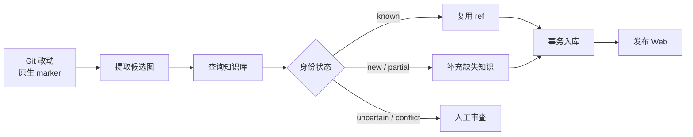
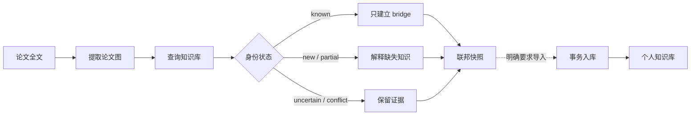

# Skill Workflows

单个 Skill 只描述一种可复用能力；这里记录多个 Skill 如何编排成可以交付结果的工具流。流程图和图下文字都是普通 Markdown，可以按需要增删节点、分支和说明，不受页面字段约束。

## 笔记进入知识库并发布 Web

[`extract-and-export-notes`](#skill-extract-and-export-notes) 只从 Git 改动和作者写下的 marker 构造候选图；[`query-kgdistiller`](#skill-query-kgdistiller) 负责识别已有知识，已知项只写 `ref`；审查通过后由 [`ingest-kgdistiller`](#skill-ingest-kgdistiller) 合入个人知识库，成功回执是 Web 发布的前置条件。

遇到 `uncertain` 或 `conflict` 时，流程停在审查门前，不猜测身份，也不为了自动发布而创建重复词条。

## 论文生成联邦知识快照

[`extract-paper-concepts`](#skill-extract-paper-concepts) 在撰写完整词条前先调用 [`query-kgdistiller`](#skill-query-kgdistiller)。已知概念不重复解释，只作为论文图与个人图谱之间的 bridge；新知识和论文特有内容留在独立的联邦快照中。

默认流程不修改个人知识库。只有收到明确导入要求时，才为选中的 `new` / `partial` 节点保留论文来源并调用 [`ingest-kgdistiller`](#skill-ingest-kgdistiller)；`known` 仍然只写 `ref`。
