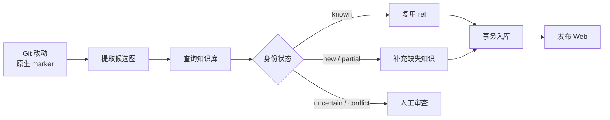
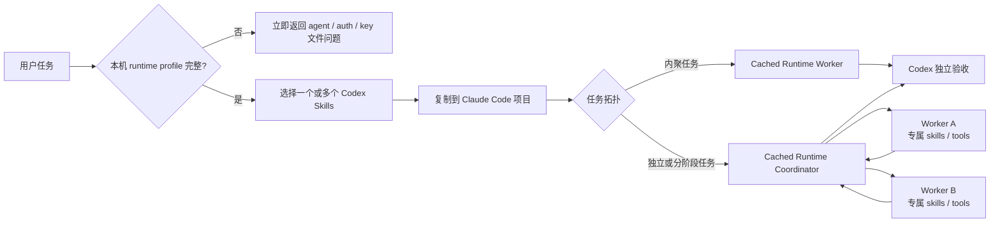
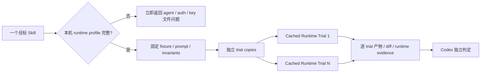
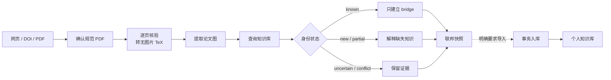

# Skill Workflows

单个 Skill 只描述一种可复用能力；这里记录多个 Skill 如何编排成可以交付结果的工具流。流程图和图下文字都是普通 Markdown，可以按需要增删节点、分支和说明，不受页面字段约束。

## 笔记进入知识库并发布 Web

[`extract-and-export-notes`](#skill-extract-and-export-notes) 只从 Git 改动和作者写下的 marker 构造候选图；[`query-kgdistiller`](#skill-query-kgdistiller) 负责识别已有知识，已知项只写 `ref`；审查通过后由 [`ingest-kgdistiller`](#skill-ingest-kgdistiller) 合入个人知识库，成功回执是 Web 发布的前置条件。

遇到 `uncertain` 或 `conflict` 时，流程停在审查门前，不猜测身份，也不为了自动发布而创建重复词条。

## Codex Skills 委派给本机配置的 Agents

[`run-workflow-with-agents`](#skill-run-workflow-with-agents) 在读取项目、选择 skills
或 staging 之前，先检查两个 agent skills 共享且 Git 忽略的本机 runtime profile。
缺少 agent 选择、订阅/API 模式或 API key 文件路径时立即询问，不启动 dry-run 或
生产工作。第一次配置的基础 agent 成为永久 fallback；可选 routes list 可按
workflow、skill 或二者组合覆盖，未匹配时不再询问。配置完整后再从 Codex 已发现的
skills 解析用户要求的一个或多个能力，
物理注入所选 runtime；内聚任务由单 worker 完成，可拆分任务由 coordinator
限定命名 workers、skill 预加载、工具权限和写入边界，最后仍由 Codex 检查
实际产物和验证结果。这个流程只处理会产生真实交付物的生产任务。

## 单 Skill 原子与压力测试

[`test-skill-with-agent`](#skill-test-skill-with-agent) 每个 contract 只测试一个
skill，不承接生产交付。它与生产 workflow 共用本机 runtime profile，并在读取目标
Skill、选择样本或创建 fixture 之前执行同一个首次使用门禁。单次 smoke、回归和负向测试使用一个一次性 fixture；
稳定性或压力测试并发运行多个互不共享文件与 session 的相同 trial，并把 provider、
harness、behavior、artifact 和 safety 失败分开统计。

## 论文生成联邦知识快照

[`extract-paper-concepts`](#skill-extract-paper-concepts) 先从网页、DOI、标题或 PDF
定位规范全文，保留 PDF hash 与逐页证据，将其规范化成只含文字、原生公式、LaTeX
表格、可信 TikZ/PGFPlots 重建和不可转换图表文字描述的 TeX。预处理通过覆盖、编译与
视觉核验后，才提取候选图并调用 [`query-kgdistiller`](#skill-query-kgdistiller)。已知
概念不重复解释，只作为论文图与个人图谱之间的 bridge；新知识和论文特有内容留在
独立的联邦快照中。

默认流程不修改个人知识库。只有收到明确导入要求时，才为选中的 `new` / `partial` 节点保留论文来源并调用 [`ingest-kgdistiller`](#skill-ingest-kgdistiller)；`known` 仍然只写 `ref`。
