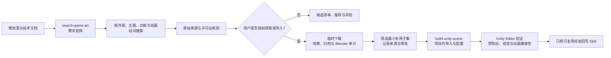
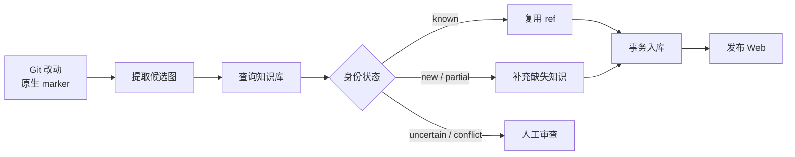
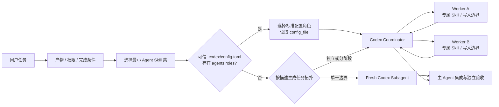
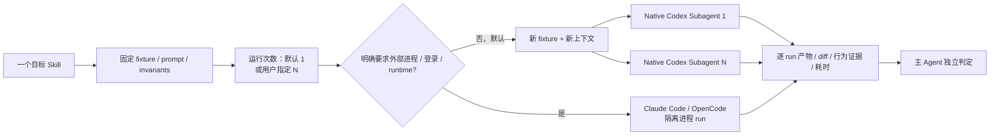
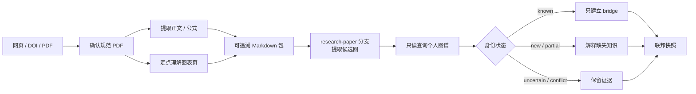

# Skill Workflows

单个 Skill 只描述一种可复用能力；这里记录多个 Skill 如何编排成可以交付结果的工具流。流程图和图下文字都是普通 Markdown，可以按需要增删节点、分支和说明，不受页面字段约束。

## 从策划案到 Unity 美术资源

[`search-game-art`](#skill-search-game-art) 先读取项目内的设计来源层级，把模糊的“风格像什么”拆成可核验的资产角色：玩法功能、叙事主题、视觉要求、所需状态或动画动词、技术约束与许可证边界。搜索阶段仍然可以独立结束；只有用户明确要求获取或导入时，才在临时目录下载候选，记录 SHA-256，审计归档的真实文件、许可证和异常内容，并用 Blender 检查实际网格、骨架与动作曲线。网页描述属于声明证据，下载包与引擎结果属于审计证据，两者不混为一谈。

审计通过后只选择当前需求所需的最小子集，再交给 [`build-unity-scene`](#skill-build-unity-scene) 按目标项目已有结构完成 Unity 导入、Importer 设置、材质或 prefab 建立以及 Editor 验证。动画包只有在目标角色的实际重定向测试通过后才算集成；仅有“Humanoid”“Mixamo compatible”或“animated”标签时保留为待验证。真实项目中的具体资源 URL、哈希和导入清单写入目标游戏仓库，Skill 本体只沉淀可复用的判断与审计步骤。面向用户的说明、提示与交接跟随用户语言，命令、标识符、结构化键和原始错误保持不变。

## Multica 控制面与执行节点

```mermaid
flowchart LR
    NL["用户自然语言<br/>无需说明操作系统"] --> Detect["只读平台探测<br/>Windows / macOS / Linux / WSL"]
    Detect --> HostCache["server profile cache<br/>Git ignored / no secrets"]
    HostCache --> TS{"Tailscale 登录 + HTTPS<br/>已就绪?"}
    TS -->|否| TSStop["立即停止<br/>用户完成设置后再次调用"]
    TSStop --> TS
    TS -->|是| Host["multica-selfhost-server<br/>唯一控制面 + 私网 HTTPS"]
    Host --> OwnerStop["打开 owner WebUI 后立即停止<br/>使用固定码 114514 注册"]
    OwnerStop --> Owner["独立 owner 身份<br/>共享 workspace"]
    Owner --> FirstVPN{"首 runtime 打开 Web UI 前<br/>VPN / Tailscale 可共存?"}
    FirstVPN -->|否| FirstSplit["持久 split routing<br/>私网直连 + 公网代理探测"]
    FirstSplit --> FirstVPN
    FirstVPN -->|是| First["multica-runtime-client<br/>服务器宿主机首个 runtime"]
    First --> FirstAgent["workspace 可调用 agent<br/>90 秒 zero-tool smoke"]
    Invitee["成员调用 runtime-client<br/>可零输入或仅 URL"] --> Guide["收集成员自己的 email<br/>生成给服主的准入请求"]
    Guide --> Gate["服主决定 workspace + access mode<br/>allowlist + 两类邀请"]
    Owner --> Gate
    Gate --> Handoff["无凭据 client handoff<br/>URL + workspace + 固定码 + 两层状态"]
    Handoff --> ClientCache["client profile cache<br/>Git ignored / no secrets"]
    ClientCache --> ClientVPN{"客户端打开 Web UI 前<br/>VPN / Tailscale 可共存?"}
    ClientVPN -->|否| ClientSplit["持久 split routing<br/>私网直连 + 公网代理探测"]
    ClientSplit --> ClientVPN
    ClientVPN -->|是| Clients["multica-runtime-client<br/>朋友机器第 2/3/N 个 runtime"]
    Clients --> MoreAgents["workspace 可调用 agents<br/>跨机器 smoke task"]
    FirstAgent --> Pool["互信团队共享 agent 计算池"]
    MoreAgents --> Pool
```

[`multica-selfhost-server`](#skill-multica-selfhost-server) 建立唯一控制面和共享 workspace，
并把服务器宿主机上的首个 runtime、workspace 可调用 agent 与真实 smoke task 设为初始
集群的强制完成条件。Windows + WSL 中 server 位于 WSL Docker，首 runtime 位于 Windows
宿主机；macOS 与原生 Linux 上 server 和同平台 runtime 同机但保持独立进程和恢复项。
WSL 始终归入 Windows 路径，不注册成 Linux runtime。它把不含凭据的地址写入
`connection.json`，再委派 [`multica-runtime-client`](#skill-multica-runtime-client) 管理
宿主机执行面。

成员可以在零输入或仅知道 Server URL 时调用 `multica-runtime-client`。Agent 先说明加入所需的
服主 handoff，收集成员自己的 Multica email，并生成可直接转发的准入请求；服主通过
`multica-selfhost-server` 决定 workspace 和 `same-tailnet` / `shared-machine`，完成 Server
allowlist、workspace invite 与 Tailscale access 后返回无凭据 handoff。workspace 与 access mode
不是成员要选择的输入，邀请/share 链接也不得粘贴给 Agent。缺少服主操作时，客户端在
`owner-handoff-required` 阶段结构化暂停。

Agent 自动探测拓扑、WSL 和 hostname；在打开任何 Multica Web UI 或浏览器认证前，还必须探测
VPN、TUN、PAC 与系统代理。仅有 `/api/config` 的 CLI 成功不足以证明浏览器路径可用；存在其他
网络客户端时，必须同时验证 Multica 经 Tailscale 直连、公共身份站点经原代理可达。macOS Clash
Verge 系统代理模式自动持久合并 `.ts.net`、Tailscale IPv4 与 IPv6 bypass；未知客户端、PAC-only
或 TUN 模式无法安全配置时结构化停止，不通过关闭用户 VPN 规避。Multica 自动发现本机全部
providers，Skill 不询问、
登录或直接验证 provider CLI，provider 也不是输入、断点或完成条件。结构化脚本结果保持英文
动作码，Agent 面向用户的解释、提示和交接则跟随用户语言。Agent 先合并 Skill 内
`.cache/<profile>/profile.env`，再自行执行脚本和验证，不把命令交回用户。两个 cache 都由
各自 `.gitignore` 排除，只保存可恢复的非凭据配置；本轮明确值覆盖旧 cache，真实只读状态
又优先于 cache。self-host 引导先于 Docker 检查 Tailscale：若登录、MagicDNS 或 HTTPS
Certificates 需要人工操作，立即结束本轮并提示用户完成后再次调用；Tailscale 就绪后才启动
server，并为这个私网实例启用固定且非秘密的验证码 `114514`，不配置邮件服务。打开 owner
WebUI 又立即结束，owner 用固定码注册后再调用才完成 workspace、首 runtime、
agent、90 秒内的 zero-tool smoke 与获授权的自启动。Agent 不在这些人工断点后台等待、轮询
或重复执行安装。邮箱/浏览器、UAC/sudo 等其他不可代办交互采用相同断点语义。

后续朋友机器只有同时通过 Tailscale tailnet 或 server machine share、server 邮箱 allowlist、
目标 workspace 邀请/成员资格和自己的身份认证，才使用 `multica-runtime-client` 加入。owner
为每位成员生成不含凭据、但明确记录固定码 `114514` 的 handoff receipt；固定码不是授权
边界，知道 `server_url` 本身也不构成许可。每台机器先
按 workspace ID、daemon ID 与 runtime IDs 关联 Multica 自动发现的本机 online runtimes，再创建显式开放给整个
workspace 的 agent，并用另一成员触发的 smoke task 验证跨机器调度。所谓“完全信任”只
表示团队有意共享这些 agents 的调用权，并接受任务在对应 runtime 本地权限内执行。

每个客户端单独配置登录自启动，不克隆 server、不启动 Docker，也不执行 provider 登录。
每台设备的本地目录资源
只属于自己的 daemon，跨设备项目优先使用 Git repository；撤销成员时同步移除 membership、
allowlist、runtime 和 agent。

### 中文调用示例

以下文字是仓库外层的个人速查模板，不属于两个 Skill 本体。示例中的邮箱、workspace 和 URL 要换成
真实值；不要在提示中粘贴 token、一次性验证码、cookie、邀请密钥或 Tailscale share link。
Skill 固定码 `114514` 是公开实例配置，不属于这个限制。

首次部署私网控制面：

> 使用 `$multica-selfhost-server` 在这台 Windows 电脑上部署唯一的 Multica 私网服务器。
> owner 邮箱是 `owner@example.com`，workspace 是 `trusted-team`。使用 Tailscale Serve，内部服务
> 只绑定 loopback。遇到必须由我完成的登录或系统授权时打开对应界面并暂停，不要在后台等待。

从人工断点继续部署：

> 继续使用 `$multica-selfhost-server` 完成上次的 `trusted-team` 部署。先读取 profile cache 和真实
> 状态，只执行当前 phase，不要重新创建已经完成的 server、workspace、runtime 或 agent。

邀请一位成员：

> 使用 `$multica-selfhost-server` 邀请 `friend@example.com` 加入 `trusted-team`。为对方使用
> `shared-machine` Tailscale access，只共享 Multica server 机器，并生成不含凭据的 client handoff。

成员还没有任何信息：

> 使用 `$multica-runtime-client` 引导我加入服主的 Multica。我还没有 Server URL 或邀请信息；请告诉
> 我需要把什么信息发给服主、向服主索取什么，并在服主完成准入前暂停。

成员只知道 Server URL：

> 使用 `$multica-runtime-client` 引导我加入 `https://server.tailnet.ts.net/`。我不知道 workspace 或
> Tailscale access mode，也不需要替服主选择；请收集我的 Multica email，并生成给服主的准入请求。

为新设备加入 runtime：

> 使用 `$multica-runtime-client` 把这台 Mac 加入服主 handoff 指定的 Server、workspace 和
> Tailscale access mode。我会使用自己的 Tailscale 与 Multica 账号。把 Multica 自动发现的
> 全部本机 online runtimes 开放给 workspace，并运行有界 smoke；不要询问或验证 provider。

继续客户端登录流程：

> 继续使用 `$multica-runtime-client` 完成这台设备的加入流程。读取现有 profile cache，验证我的
> Multica 身份与 workspace membership，然后从第一个未完成阶段继续，不要重复创建 agent 或 issue。

排查 runtime offline：

> 使用 `$multica-runtime-client` 排查为什么这台设备在 `trusted-team` 中显示 runtime offline。
> 按 Tailscale reachability、Multica identity、workspace membership、daemon、runtime verifier、
> agent access、smoke 的顺序，只处理第一个失败点。provider 不属于排查步骤。

升级并验证服务器：

> 使用 `$multica-selfhost-server` 为当前 Multica Server 制定升级计划。先做 verified backup，固定
> release 和 image digest，审查 migration；得到我的明确授权后再升级，并重新验证私网 URL、
> runtime verifier 与 smoke。失败时停止并按旧版本回滚。

撤销成员访问：

> 使用 `$multica-selfhost-server` 先生成撤销 `friend@example.com` 访问权的计划，不要立即 apply。
> 计划应覆盖 workspace membership、allowlist、agents、runtimes 和 Tailscale access，并分别说明
> 哪些远程删除需要我的确认。

## 笔记进入知识库并发布 Web

[`extract-and-export-notes`](#skill-extract-and-export-notes) 只从 Git 改动和作者写下的 marker 构造候选图；[`query-kgdistiller`](#skill-query-kgdistiller) 负责识别已有知识，已知项只写 `ref`；审查通过后由 [`ingest-kgdistiller`](#skill-ingest-kgdistiller) 合入个人知识库，成功回执是 Web 发布的前置条件。

遇到 `uncertain` 或 `conflict` 时，流程停在审查门前，不猜测身份，也不为了自动发布而创建重复词条。

## Codex 原生 Subagent 生产工作流

[`codex-subagent-workflow`](#skill-codex-subagent-workflow) 只使用当前 Codex 会话的
原生 subagents，不通过 shell 或 API 再启动 Codex、Claude Code 或 OpenCode。
主 agent 先固定交付物、权限和完成条件，再检查可信主项目的 `.codex/config.toml`：
若 `[agents.<role>]` 已声明角色，就按标准描述、`config_file`、默认模型/推理强度和并发
限制选择最小角色集；只有没有自定义角色时才根据任务描述自动编排。配置损坏或当前
surface 无法选择已配置角色时明确失败，不悄悄退化。每个 worker 仍需指定最小 Skill、
上下文、写入所有权和依赖关系；独立任务可以有界并发，依赖任务顺序交接。Subagents
共享当前 runtime 与工作区，因此它们是新工作上下文而不是独立安全主体；最终 diff、
产物和 validators 始终由主 agent 集成并验收。这个流程只处理真实生产交付物。

## 单 Skill 原子与压力测试

[`codex-subagent-testskill`](#skill-codex-subagent-testskill) 每个 contract 只测试一个
Skill，是单 Skill 测试默认入口，不承接生产交付。每个 run 使用新的 fixture copy 和
不继承对话历史的原生 Codex subagent；未指定次数时只运行一次，用户可指定正整数次数
重复同一 contract。重复测试默认串行以保持耗时可比，只有用户明确要求时才在可用
subagent slots 内有界并发。主 agent 记录每次运行与完整 harness 的 wall-clock 时间，
独立检查产物、workspace diff 和 validators，并区分 harness、behavior、artifact、safety
与 orchestration 失败。它提供行为与上下文隔离，不声称全新进程、登录、provider 或
文件系统隔离。

只有用户明确要求 Claude Code、OpenCode、跨 runtime 对比或全新进程/认证时，才改用
[`codex-external-agent-testskill`](#skill-codex-external-agent-testskill)。它的本机 profile
只配置这两个外部 evaluator，不包含 Codex target；首次使用或缓存被清理后必须重新
回答 runtime 与认证问题。

## 论文生成联邦知识快照

[`extract-paper-markdown`](#skill-extract-paper-markdown) 先从网页、DOI、标题或 PDF
定位规范全文，保留来源 hash 和页码映射，把正文、公式、结论、限制与附件转成语义
Markdown。它只渲染 caption、低文本、解析异常或含重要视觉对象的页面；每个图表在
Markdown 中只留下编号、页码、标题、内容摘要、支撑结论和不确定项，不嵌图、不复刻
版式，也不经过 TeX 编译；交付前还必须清理 HTML layout 与 Pandoc 数学转码残留。

随后 [`extract-and-export-notes`](#skill-extract-and-export-notes) 选择
`research-paper` 分支，复用同一套候选图、确定性 snapshot 和
[`query-kgdistiller`](#skill-query-kgdistiller) 对齐流程。已知概念只建立跨 namespace
bridge；`new` 与 `partial` 只解释未知或缺失部分；冲突与歧义保留证据。交付物是独立
论文图及学习顺序，不修改论文 Markdown、个人来源、主图谱或 Web。把论文知识导入
主图谱是另一条需要重新授权和审查的流程，不属于这里的默认或可选分支。
