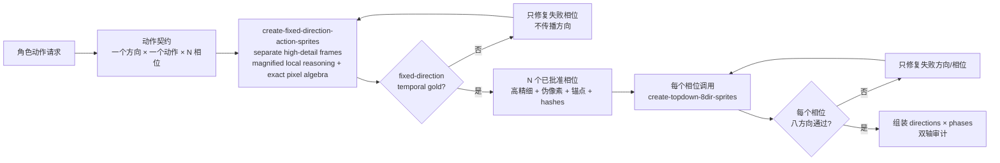

# Skill Workflows

## 固定方向动作与八方向传播

[`create-fixed-direction-action-sprites`](#skill-create-fixed-direction-action-sprites) 只拥有时间轴：一个固定方向里的动作相位、植足/摆足、身体起伏、事件帧、帧间差异与循环闭合。每个相位先生成完整高精细人物，并分别在高精细原图、伪像素大图和最终逻辑像素的最近邻放大图中检查；Agent 像阅读文字片段一样在局部窗口中判断语义、相位、锚点、遮挡和连接，并先区分稳定身份块（如同一朝向的完整头部、五官、刚性标志）与相位块（如裙摆、袖口、手、腿和鞋）。脚本只做无失真的裁剪、放大、精确集合差分、透明擦除、整数变换、逐点 RGBA 写回与哈希校验。恢复优先共用一个伪像素网格；若独立生成源需要不同整数 refined grids，则逐帧记录并依靠统一 64×64 画布、身体轴、1:1 放置、局部身份块和放大循环审查保证连贯性，禁止用连续缩放或恢复后重采样强求网格一致。尺寸、Alpha、哈希、越界写入、禁用重采样与显式提升的 contract gate 属于不可豁免硬检查；左右动作距离和节奏比默认是诊断，超限时必须由正常速与慢速循环、理由及用户或 Agent 视觉权威显式确认，不能自动判好或判坏。技术检查通过而缺少完整视觉审查时只能停在 `awaiting-visual-review`；固定方向循环未通过时不得生成其他方向。

[`create-topdown-8dir-sprites`](#skill-create-topdown-8dir-sprites) 仍保持原子化，只拥有空间方向轴：对一个已经批准的相位维护身份、相机、调色板、方向语义、脚轴和环形转向连续性；伪像素转换重新引入画布占比漂移时，只在 Perfect Pixel 前对透明高分辨率源做统一最近邻归一化，恢复后的逻辑像素仍禁止缩放。新 Skill 通过显式 handoff 引用它，但不修改、复制或扩张它。最终动作表只有在每个方向的时间循环和每个相位的八方向转向都通过后才可组装或导入引擎。

## Multica 控制面与执行节点

```mermaid
flowchart LR
    NL["用户自然语言<br/>无需说明操作系统"] --> Detect["只读平台探测<br/>Windows / macOS / Linux / WSL"]
    Detect --> HostCache["server profile cache<br/>Git ignored / no secrets"]
    HostCache --> TS{"Tailscale 登录 + HTTPS<br/>已就绪?"}
    TS -->|否| TSStop["立即停止<br/>用户完成设置后再次调用"]
    TSStop --> TS
    TS -->|是| Host["multica-selfhost-server<br/>唯一控制面 + 私网 HTTPS"]
    Host --> OwnerStop["打开 owner WebUI 后立即停止<br/>使用固定码 114514 注册"]
    OwnerStop --> Owner["独立 owner 身份<br/>共享 workspace"]
    Owner --> FirstVPN{"首 runtime 打开 Web UI 前<br/>VPN / Tailscale 可共存?"}
    FirstVPN -->|否| FirstSplit["持久 split routing<br/>私网直连 + 公网代理探测"]
    FirstSplit --> FirstVPN
    FirstVPN -->|是| First["multica-client-setup<br/>服务器宿主机首个 runtime"]
    First --> FirstAgent["workspace 可调用 agent<br/>90 秒 zero-tool smoke"]
    Invitee["成员提出任意接入问题<br/>无需理解 workspace / tailnet"] --> Guide["服主 Skill 收集成员事实<br/>生成服主操作清单"]
    Guide --> Scope{"仅需 Multica<br/>还是加入更广私网?"}
    Scope -->|仅 Multica / 默认| Share["shared-machine<br/>只共享 Server"]
    Scope -->|明确需要更广私网| Join["same-tailnet<br/>邀请成员设备"]
    Share --> Gate["服主选择 workspace<br/>allowlist + workspace invite"]
    Join --> Gate
    Owner --> Gate
    Gate --> Handoff["无凭据 client handoff<br/>URL + workspace + 固定码 + 两层状态"]
    Handoff --> ClientCache["client profile cache<br/>Git ignored / no secrets"]
    ClientCache --> ClientVPN{"客户端打开 Web UI 前<br/>VPN / Tailscale 可共存?"}
    ClientVPN -->|否| ClientSplit["识别客户端与模式<br/>适配器或证据化人工排障"]
    ClientSplit --> ClientVPN
    ClientVPN -->|是| Clients["multica-client-setup<br/>朋友机器第 2/3/N 个 runtime"]
    Clients --> MoreAgents["workspace 可调用 agents<br/>跨机器 smoke task"]
    FirstAgent --> Pool["互信团队共享 agent 计算池"]
    MoreAgents --> Pool
    Provision["明确授权的新 workspace / agent"] --> RuntimeClient["multica-runtime-client<br/>workspace / agent / issue / task"]
    Work["成员自然语言工作"] --> RuntimeClient
    RuntimeClient --> Pool
    Lifecycle["明确授权的停止 / 迁移"] --> StopEnv["停止唯一 Server<br/>保留容器 / 卷 / Serve"]
    StopEnv --> ExportEnv["一致性 dump + uploads + env<br/>整包 age 加密"]
    ExportEnv --> RestoreEnv["空目标 restore<br/>保持停止"]
    RestoreEnv --> Host
```

[`multica-selfhost-server`](#skill-multica-selfhost-server) 建立唯一控制面和共享 workspace，
并把服务器宿主机上的首个 runtime、workspace 可调用 agent 与真实 smoke task 设为初始
集群的强制完成条件。Windows + WSL 中 server 位于 WSL Docker，首 runtime 位于 Windows
宿主机；macOS 与原生 Linux 上 server 和同平台 runtime 同机但保持独立进程和恢复项。
WSL 始终归入 Windows 路径，不注册成 Linux runtime。它把不含凭据的地址写入
`connection.json`，再委派 [`multica-client-setup`](#skill-multica-client-setup) 配置
宿主机执行面。

Server 生命周期迁移严格保持单主：明确停机后保留容器、卷、Tailscale Serve 与自启动定义，
再从停止态临时只启动 PostgreSQL 做一致性逻辑导出，把数据库、uploads、`.env`、版本/镜像与
状态证据整包加密成 `.tar.age`。恢复只接受已经通过 Tailscale 门槛、没有 `.env`、容器或目标
数据卷的空机器；解密、校验、恢复后仍保持停止并回到 `cluster-finalizing`，必须复用正常
start/publish、owner/workspace、runtime/agent 和 smoke 验证链后才成为新权威。旧 Server 在验收前
保持停止，不能与恢复出的副本同时可写；archive 与 age identity 也不能放在同一处。

服主使用 `multica-selfhost-server` 承接成员提出的任何接入问题。Skill 向服主收集成员的
Multica email、必要时的 Tailscale identity，以及服主希望开放的自然语言范围；workspace、
tailnet 和 `same-tailnet` / `shared-machine` 都由服主侧决定。只需 Multica 时默认共享 Server
机器，只有服主明确要求更广私网成员资格时才邀请加入 tailnet。Skill 再完成 Server allowlist、
workspace invite 与 Tailscale access，向服主输出操作清单、可直接回复成员的话术和无凭据
handoff。成员无需理解网络结构，邀请/share 链接也不得粘贴给 Agent。

Agent 自动探测拓扑、WSL 和 hostname；在打开任何 Multica Web UI 或浏览器认证前，还必须探测
VPN、TUN、PAC、系统代理、路由与配置所有者。仅有 `/api/config` 的 CLI 成功不足以证明浏览器
路径可用；存在其他网络客户端时，必须同时验证 Multica 经 Tailscale 直连、公共身份站点经原
代理可达。macOS Clash Verge 系统代理模式有完整静态适配器：在当前订阅 Rules Enhancement
前置 Tailscale DIRECT 规则，并设置本轮立即生效的 macOS bypass；需要重新加载配置时，脚本在
人工重启断点停止，绝不自行退出或重启网络客户端。恢复后再验证生成配置以及直连、强制代理和
公共代理三条路径。其他客户端按 system proxy、PAC、TUN、split tunnel、managed VPN 或 unknown 分类，
只有验证过生命周期持久性的适配器才自动修改；否则输出观测证据、精确直连目标和人工动作后
结构化停止。任何路径都不通过关闭用户 VPN 规避，也不把一次性 OS 修改当作持久配置。Multica 自动发现本机全部
providers，Skill 不询问、
登录或直接验证 provider CLI，provider 也不是输入、断点或完成条件。结构化脚本结果保持英文
动作码，Agent 面向用户的解释、提示和交接则跟随用户语言。Agent 先合并 Skill 内
`.cache/<profile>/profile.env`，再自行执行脚本和验证，不把命令交回用户。两个 cache 都由
各自 `.gitignore` 排除，只保存可恢复的非凭据配置；本轮明确值覆盖旧 cache，真实只读状态
又优先于 cache。self-host 引导先于 Docker 检查 Tailscale：若登录、MagicDNS 或 HTTPS
Certificates 需要人工操作，立即结束本轮并提示用户完成后再次调用；Tailscale 就绪后才启动
server，并为这个私网实例启用固定且非秘密的验证码 `114514`，不配置邮件服务。打开 owner
WebUI 又立即结束，owner 用固定码注册后再调用才完成 workspace、首 runtime、
agent、90 秒内的 zero-tool smoke 与获授权的自启动。Agent 不在这些人工断点后台等待、轮询
或重复执行安装。邮箱/浏览器、UAC/sudo 等其他不可代办交互采用相同断点语义。

后续朋友机器只有同时通过 Tailscale tailnet 或 server machine share、server 邮箱 allowlist、
目标 workspace 邀请/成员资格和自己的身份认证，才使用 `multica-client-setup` 加入。owner
为每位成员生成不含凭据、但明确记录固定码 `114514` 的 handoff receipt；固定码不是授权
边界，知道 `server_url` 本身也不构成许可。每台机器先
按 workspace ID、daemon ID 与 runtime IDs 关联 Multica 自动发现的本机 online runtimes，再创建显式开放给整个
workspace 的 agent，并用另一成员触发的 smoke task 验证跨机器调度。所谓“完全信任”只
表示团队有意共享这些 agents 的调用权，并接受任务在对应 runtime 本地权限内执行。

每个客户端单独配置登录自启动，不克隆 server、不启动 Docker，也不执行 provider 登录。
每台设备的本地目录资源
只属于自己的 daemon，跨设备项目优先使用 Git repository；撤销成员时同步移除 membership、
allowlist、runtime 和 agent。

客户端完成接入后，日常工作和明确授权的 workspace/agent 扩展由
[`multica-runtime-client`](#skill-multica-runtime-client) 承接。它默认读取既有 profile、workspace、
agents 和 online runtimes；只有用户明确要求时才先按永久 slug 防重复地创建 workspace，并以完整
workspace ID 继续，除非用户同时要求，否则不改变 profile 默认 workspace。每个新建 Codex agent
都显式携带 `danger-full-access` 与 `never` 的启动覆盖，因为 Multica 的独立 task home 不能依赖
全局 Codex sandbox marker；其他 provider 不使用这组参数。随后自然语言请求被整理为一个可验收
issue，以完整 agent ID 入队一次，再通过 runs 和 messages 监控、续接、取消或按授权 rerun。
安装、身份、membership、Tailscale/VPN、首台设备接入和自启动仍属于 `multica-client-setup`，
两者不互相兜底执行；`multica-client-setup` 自己创建 Codex agent 时也执行同一参数规则。

同一台机器上的 daemon 并发是跨 workspace 共享的全局容量，不等于单个 agent 的并发上限。
可信生产节点默认使用 `10`；`multica-selfhost-server` 在服主 cache 中记录该值，
`multica-client-setup` 将它同时写入客户端 profile、实际 daemon 启动参数和获授权的自启动定义，
并在恢复后核验四者一致。`multica-runtime-client` 遇到长时间 `queued` 时必须检查 daemon 服务的
全部 workspace、`active_task_count` 与真实启动容量，不能只看当前 workspace 是否空闲。

### 中文调用示例

以下文字是仓库外层的个人速查模板，不属于三个 Skill 本体。示例中的邮箱、workspace 和 URL 要换成
真实值；不要在提示中粘贴 token、一次性验证码、cookie、邀请密钥或 Tailscale share link。
Skill 固定码 `114514` 是公开实例配置，不属于这个限制。

首次部署私网控制面：

> 使用 `$multica-selfhost-server` 在这台 Windows 电脑上部署唯一的 Multica 私网服务器。
> owner 邮箱是 `owner@example.com`，workspace 是 `trusted-team`。使用 Tailscale Serve，内部服务
> 只绑定 loopback。遇到必须由我完成的登录或系统授权时打开对应界面并暂停，不要在后台等待。

从人工断点继续部署：

> 继续使用 `$multica-selfhost-server` 完成上次的 `trusted-team` 部署。先读取 profile cache 和真实
> 状态，只执行当前 phase，不要重新创建已经完成的 server、workspace、runtime 或 agent。

停止并导出唯一服务器：

> 使用 `$multica-selfhost-server` 先确认当前 runtime 没有活动任务，再停止唯一 Server，但保留
> 容器、数据卷、Tailscale Serve 与自启动定义。使用我指定的 age recipient，把一致性数据库、
> uploads、环境、版本和校验信息导出到仓库外目录；导出后保持 Server 停止，不要删除任何卷。

从环境包冷迁移：

> 使用 `$multica-selfhost-server` 把我指定的 `.tar.age` 恢复到这台已经通过 Tailscale 就绪门槛的
> 空机器。我明确授权 recovery，但不授权删除或覆盖任何现存 `.env`、容器或数据卷；遇到冲突就
> 停止。恢复后保持停止，随后走正常 start/publish、owner/workspace、runtime/agent 和 smoke 验证。

邀请一位成员：

> 使用 `$multica-selfhost-server` 帮我接入一位新成员。对方只需要使用 Multica，并不了解
> workspace、tailnet 或 access mode。请向我收集服主必须决定的信息，选择已有 workspace，
> 告诉我需要执行的 Tailscale 与 Multica 操作，并生成我可以直接转发的完整 client handoff。

成员还没有任何信息：

> 使用 `$multica-client-setup` 引导我加入服主的 Multica。我还没有 Server URL 或邀请信息；请告诉
> 我需要把什么信息发给服主、向服主索取什么，并在服主完成准入前暂停。

成员只知道 Server URL：

> 使用 `$multica-client-setup` 引导我加入 `https://server.tailnet.ts.net/`。我不知道 workspace 或
> Tailscale access mode，也不需要替服主选择；请收集我的 Multica email，并生成给服主的准入请求。

为新设备加入 runtime：

> 使用 `$multica-client-setup` 把这台 Mac 加入服主 handoff 指定的 Server、workspace 和
> Tailscale access mode。我会使用自己的 Tailscale 与 Multica 账号。把 Multica 自动发现的
> 全部本机 online runtimes 开放给 workspace，并运行有界 smoke；不要询问或验证 provider。

继续客户端登录流程：

> 继续使用 `$multica-client-setup` 完成这台设备的加入流程。读取现有 profile cache，验证我的
> Multica 身份与 workspace membership，然后从第一个未完成阶段继续，不要重复创建 agent 或 issue。

排查 runtime offline：

> 使用 `$multica-runtime-client` 排查为什么这台设备在 `trusted-team` 中显示 runtime offline。
> 读取已经配置好的 profile，按 workspace、agent permission/status、runtime online、daemon、
> issue、task、messages 的顺序只处理第一个失败点；若发现安装、身份、membership 或网络前提
> 缺失，就交回 `$multica-client-setup`。provider 不属于排查步骤。

在已配置的 agent 上执行日常工作：

> 使用 `$multica-runtime-client` 在 `trusted-team` 中选择与当前仓库和平台匹配的 online agent，
> 把“修复现有测试失败并运行相关验证”整理成一个带验收条件的 issue，只入队一次；读取 runs 和
> messages 直到有界等待结束，并返回 workspace、agent、issue、task ID 与可核验结果。

升级并验证服务器：

> 使用 `$multica-selfhost-server` 为当前 Multica Server 制定升级计划。先做 verified backup，固定
> release 和 image digest，审查 migration；得到我的明确授权后再升级，并重新验证私网 URL、
> runtime verifier 与 smoke。失败时停止并按旧版本回滚。

撤销成员访问：

> 使用 `$multica-selfhost-server` 先生成撤销 `friend@example.com` 访问权的计划，不要立即 apply。
> 计划应覆盖 workspace membership、allowlist、agents、runtimes 和 Tailscale access，并分别说明
> 哪些远程删除需要我的确认。
